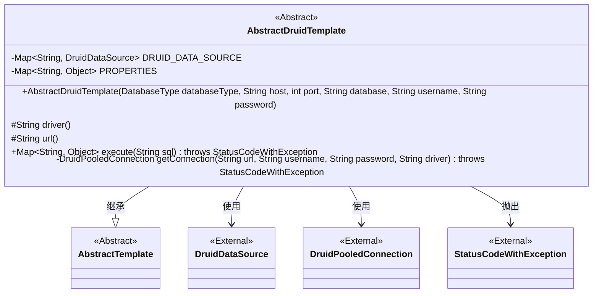
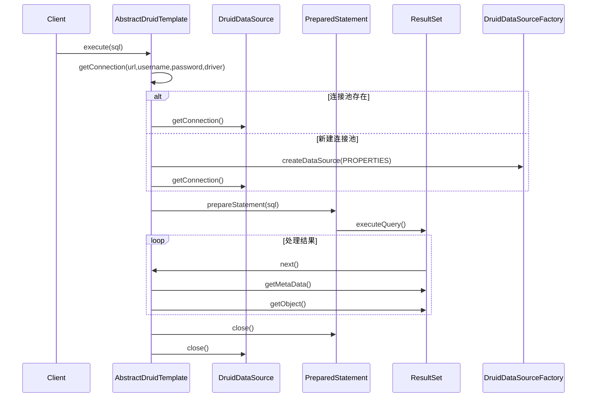

# 基础信息

|      |      |
|------|------|
| 名称 | AbstractDruidTemplate |
| 编码语言 | .java |
| 代码路径 | WeFe/serving/serving-service/src/main/java/com/welab/wefe/serving/service/feature/sql/AbstractDruidTemplate.java |
| 包名 | com.welab.wefe.serving.service.feature.sql |
| 依赖项 | ['com.alibaba.druid.pool.DruidDataSource', 'com.alibaba.druid.pool.DruidDataSourceFactory', 'com.alibaba.druid.pool.DruidPooledConnection', 'com.welab.wefe.common.StatusCode', 'com.welab.wefe.common.exception.StatusCodeWithException', 'com.welab.wefe.common.jdbc.base.DatabaseType', 'java.sql.PreparedStatement', 'java.sql.ResultSet', 'java.sql.SQLException', 'java.util.HashMap', 'java.util.Map'] |
| 概述说明 | 抽象类AbstractDruidTemplate继承AbstractTemplate，管理Druid连接池，包含连接超时等默认配置。提供执行SQL查询方法，返回结果集映射为Map。通过getConnection方法获取或创建连接池，确保线程安全。异常处理完善。 |

# 说明

AbstractDruidTemplate是一个抽象类，继承自AbstractTemplate，用于管理Druid数据库连接池。它包含两个静态Map：DRUID_DATA_SOURCE存储数据源，PROPERTIES存储连接池配置参数如超时时间和最大连接数。构造函数接收数据库连接参数。抽象方法driver和url需子类实现。execute方法执行SQL查询，返回结果集映射为Map，处理异常并确保资源释放。getConnection方法同步创建和管理连接池，确保线程安全，处理连接失败情况并抛出异常。

# 类列表 Class Summary

| 名称   | 类型  | 说明 |
|-------|------|-------------|
| AbstractDruidTemplate | class | 抽象类AbstractDruidTemplate继承AbstractTemplate，管理Druid连接池，提供数据库查询功能，包含连接超时等配置，通过execute方法执行SQL并返回结果集。 |


## 类 AbstractDruidTemplate

|      |      |
|------|------|
| 访问范围 | public abstract |
| 类型 | class |
| 名称 | AbstractDruidTemplate |
| 说明 | 抽象类AbstractDruidTemplate继承AbstractTemplate，管理Druid连接池，提供数据库查询功能，包含连接超时等配置，通过execute方法执行SQL并返回结果集。 |


### UML类图



该代码展示了一个抽象类`AbstractDruidTemplate`，它继承自`AbstractTemplate`，主要用于管理Druid数据库连接池和执行SQL查询。类中包含静态属性`DRUID_DATA_SOURCE`和`PROPERTIES`用于存储连接池和配置信息，提供了获取连接和执行查询的方法。通过`getConnection`方法实现连接池的懒加载和线程安全管理，`execute`方法处理SQL查询并返回结果集。整体设计体现了连接池管理和数据库操作的核心功能。


### 内部方法调用关系图

```mermaid
graph TD
    A["抽象类AbstractDruidTemplate"]
    B["静态Map: DRUID_DATA_SOURCE<String,DruidDataSource>"]
    C["静态Map: PROPERTIES<String,Object>"]
    D["静态块: 初始化连接池参数"]
    E["构造方法: AbstractDruidTemplate(DatabaseType, String, int, String, String, String)"]
    F["抽象方法: String driver()"]
    G["抽象方法: String url()"]
    H["重写方法: execute(String sql)"]
    I["私有方法: getConnection(String, String, String, String)"]
    J["步骤: 获取连接池"]
    K["步骤: 执行SQL查询"]
    L["步骤: 处理结果集"]
    M["步骤: 关闭连接"]

    A -->|继承| AbstractTemplate
    A --> B
    A --> C
    A --> D
    A --> E
    A --> F
    A --> G
    A --> H
    A --> I
    H --> J --> I
    H --> K -->|"PreparedStatement.executeQuery()"| L
    H --> M -->|"connection.close()"| end
    I -->|"DruidDataSourceFactory.createDataSource()"| J
    I -->|"druidDataSource.getConnection()"| J
```



这段代码实现了一个基于Druid连接池的数据库模板抽象类，主要功能包括：1) 通过静态块初始化连接池默认参数；2) 提供获取数据库连接的私有方法，支持连接池复用；3) 实现SQL执行和结果集处理逻辑。流程图展示了类结构和关键方法调用关系，时序图详细描述了执行SQL查询时的交互过程，包括连接获取、查询执行和资源释放等关键步骤。代码通过双重检查锁机制确保线程安全，并规范处理了各种异常情况。

### 字段列表 Field List

| 名称  | 类型  | 说明 |
|-------|-------|------|
| DRUID_DATA_SOURCE = new HashMap<>() | Map<String, DruidDataSource> | 定义了一个静态不可变的HashMap，键为String类型，值为DruidDataSource类型，用于存储数据源。 |
| PROPERTIES = new HashMap<>() | Map<String, Object> | 定义静态不可变哈希映射PROPERTIES，键为字符串，值为对象。 |

### 方法列表

| 名称  | 类型  | 说明 |
|-------|-------|------|
| driver | String | 抽象方法声明，返回字符串类型，需子类实现具体驱动逻辑。 |
| execute | Map<String, Object> | 该方法执行SQL查询并返回结果集的首行数据为Map，键为列名，值为对应数据。使用Druid连接池，处理异常并确保资源关闭。查询无结果返回null。 |
| getConnection | DruidPooledConnection | 获取数据库连接的方法：检查现有连接池，若无则创建新连接并缓存。异常时关闭连接并抛出错误。 |
| url | String | 抽象方法定义URL字符串，需子类实现具体逻辑。 |


