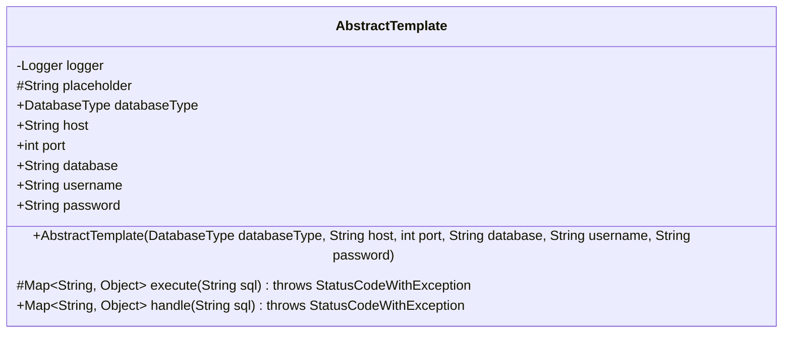
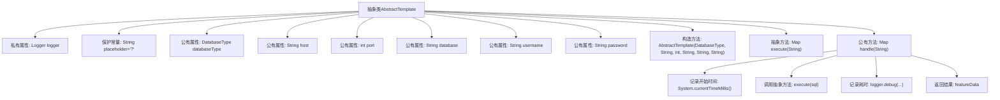

# 基础信息

|      |      |
|------|------|
| 名称 | AbstractTemplate |
| 编码语言 | .java |
| 代码路径 | WeFe/serving/serving-service/src/main/java/com/welab/wefe/serving/service/feature/sql/AbstractTemplate.java |
| 包名 | com.welab.wefe.serving.service.feature.sql |
| 依赖项 | ['com.welab.wefe.common.exception.StatusCodeWithException', 'com.welab.wefe.common.jdbc.base.DatabaseType', 'org.slf4j.Logger', 'org.slf4j.LoggerFactory', 'java.util.Map'] |
| 概述说明 | 抽象类AbstractTemplate定义数据库模板，包含类型、主机、端口等连接信息，提供执行SQL的抽象方法和带日志的处理方法。 |

# 说明

这是一个名为AbstractTemplate的抽象类，主要用于数据库操作模板。类中包含Logger日志记录器和一个常量占位符placeholder。定义了数据库连接相关字段：databaseType枚举表示数据库类型，host表示主机地址，port表示端口号，database表示数据库名，username和password表示登录凭证。通过构造函数初始化这些字段。提供了两个关键方法：execute是抽象方法需子类实现，用于执行SQL并返回特征数据映射；handle方法封装了执行流程，记录耗时并调用execute方法。整个类设计为数据库操作的模板基类，强制子类实现具体执行逻辑。

# 类列表 Class Summary

| 名称   | 类型  | 说明 |
|-------|------|-------------|
| AbstractTemplate | class | 抽象类AbstractTemplate定义数据库模板基类，包含连接参数和日志，提供执行SQL的抽象方法execute和带计时功能的handle方法。 |

## 类 AbstractTemplate

|      |      |
|------|------|
| 访问范围 | public abstract |
| 类型 | class |
| 名称 | AbstractTemplate |
| 说明 | 抽象类AbstractTemplate定义数据库模板基类，包含连接参数和日志，提供执行SQL的抽象方法execute和带计时功能的handle方法。 |

### UML类图

这段代码定义了一个名为`AbstractTemplate`的抽象类，主要用于数据库操作模板。类中包含数据库连接相关字段（如host、port、username等）和一个受保护的占位符常量。核心功能是通过`execute`抽象方法执行SQL语句，并由`handle`方法统一处理执行过程，包括记录执行时间。该类采用模板方法设计模式，强制子类实现具体的SQL执行逻辑，同时提供统一的执行流程控制。Logger用于记录调试信息，StatusCodeWithException是可能抛出的异常类型。

### 内部方法调用关系图

这段代码定义了一个抽象模板类AbstractTemplate，主要用于数据库操作。它包含数据库连接相关属性和一个执行SQL的模板方法handle。该模板方法记录了SQL执行时间，并通过抽象方法execute实现具体数据库操作，子类需要实现execute方法。类中包含数据库类型、主机、端口等连接信息，以及日志记录和时间统计功能，实现了执行SQL的通用流程框架。

### 字段列表 Field List

| 名称  | 类型  | 说明 |
|-------|-------|------|
| password | String | 公开字符串类型密码变量。 |
| placeholder = "?" | String | 保护性字符串常量，值为"?"。 |
| port | int | 声明一个公共整型变量port。 |
| logger = LoggerFactory.getLogger(getClass()) | Logger | 定义一个私有日志记录器，使用当前类名初始化。 |
| username | String | 声明一个公共字符串变量username。 |
| databaseType | DatabaseType | 声明一个DatabaseType类型的公共变量databaseType。 |
| host | String | 声明一个公共字符串变量host。 |
| database | String | 声明一个名为database的公共字符串变量。 |

### 方法列表

| 名称  | 类型  | 说明 |
|-------|-------|------|
| execute | Map<String, Object> | 抽象方法execute接收SQL字符串，返回Map<String, Object>，可能抛出StatusCodeWithException异常。 |
| handle | Map<String, Object> | 方法处理SQL查询，记录执行时间并返回结果数据。 |

