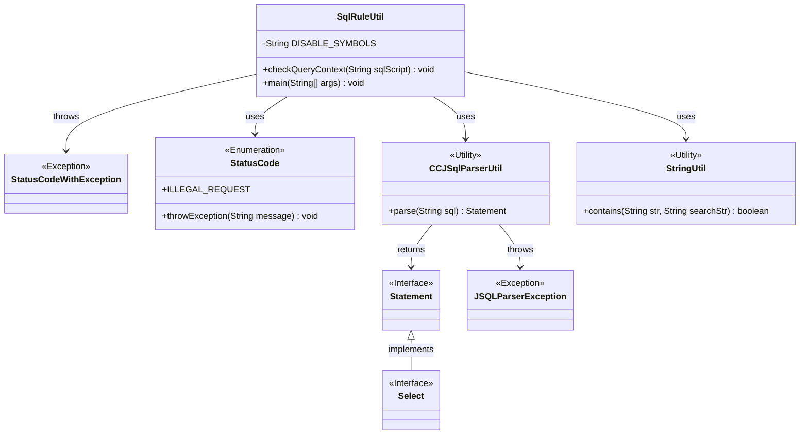
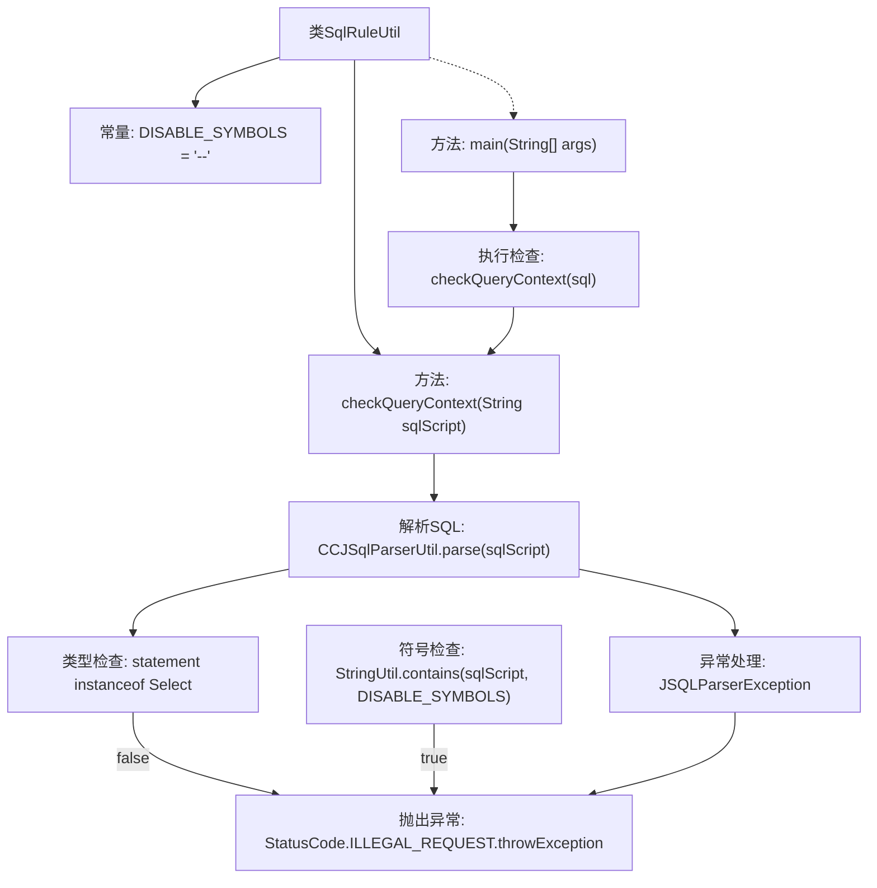

# 基础信息

|      |      |
|------|------|
| 名称 | SqlRuleUtil |
| 编码语言 | .java |
| 代码路径 | WeFe/serving/serving-service/src/main/java/com/welab/wefe/serving/service/feature/sql/SqlRuleUtil.java |
| 包名 | com.welab.wefe.serving.service.feature.sql |
| 依赖项 | ['com.welab.wefe.common.StatusCode', 'com.welab.wefe.common.exception.StatusCodeWithException', 'com.welab.wefe.common.util.StringUtil', 'net.sf.jsqlparser.JSQLParserException', 'net.sf.jsqlparser.parser.CCJSqlParserUtil', 'net.sf.jsqlparser.statement.Statement', 'net.sf.jsqlparser.statement.select.Select'] |
| 概述说明 | SqlRuleUtil类检查SQL脚本是否为合法查询，禁止注释符号"--"和非Select语句，否则抛出异常。 |

# 说明

SqlRuleUtil是一个用于检查SQL查询脚本的工具类，包含静态方法checkQueryContext。该方法首先使用CCJSqlParserUtil解析传入的SQL脚本，验证是否为SELECT语句。如果脚本包含禁用符号"--"或解析失败，均会抛出StatusCode.ILLEGAL_REQUEST异常。示例main方法演示了检查包含注释符号的SQL脚本时的异常抛出场景。

# 类列表 Class Summary

| 名称   | 类型  | 说明 |
|-------|------|-------------|
| SqlRuleUtil | class | SqlRuleUtil类检查SQL脚本是否为合法查询，禁止非Select语句和注释符号"--"，否则抛出异常。 |

## 类 SqlRuleUtil

|      |      |
|------|------|
| 访问范围 | public |
| 类型 | class |
| 名称 | SqlRuleUtil |
| 说明 | SqlRuleUtil类检查SQL脚本是否为合法查询，禁止非Select语句和注释符号"--"，否则抛出异常。 |

### UML类图

类图描述：该图展示了SqlRuleUtil工具类的结构及其依赖关系。SqlRuleUtil通过CCJSqlParserUtil解析SQL语句，使用StringUtil进行字符串检查，并可能抛出StatusCodeWithException异常。StatusCode枚举提供错误处理，Statement和Select接口表示SQL语句类型，JSQLParserException处理解析错误。整体实现SQL脚本的安全检查功能。

### 内部方法调用关系图

流程图描述：该流程图展示了SqlRuleUtil类的核心逻辑，主要包含SQL查询验证功能。流程从main方法启动，调用checkQueryContext方法后分为两条路径：1) 通过CCJSqlParserUtil解析SQL语句，若非Select类型则抛异常；2) 检查是否包含禁用符号"--"。两种异常情况都会触发StatusCode.ILLEGAL_REQUEST异常，确保只有合法的SELECT语句能通过验证。

### 字段列表 Field List

| 名称  | 类型  | 说明 |
|-------|-------|------|
| DISABLE_SYMBOLS = "--" | String | 定义常量字符串DISABLE_SYMBOLS，值为"--"。 |

### 方法列表

| 名称  | 类型  | 说明 |
|-------|-------|------|
| checkQueryContext | void | 检查SQL查询脚本合法性，仅允许SELECT语句且不含禁用符号，否则抛出异常。 |
| main | void | Java主方法执行SQL查询检查，包含SELECT语句和注释的删除表操作，调用checkQueryContext方法验证SQL上下文。 |

