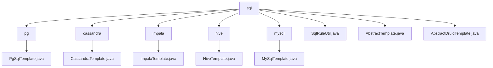

# 基础信息

|      |      |
|------|------|
| 名称 | sql |
| 编码语言 | .java |
| 代码路径 | WeFe/serving/serving-service/src/main/java/com/welab/wefe/serving/service/feature/sql |
| 包名 | docs.serving.serving-service.src.main.java.com.welab.wefe.serving.service.feature.sql |
| 概述说明 | PgSqlTemplate用于PostgreSQL连接，重写driver和url方法。ImpalaTemplate连接Impala，使用Hive驱动和Hive2协议。HiveTemplate连接Hive，重写driver和url。MySqlTemplate专用于MySQL，重写driver和url。SqlRuleUtil检查SQL脚本合法性。AbstractTemplate是数据库操作基类。AbstractDruidTemplate管理Druid连接池，子类需实现driver和url。 |

# 说明

## 概述  
该模块提供统一的数据库连接与SQL操作框架，核心职责为通过模板类封装多种数据库（PostgreSQL/Impala/Hive/MySQL）的JDBC连接与查询执行。接口规范遵循模板方法模式，父类定义执行流程（如连接池管理、异常处理），子类实现驱动加载和URL生成等差异化逻辑。关键数据结构包括连接池配置Map（DRUID_DATA_SOURCE）和特征数据结果Map。外部依赖包括Druid连接池、各数据库驱动（如PostgreSQL JDBC）及SQL解析器CCJSqlParser。例如PgSqlTemplate生成`jdbc:postgres://`格式URL，SqlRuleUtil则通过解析器验证SQL合法性。

## 主要业务场景  
模块支持跨数据库的特征数据查询，典型流程为：通过具体模板类（如HiveTemplate）建立连接池，执行SQL并映射结果。交互模式类似工厂方法，AbstractDruidTemplate统一管理连接池，子类处理协议差异（如Impala使用Hive2协议）。功能完整性体现在SQL安全校验（禁用注释符号）、连接池复用及异常统一处理。典型应用包括多源数据聚合分析，例如MySqlTemplate执行查询后返回Map结构数据。API类型涵盖连接管理（getConnection）、查询执行（execute）及规则检查（checkQueryContext）。

### 包内部结构视图

该流程图展示了WeFe项目中SQL特征服务的文件结构。根节点"sql"下包含6个子目录(pg/cassandra/impala/hive/mysql)和3个工具类文件。每个子目录分别包含对应的数据库模板实现类，如PgSqlTemplate.java、CassandraTemplate.java等，体现了多数据库支持的设计架构。

# 文件列表

| 名称   | 类型  | 说明 |
|-------|------|-------------|
| [SqlRuleUtil.java](SqlRuleUtil.md) | file | SqlRuleUtil类检查SQL脚本是否为合法查询，禁止注释符号"--"和非Select语句，否则抛出异常。 |
| [AbstractTemplate.java](AbstractTemplate.md) | file | 抽象类AbstractTemplate定义数据库模板，包含类型、主机、端口等连接信息，提供执行SQL的抽象方法和带日志的处理方法。 |
| [AbstractDruidTemplate.java](AbstractDruidTemplate.md) | file | 抽象类AbstractDruidTemplate继承AbstractTemplate，管理Druid连接池，包含连接超时等默认配置。提供执行SQL查询方法，返回结果集映射为Map。通过getConnection方法获取或创建连接池，确保线程安全。异常处理完善。 |
| [mysql](mysql/_module.md) | package | MySqlTemplate继承AbstractDruidTemplate，通过构造函数传入数据库连接参数，重写driver和url方法返回MySQL驱动和连接URL。 |
| [hive](hive/_module.md) | package | HiveTemplate继承AbstractDruidTemplate，通过构造函数传入数据库连接参数，重写driver和url方法返回Hive驱动和连接URL。 |
| [impala](impala/_module.md) | package | ImpalaTemplate继承AbstractDruidTemplate，通过构造函数初始化数据库连接参数，重写driver和url方法返回Hive驱动和连接URL。 |
| [cassandra](cassandra/_module.md) | package | 输入为空，无法生成概要描述。 |
| [pg](pg/_module.md) | package | PgSqlTemplate类继承AbstractDruidTemplate，用于PostgreSQL数据库连接，包含驱动和URL配置方法。 |

