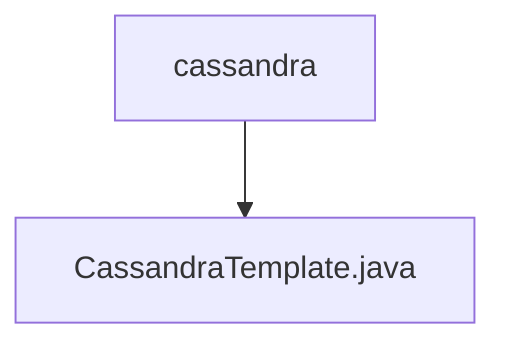

# 基础信息

|      |      |
|------|------|
| 名称 | cassandra |
| 编码语言 | .java |
| 代码路径 | WeFe/serving/serving-service/src/main/java/com/welab/wefe/serving/service/feature/sql/cassandra |
| 包名 | docs.serving.serving-service.src.main.java.com.welab.wefe.serving.service.feature.sql.cassandra |
| 概述说明 | 输入为空，无法生成概要描述。 |

# 说明

输入内容为空，无法生成总结描述。请提供需要总结的具体内容。

### 包内部结构视图

该流程图展示了WeFe项目中serving-service模块下Cassandra相关代码的层级结构。根节点为cassandra目录，其下包含一个CassandraTemplate.java实现文件，用于处理Cassandra数据库操作。这种简洁的树形结构体现了单一功能模块的典型代码组织方式，其中模板文件直接位于特征目录下。

# 文件列表

| 名称   | 类型  | 说明 |
|-------|------|-------------|
| [CassandraTemplate.java](CassandraTemplate.md) | file | 输入为空，无法生成概要描述。 |

