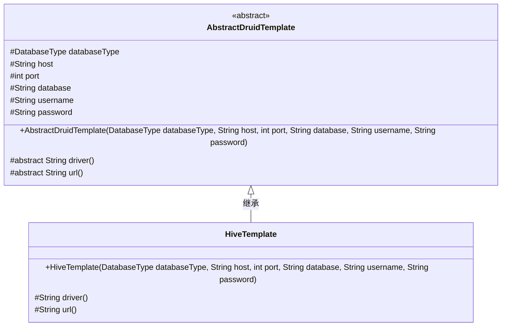
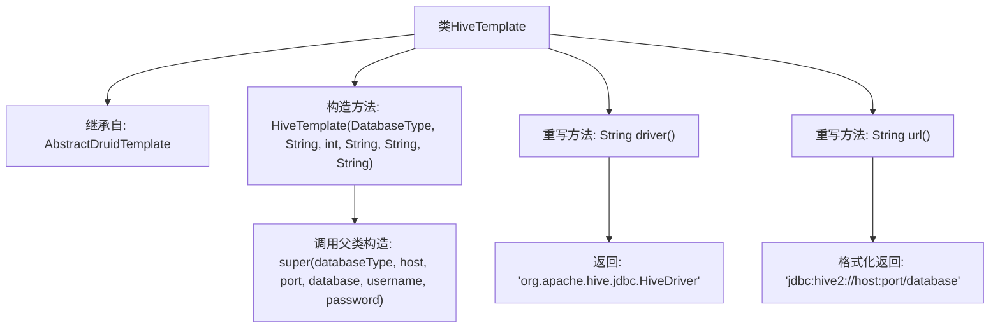

# 基础信息

|      |      |
|------|------|
| 名称 | HiveTemplate |
| 编码语言 | .java |
| 代码路径 | WeFe/serving/serving-service/src/main/java/com/welab/wefe/serving/service/feature/sql/hive/HiveTemplate.java |
| 包名 | com.welab.wefe.serving.service.feature.sql.hive |
| 依赖项 | ['com.welab.wefe.common.jdbc.base.DatabaseType', 'com.welab.wefe.serving.service.feature.sql.AbstractDruidTemplate'] |
| 概述说明 | HiveTemplate继承AbstractDruidTemplate，通过构造函数传入数据库连接参数，重写driver和url方法返回Hive驱动和连接URL。 |

# 说明

HiveTemplate类继承自AbstractDruidTemplate，用于连接Hive数据库。构造函数接收数据库类型、主机地址、端口号、数据库名称、用户名和密码参数。该类重写了driver方法，返回Hive的JDBC驱动类名；重写了url方法，生成Hive2协议的JDBC连接字符串，包含主机、端口和数据库信息。

# 类列表 Class Summary

| 名称   | 类型  | 说明 |
|-------|------|-------------|
| HiveTemplate | class | HiveTemplate继承AbstractDruidTemplate，通过构造函数传入数据库连接参数，重写driver和url方法返回Hive驱动和连接URL。 |

## 类 HiveTemplate

|      |      |
|------|------|
| 访问范围 | public |
| 类型 | class |
| 名称 | HiveTemplate |
| 说明 | HiveTemplate继承AbstractDruidTemplate，通过构造函数传入数据库连接参数，重写driver和url方法返回Hive驱动和连接URL。 |

### UML类图

这段类图展示了HiveTemplate继承自抽象类AbstractDruidTemplate的层级关系。AbstractDruidTemplate定义了数据库连接的基本属性和抽象方法(driver和url)，HiveTemplate通过具体实现这些方法来支持Hive数据库连接。其中driver()返回Hive的JDBC驱动类，url()按照Hive2协议格式生成连接字符串。整个设计体现了模板方法模式，父类控制流程，子类实现具体细节。

### 内部方法调用关系图

这段代码展示了一个继承自AbstractDruidTemplate的HiveTemplate类，主要用于配置Hive数据库连接。类中包含构造方法用于初始化连接参数，并重写了driver()和url()方法分别返回Hive驱动类名和格式化后的JDBC连接字符串。流程图清晰地呈现了类的继承关系、方法重写逻辑和关键字符串生成过程。

### 字段列表 Field List

| 名称  | 类型  | 说明 |
|-------|-------|------|

### 方法列表

| 名称  | 类型  | 说明 |
|-------|-------|------|
| driver | String | 重写driver方法，返回Hive JDBC驱动类名。 |
| url | String | 生成Hive数据库连接URL，格式为jdbc:hive2://主机:端口/数据库名。 |

