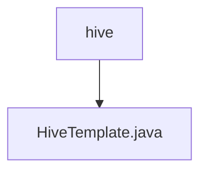

# 基础信息

|      |      |
|------|------|
| 名称 | hive |
| 编码语言 | .java |
| 代码路径 | WeFe/serving/serving-service/src/main/java/com/welab/wefe/serving/service/feature/sql/hive |
| 包名 | docs.serving.serving-service.src.main.java.com.welab.wefe.serving.service.feature.sql.hive |
| 概述说明 | HiveTemplate继承AbstractDruidTemplate，通过构造函数传入数据库连接参数，重写driver和url方法返回Hive驱动和连接URL。 |

# 说明

HiveTemplate类继承自AbstractDruidTemplate，用于连接Hive数据库。构造函数接收数据库类型、主机地址、端口号、数据库名称、用户名和密码参数。该类重写了driver方法，返回Hive的JDBC驱动类名；重写了url方法，生成Hive2协议的JDBC连接字符串，包含主机、端口和数据库信息。

### 包内部结构视图

该流程图展示了Hive目录与其包含的Java文件之间的层级关系。根节点为hive文件夹，其下直接包含一个HiveTemplate.java文件。结构简单明了，体现了Hive模板文件在项目中的存储位置，符合给定的两条路径信息。

# 文件列表

| 名称   | 类型  | 说明 |
|-------|------|-------------|
| [HiveTemplate.java](HiveTemplate.md) | file | HiveTemplate继承AbstractDruidTemplate，通过构造函数传入数据库连接参数，重写driver和url方法返回Hive驱动和连接URL。 |

