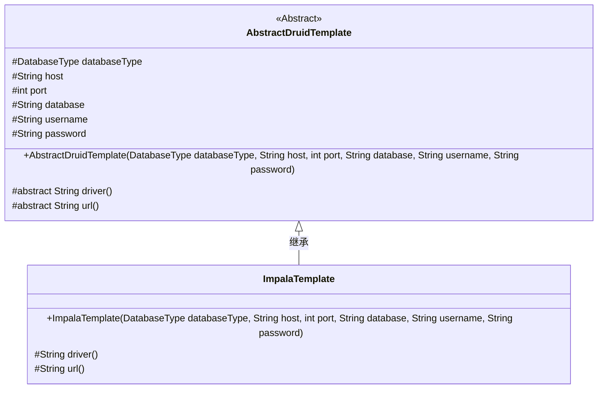
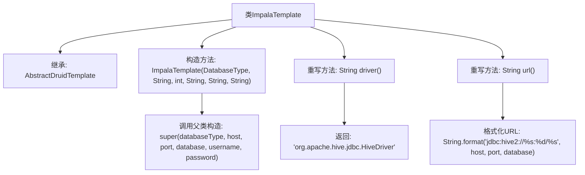

# 基础信息

|      |      |
|------|------|
| 名称 | ImpalaTemplate |
| 编码语言 | .java |
| 代码路径 | WeFe/serving/serving-service/src/main/java/com/welab/wefe/serving/service/feature/sql/impala/ImpalaTemplate.java |
| 包名 | com.welab.wefe.serving.service.feature.sql.impala |
| 依赖项 | ['com.welab.wefe.common.jdbc.base.DatabaseType', 'com.welab.wefe.serving.service.feature.sql.AbstractDruidTemplate'] |
| 概述说明 | ImpalaTemplate继承AbstractDruidTemplate，通过构造函数初始化数据库连接参数，重写driver和url方法返回Hive驱动和连接URL。 |

# 说明

ImpalaTemplate类继承自AbstractDruidTemplate，用于连接Impala数据库。构造函数接收数据库类型、主机地址、端口号、数据库名称、用户名和密码参数。该类重写了driver方法返回Hive驱动类路径，并重写url方法生成Hive2协议的JDBC连接字符串，格式为jdbc:hive2://主机:端口/数据库名。

# 类列表 Class Summary

| 名称   | 类型  | 说明 |
|-------|------|-------------|
| ImpalaTemplate | class | ImpalaTemplate继承AbstractDruidTemplate，通过构造函数初始化数据库连接参数，重写driver和url方法返回Hive驱动和连接字符串。 |

## 类 ImpalaTemplate

|      |      |
|------|------|
| 访问范围 | public |
| 类型 | class |
| 名称 | ImpalaTemplate |
| 说明 | ImpalaTemplate继承AbstractDruidTemplate，通过构造函数初始化数据库连接参数，重写driver和url方法返回Hive驱动和连接字符串。 |

### UML类图

该类图展示了ImpalaTemplate继承自抽象类AbstractDruidTemplate的关系。AbstractDruidTemplate定义了数据库连接的基本属性和抽象方法，ImpalaTemplate实现了具体的驱动和URL生成逻辑。抽象类包含受保护的数据库连接参数，子类通过重写driver()和url()方法提供Impala数据库特定的JDBC配置。

### 内部方法调用关系图

该流程图展示了ImpalaTemplate类的结构，它继承自AbstractDruidTemplate类。主要包含一个构造方法和两个重写方法：driver()返回Hive驱动类名，url()格式化生成Hive JDBC连接字符串。构造方法通过super调用父类构造器初始化数据库连接参数。整个设计实现了Impala数据库连接模板的定制化配置，特别针对Hive JDBC驱动进行了适配。

### 字段列表 Field List

| 名称  | 类型  | 说明 |
|-------|-------|------|

### 方法列表

| 名称  | 类型  | 说明 |
|-------|-------|------|
| url | String | 该方法生成Hive JDBC连接URL，格式为jdbc:hive2://主机:端口/数据库。 |
| driver | String | 代码重写driver方法，返回Hive JDBC驱动类名。 |

