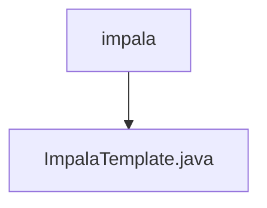

# 基础信息

|      |      |
|------|------|
| 名称 | impala |
| 编码语言 | .java |
| 代码路径 | WeFe/serving/serving-service/src/main/java/com/welab/wefe/serving/service/feature/sql/impala |
| 包名 | docs.serving.serving-service.src.main.java.com.welab.wefe.serving.service.feature.sql.impala |
| 概述说明 | ImpalaTemplate继承AbstractDruidTemplate，通过构造函数初始化数据库连接参数，重写driver和url方法返回Hive驱动和连接URL。 |

# 说明

ImpalaTemplate类继承自AbstractDruidTemplate，用于连接Impala数据库。构造函数接收数据库类型、主机地址、端口号、数据库名称、用户名和密码参数。该类重写了driver方法返回Hive驱动类路径，并重写url方法生成Hive2协议的JDBC连接字符串，格式为jdbc:hive2://主机:端口/数据库名。

### 包内部结构视图

该流程图展示了ImpalaTemplate.java文件位于impala目录下的层级关系。路径结构简洁明了，仅包含两层：父目录impala和其子文件ImpalaTemplate.java。这种结构常见于特定功能模块的实现类存放目录，体现了代码组织的最小化原则。

# 文件列表

| 名称   | 类型  | 说明 |
|-------|------|-------------|
| [ImpalaTemplate.java](ImpalaTemplate.md) | file | ImpalaTemplate继承AbstractDruidTemplate，通过构造函数初始化数据库连接参数，重写driver和url方法返回Hive驱动和连接URL。 |

