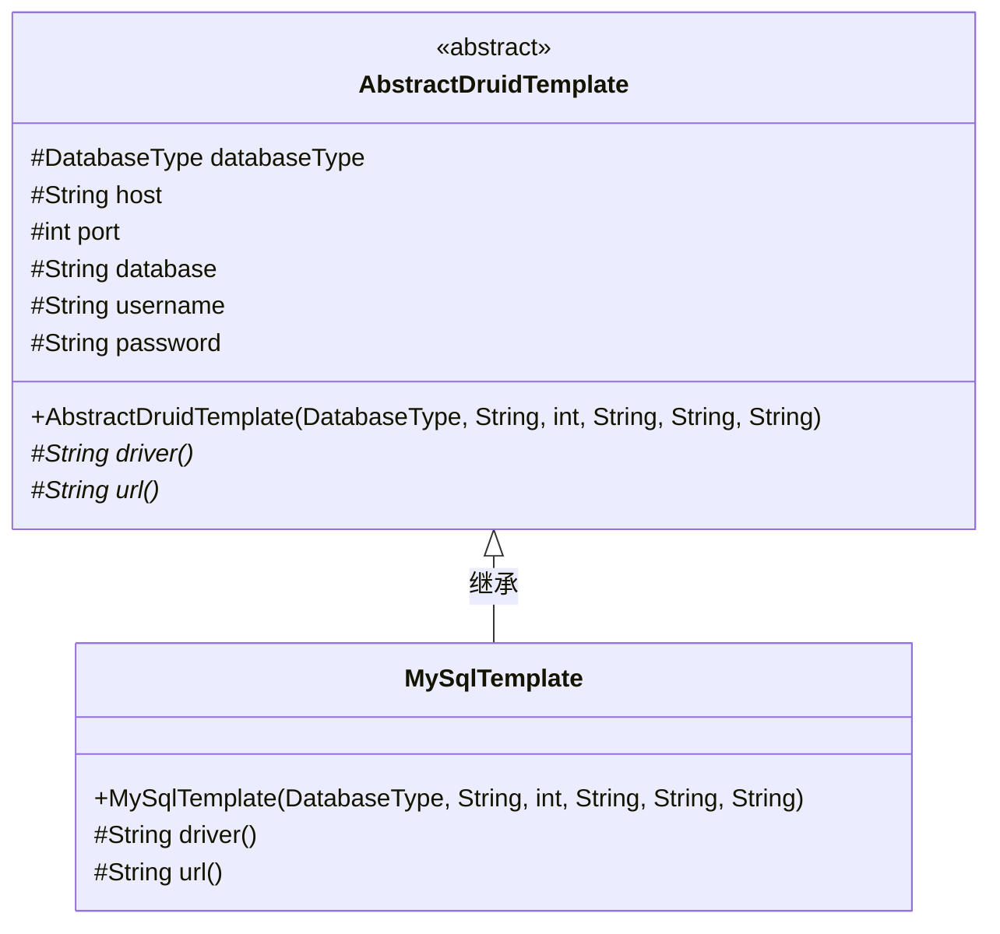
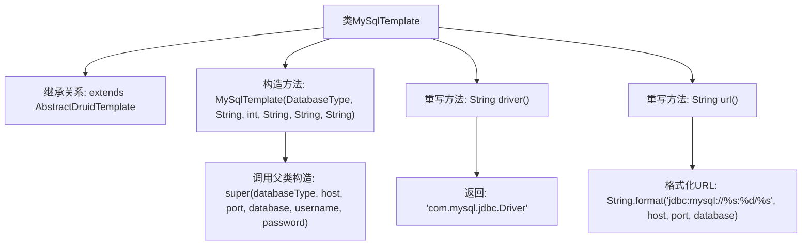

# 基础信息

|      |      |
|------|------|
| 名称 | MySqlTemplate |
| 编码语言 | .java |
| 代码路径 | WeFe/serving/serving-service/src/main/java/com/welab/wefe/serving/service/feature/sql/mysql/MySqlTemplate.java |
| 包名 | com.welab.wefe.serving.service.feature.sql.mysql |
| 依赖项 | ['com.welab.wefe.common.jdbc.base.DatabaseType', 'com.welab.wefe.serving.service.feature.sql.AbstractDruidTemplate'] |
| 概述说明 | MySqlTemplate继承AbstractDruidTemplate，通过构造函数传入数据库连接参数，重写driver和url方法返回MySQL驱动和连接URL。 |

# 说明

MySqlTemplate是一个继承自AbstractDruidTemplate的类，专门用于MySQL数据库连接。它通过构造函数接收数据库类型、主机地址、端口号、数据库名称、用户名和密码等参数，并传递给父类。该类重写了driver方法，返回MySQL的JDBC驱动类名，并重写了url方法，生成符合MySQL格式的JDBC连接字符串，包含主机、端口和数据库名。

# 类列表 Class Summary

| 名称   | 类型  | 说明 |
|-------|------|-------------|
| MySqlTemplate | class | MySqlTemplate继承AbstractDruidTemplate，通过构造函数传入数据库参数，重写driver和url方法返回MySQL驱动和连接URL。 |

## 类 MySqlTemplate

|      |      |
|------|------|
| 访问范围 | public |
| 类型 | class |
| 名称 | MySqlTemplate |
| 说明 | MySqlTemplate继承AbstractDruidTemplate，通过构造函数传入数据库参数，重写driver和url方法返回MySQL驱动和连接URL。 |

### UML类图

类图描述：该图展示了一个MySQL数据库连接模板的实现结构。抽象基类AbstractDruidTemplate定义了数据库连接所需的通用属性和抽象方法，包括驱动程序和连接URL的获取方法。具体子类MySqlTemplate继承基类并实现了这两个抽象方法，专门针对MySQL数据库提供具体的驱动类名和URL格式。通过继承关系，MySqlTemplate复用基类的连接参数和基础功能，同时实现特定于MySQL的细节。

### 内部方法调用关系图

该流程图展示了MySqlTemplate类的继承结构和关键方法实现。类继承自AbstractDruidTemplate，通过构造方法初始化数据库连接参数并调用父类构造器。重写的driver()方法返回MySQL驱动类名，url()方法通过格式化字符串生成MySQL标准连接地址。所有箭头清晰表示了类成员间的调用关系和数据流向。

### 字段列表 Field List

| 名称  | 类型  | 说明 |
|-------|-------|------|

### 方法列表

| 名称  | 类型  | 说明 |
|-------|-------|------|
| driver | String | 代码重写父类方法，返回MySQL的JDBC驱动类名。 |
| url | String | 该方法生成MySQL数据库连接URL，格式为jdbc:mysql://主机:端口/数据库名。 |

