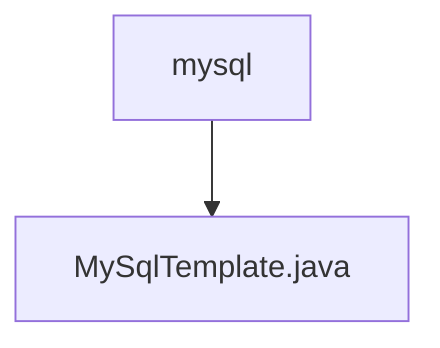

# 基础信息

|      |      |
|------|------|
| 名称 | mysql |
| 编码语言 | .java |
| 代码路径 | WeFe/serving/serving-service/src/main/java/com/welab/wefe/serving/service/feature/sql/mysql |
| 包名 | docs.serving.serving-service.src.main.java.com.welab.wefe.serving.service.feature.sql.mysql |
| 概述说明 | MySqlTemplate继承AbstractDruidTemplate，通过构造函数传入数据库连接参数，重写driver和url方法返回MySQL驱动和连接URL。 |

# 说明

MySqlTemplate是一个继承自AbstractDruidTemplate的类，专门用于MySQL数据库连接。它通过构造函数接收数据库类型、主机地址、端口号、数据库名称、用户名和密码等参数，并传递给父类。该类重写了driver方法，返回MySQL的JDBC驱动类名，并重写了url方法，生成符合MySQL格式的JDBC连接字符串，包含主机、端口和数据库名。

### 包内部结构视图

该流程图展示了MySQL相关代码文件的层级结构。顶层节点为mysql目录，其下包含一个具体的Java实现文件MySqlTemplate.java。这种结构常见于数据库操作相关的代码组织，其中模板类通常用于封装数据库操作的基本逻辑。

# 文件列表

| 名称   | 类型  | 说明 |
|-------|------|-------------|
| [MySqlTemplate.java](MySqlTemplate.md) | file | MySqlTemplate继承AbstractDruidTemplate，通过构造函数传入数据库连接参数，重写driver和url方法返回MySQL驱动和连接URL。 |

