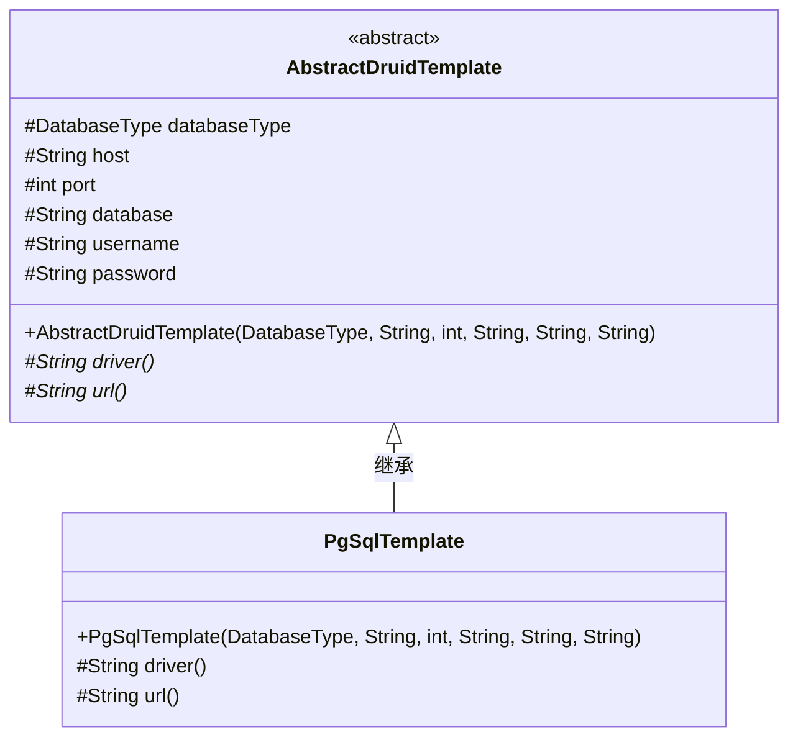
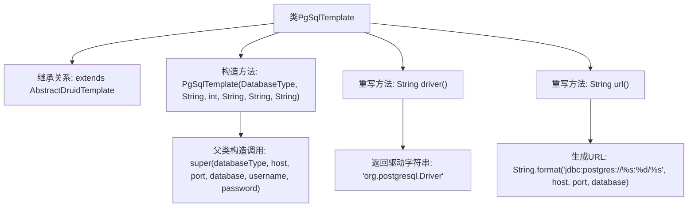

# 基础信息

|      |      |
|------|------|
| 名称 | PgSqlTemplate |
| 编码语言 | .java |
| 代码路径 | WeFe/serving/serving-service/src/main/java/com/welab/wefe/serving/service/feature/sql/pg/PgSqlTemplate.java |
| 包名 | com.welab.wefe.serving.service.feature.sql.pg |
| 依赖项 | ['com.welab.wefe.common.jdbc.base.DatabaseType', 'com.welab.wefe.serving.service.feature.sql.AbstractDruidTemplate'] |
| 概述说明 | PgSqlTemplate类继承AbstractDruidTemplate，用于PostgreSQL数据库连接，包含驱动和URL配置方法。 |

# 说明

PgSqlTemplate类继承自AbstractDruidTemplate，用于PostgreSQL数据库连接。构造函数接收数据库类型、主机地址、端口号、数据库名、用户名和密码参数，并传递给父类。该类重写了driver方法返回PostgreSQL驱动类名，并重写url方法生成PostgreSQL的JDBC连接字符串，格式为jdbc:postgres://主机:端口/数据库名。

# 类列表 Class Summary

| 名称   | 类型  | 说明 |
|-------|------|-------------|
| PgSqlTemplate | class | PgSqlTemplate类继承AbstractDruidTemplate，用于PostgreSQL数据库连接，包含驱动和URL配置。 |

## 类 PgSqlTemplate

|      |      |
|------|------|
| 访问范围 | public |
| 类型 | class |
| 名称 | PgSqlTemplate |
| 说明 | PgSqlTemplate类继承AbstractDruidTemplate，用于PostgreSQL数据库连接，包含驱动和URL配置。 |

### UML类图

这段类图展示了PgSqlTemplate继承自抽象类AbstractDruidTemplate的关系。AbstractDruidTemplate定义了数据库连接的基础属性和抽象方法，包括驱动名称(driver)和连接URL(url)的生成方法。PgSqlTemplate作为具体实现类，提供了PostgreSQL数据库特定的驱动类名和URL格式。通过继承机制，PgSqlTemplate复用父类的数据库连接参数，同时实现了特定的数据库驱动逻辑。

### 内部方法调用关系图

这段代码展示了一个PostgreSQL数据库模板类PgSqlTemplate，它继承自AbstractDruidTemplate抽象类。主要功能包括：通过构造方法初始化数据库连接参数，重写driver()方法返回PostgreSQL驱动类名，重写url()方法动态生成符合PostgreSQL规范的JDBC连接字符串。流程图清晰呈现了类的继承关系、构造方法参数传递、以及两个核心重写方法的实现逻辑，体现了模板方法模式在数据库连接管理中的应用。

### 字段列表 Field List

| 名称  | 类型  | 说明 |
|-------|-------|------|

### 方法列表

| 名称  | 类型  | 说明 |
|-------|-------|------|
| driver | String | Java方法重写，返回PostgreSQL驱动类名。 |
| url | String | 该方法生成PostgreSQL数据库连接URL，格式为jdbc:postgres://主机:端口/数据库名。 |

