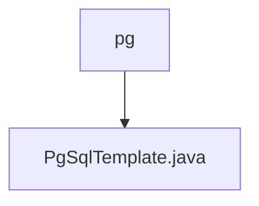

# 基础信息

|      |      |
|------|------|
| 名称 | pg |
| 编码语言 | .java |
| 代码路径 | WeFe/serving/serving-service/src/main/java/com/welab/wefe/serving/service/feature/sql/pg |
| 包名 | docs.serving.serving-service.src.main.java.com.welab.wefe.serving.service.feature.sql.pg |
| 概述说明 | PgSqlTemplate类继承AbstractDruidTemplate，用于PostgreSQL数据库连接，包含驱动和URL配置方法。 |

# 说明

PgSqlTemplate类继承自AbstractDruidTemplate，用于PostgreSQL数据库连接。构造函数接收数据库类型、主机地址、端口号、数据库名、用户名和密码参数，并传递给父类。该类重写了driver方法返回PostgreSQL驱动类名，并重写url方法生成PostgreSQL的JDBC连接字符串，格式为jdbc:postgres://主机:端口/数据库名。

### 包内部结构视图

该流程图展示了PostgreSQL相关代码的层级结构。pg作为父级目录，包含一个子文件PgSqlTemplate.java。这种简洁的结构表明这是一个专门处理PostgreSQL数据库操作的模块，可能包含SQL模板或查询构建功能。

# 文件列表

| 名称   | 类型  | 说明 |
|-------|------|-------------|
| [PgSqlTemplate.java](PgSqlTemplate.md) | file | PgSqlTemplate类继承AbstractDruidTemplate，用于PostgreSQL数据库连接，包含驱动和URL配置方法。 |

