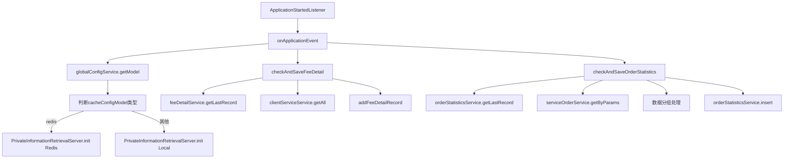
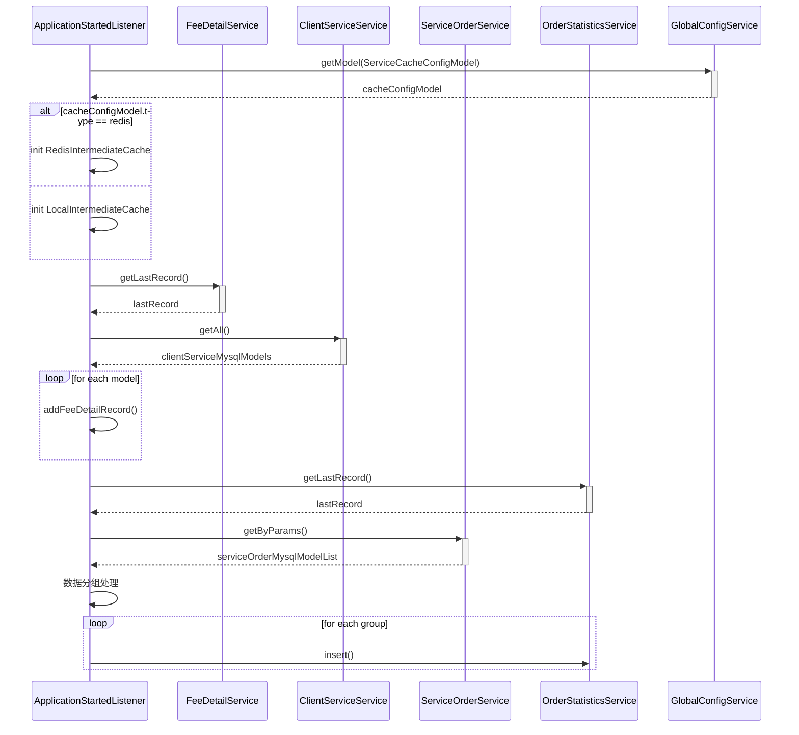

# 基础信息

|      |      |
|------|------|
| 名称 | ApplicationStartedListener |
| 编码语言 | .java |
| 代码路径 | WeFe/serving/serving-service/src/main/java/com/welab/wefe/serving/service/listener/ApplicationStartedListener.java |
| 包名 | com.welab.wefe.serving.service.listener |
| 依赖项 | ['java.math.BigDecimal', 'java.util.ArrayList', 'java.util.Calendar', 'java.util.Date', 'java.util.List', 'java.util.Map', 'java.util.stream.Collectors', 'org.slf4j.Logger', 'org.slf4j.LoggerFactory', 'org.springframework.beans.factory.annotation.Autowired', 'org.springframework.boot.context.event.ApplicationStartedEvent', 'org.springframework.context.ApplicationListener', 'org.springframework.stereotype.Component', 'com.welab.wefe.common.util.DateUtil', 'com.welab.wefe.mpc.pir.server.PrivateInformationRetrievalServer', 'com.welab.wefe.serving.service.database.entity.ClientServiceMysqlModel', 'com.welab.wefe.serving.service.database.entity.FeeConfigMysqlModel', 'com.welab.wefe.serving.service.database.entity.FeeDetailMysqlModel', 'com.welab.wefe.serving.service.database.entity.OrderStatisticsMysqlModel', 'com.welab.wefe.serving.service.database.entity.PartnerMysqlModel', 'com.welab.wefe.serving.service.database.entity.ServiceOrderMysqlModel', 'com.welab.wefe.serving.service.dto.ServiceOrderInput', 'com.welab.wefe.serving.service.dto.globalconfig.ServiceCacheConfigModel', 'com.welab.wefe.serving.service.enums.CallByMeEnum', 'com.welab.wefe.serving.service.enums.ServiceClientTypeEnum', 'com.welab.wefe.serving.service.enums.ServiceOrderEnum', 'com.welab.wefe.serving.service.service.ClientServiceService', 'com.welab.wefe.serving.service.service.FeeConfigService', 'com.welab.wefe.serving.service.service.FeeDetailService', 'com.welab.wefe.serving.service.service.OrderStatisticsService', 'com.welab.wefe.serving.service.service.PartnerService', 'com.welab.wefe.serving.service.service.ServiceOrderService', 'com.welab.wefe.serving.service.service.globalconfig.GlobalConfigService', 'com.welab.wefe.serving.service.utils.RedisIntermediateCache'] |
| 概述说明 | 应用启动监听器，初始化缓存配置并统计订单和费用数据。根据缓存类型选择Redis或本地缓存，分组统计订单状态，计算费用明细并保存。 |

# 说明

该代码是一个Spring组件，监听应用启动事件。主要功能包括初始化缓存配置、统计订单数据和保存费用明细。启动时检查并保存费用明细和订单统计数据。根据全局配置初始化缓存类型（Redis或本地），并记录日志。订单统计方法按服务、合作伙伴和时间分组计算成功和失败次数，生成统计记录并保存。费用明细方法获取客户服务信息，计算费用并保存明细记录，处理异常情况并记录日志。

# 类列表 Class Summary

| 名称   | 类型  | 说明 |
|-------|------|-------------|
| ApplicationStartedListener | class | 应用启动监听器，初始化缓存配置并统计订单和费用数据。根据缓存类型选择Redis或本地缓存，分组统计订单状态，计算费用明细并保存。 |

## 类 ApplicationStartedListener

|      |      |
|------|------|
| 访问范围 | @Component;public |
| 类型 | class |
| 名称 | ApplicationStartedListener |
| 说明 | 应用启动监听器，初始化缓存配置并统计订单和费用数据。根据缓存类型选择Redis或本地缓存，分组统计订单状态，计算费用明细并保存。 |

### UML类图

```mermaid
classDiagram
    class ApplicationStartedListener {
        -Logger logger
        -FeeDetailService feeDetailService
        -ClientServiceService clientServiceService
        -FeeConfigService feeConfigService
        -ServiceOrderService serviceOrderService
        -OrderStatisticsService orderStatisticsService
        -GlobalConfigService globalConfigService
        -PartnerService partnerService
        +onApplicationEvent(ApplicationStartedEvent event) void
        +checkAndSaveOrderStatistics() void
        +checkAndSaveFeeDetail() void
        +addFeeDetailRecord(String serviceId, String clientId, Date endTime) void
    }

    class FeeDetailService {
        <<Interface>>
        +getLastRecord() FeeDetailMysqlModel
        +save(FeeDetailMysqlModel model) void
    }

    class ClientServiceService {
        <<Interface>>
        +getAll() List~ClientServiceMysqlModel~
    }

    class FeeConfigService {
        <<Interface>>
        +queryOne(String serviceId, String clientId) FeeConfigMysqlModel
    }

    class ServiceOrderService {
        <<Interface>>
        +getByParams(ServiceOrderInput input) List~ServiceOrderMysqlModel~
    }

    class OrderStatisticsService {
        <<Interface>>
        +getLastRecord() OrderStatisticsMysqlModel
        +insert(OrderStatisticsMysqlModel model) void
    }

    class GlobalConfigService {
        <<Interface>>
        +getModel(Class~T~ clazz) T
    }

    class PartnerService {
        <<Interface>>
        +findOne(String clientId) PartnerMysqlModel
    }

    ApplicationStartedListener --> FeeDetailService : 依赖
    ApplicationStartedListener --> ClientServiceService : 依赖
    ApplicationStartedListener --> FeeConfigService : 依赖
    ApplicationStartedListener --> ServiceOrderService : 依赖
    ApplicationStartedListener --> OrderStatisticsService : 依赖
    ApplicationStartedListener --> GlobalConfigService : 依赖
    ApplicationStartedListener --> PartnerService : 依赖
```

这段代码定义了一个Spring组件`ApplicationStartedListener`，它实现了`ApplicationListener`接口，用于监听应用启动事件。该类通过自动注入多个服务接口（如`FeeDetailService`、`ClientServiceService`等），在应用启动时执行订单统计和费用明细检查保存操作。主要功能包括：1) 检查并保存订单统计数据；2) 检查并保存费用明细记录；3) 根据全局配置初始化缓存服务。类图清晰地展示了该类与各服务接口之间的依赖关系，体现了模块化设计和依赖注入的Spring特性。

### 内部方法调用关系图

这段代码实现了一个Spring应用启动监听器，主要功能包括：1) 检查并保存费用明细记录；2) 检查并保存订单统计数据；3) 根据全局配置初始化缓存服务。流程图展示了类方法调用关系，时序图详细描述了事件处理流程。代码通过自动装配多个服务类，在应用启动时执行数据校验和初始化操作，包含对Redis和本地缓存的差异化处理，以及复杂的数据分组统计逻辑。

### 字段列表 Field List

| 名称  | 类型  | 说明 |
|-------|-------|------|
| serviceOrderService | ServiceOrderService | 自动注入ServiceOrderService实例。 |
| feeConfigService | FeeConfigService | 自动注入FeeConfigService服务实例。 |
| logger = LoggerFactory.getLogger(ApplicationStartedListener.class) | Logger | 定义静态常量logger，使用LoggerFactory获取ApplicationStartedListener类的日志记录器实例。 |
| feeDetailService | FeeDetailService | 自动注入FeeDetailService服务实例。 |
| clientServiceService | ClientServiceService | 使用@Autowired自动注入ClientServiceService实例。 |
| partnerService | PartnerService | 使用@Autowired自动注入PartnerService实例。 |
| globalConfigService | GlobalConfigService | 使用@Autowired自动注入GlobalConfigService实例。 |
| orderStatisticsService | OrderStatisticsService | 使用@Autowired自动注入OrderStatisticsService服务实例。 |

### 方法列表

| 名称  | 类型  | 说明 |
|-------|-------|------|
| onApplicationEvent | void | 应用启动时检查并保存费用和订单统计，根据缓存配置初始化私有信息检索服务，支持Redis或本地缓存。 |
| checkAndSaveOrderStatistics | void | 方法`checkAndSaveOrderStatistics`用于统计并保存订单数据。流程：获取最新统计时间，查询指定时间段的订单，按服务ID、合作方ID和时间分组，计算成功和失败次数，生成统计记录并保存。 |
| checkAndSaveFeeDetail | void | 方法检查并保存费用明细：获取所有客户服务，查询最后记录时间，遍历服务列表，跳过无效或激活类型，统计开通服务并添加费用记录。 |
| addFeeDetailRecord | void | 该方法用于添加费用明细记录，根据服务ID、客户ID和结束时间查询订单，计算总费用并保存明细。包含异常处理和日志记录。 |

