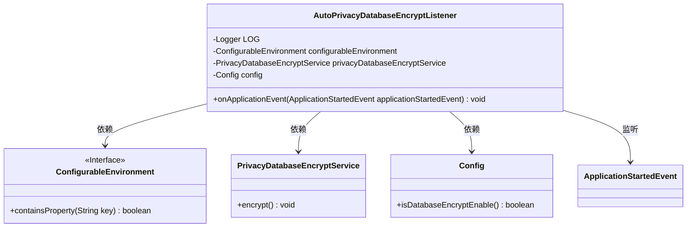
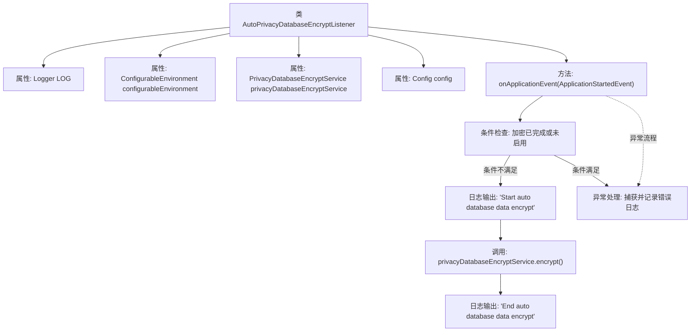

# 基础信息

|      |      |
|------|------|
| 名称 | AutoPrivacyDatabaseEncryptListener |
| 编码语言 | .java |
| 代码路径 | WeFe/serving/serving-service/src/main/java/com/welab/wefe/serving/service/listener/AutoPrivacyDatabaseEncryptListener.java |
| 包名 | com.welab.wefe.serving.service.listener |
| 依赖项 | ['com.welab.wefe.serving.service.config.Config', 'com.welab.wefe.serving.service.service.PrivacyDatabaseEncryptService', 'org.slf4j.Logger', 'org.slf4j.LoggerFactory', 'org.springframework.beans.factory.annotation.Autowired', 'org.springframework.boot.context.event.ApplicationStartedEvent', 'org.springframework.context.ApplicationListener', 'org.springframework.core.env.ConfigurableEnvironment', 'org.springframework.stereotype.Component'] |
| 概述说明 | 这是一个Spring组件类，监听应用启动事件，在配置启用且未完成加密时自动执行数据库加密服务，记录操作日志和异常。 |

# 说明

这是一个名为AutoPrivacyDatabaseEncryptListener的Spring组件类，实现了ApplicationListener接口用于监听应用启动事件。该类包含三个自动注入的依赖项：ConfigurableEnvironment、PrivacyDatabaseEncryptService和Config配置对象。当应用启动时，它会检查是否已完成数据库加密或加密功能被禁用，若未完成且启用加密功能，则调用隐私数据库加密服务执行加密操作，并记录开始和结束日志。若加密过程中出现异常，会记录错误日志。整个过程实现了数据库数据的自动加密功能。

# 类列表 Class Summary

| 名称   | 类型  | 说明 |
|-------|------|-------------|
| AutoPrivacyDatabaseEncryptListener | class | 这是一个Spring组件类，监听应用启动事件，在数据库加密未完成且配置启用时自动执行隐私数据加密服务，记录操作日志和异常。 |

## 类 AutoPrivacyDatabaseEncryptListener

|      |      |
|------|------|
| 访问范围 | @Component;public |
| 类型 | class |
| 名称 | AutoPrivacyDatabaseEncryptListener |
| 说明 | 这是一个Spring组件类，监听应用启动事件，在数据库加密未完成且配置启用时自动执行隐私数据加密服务，记录操作日志和异常。 |

### UML类图

类图描述：该图展示了AutoPrivacyDatabaseEncryptListener类及其依赖关系。该类实现了ApplicationListener接口，监听ApplicationStartedEvent事件，并依赖ConfigurableEnvironment、PrivacyDatabaseEncryptService和Config三个组件。当应用启动时，若满足条件，该监听器会调用加密服务对数据库数据进行加密处理。图中清晰展示了各组件间的协作关系。

### 内部方法调用关系图

这段代码是一个Spring组件，用于监听应用启动事件并自动执行数据库加密操作。流程图展示了从事件触发到加密完成的完整流程：首先检查加密条件（是否已完成或未启用），若条件允许则调用加密服务并记录过程日志，出现异常时捕获并记录错误。该组件通过环境变量和配置控制加密行为，确保数据安全性的自动化处理。

### 字段列表 Field List

| 名称  | 类型  | 说明 |
|-------|-------|------|
| privacyDatabaseEncryptService | PrivacyDatabaseEncryptService | 使用@Autowired自动注入隐私数据库加密服务实例。 |
| LOG = LoggerFactory.getLogger(AutoPrivacyDatabaseEncryptListener.class) | Logger | 类AutoPrivacyDatabaseEncryptListener的静态日志常量LOG，通过LoggerFactory获取。 |
| config | Config | 自动注入Config配置实例。 |
| configurableEnvironment | ConfigurableEnvironment | 在Spring框架中，使用@Autowired自动注入ConfigurableEnvironment对象，用于访问和配置应用环境属性。 |

### 方法列表

| 名称  | 类型  | 说明 |
|-------|-------|------|
| onApplicationEvent | void | 方法处理应用启动事件，检查数据库加密配置。若无需加密则返回，否则执行加密服务并记录日志，捕获异常并记录错误。 |

