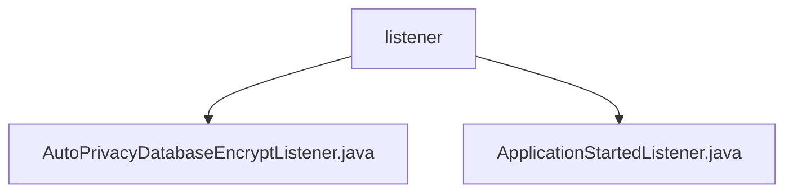

# 基础信息

|      |      |
|------|------|
| 名称 | listener |
| 编码语言 | .java |
| 代码路径 | WeFe/serving/serving-service/src/main/java/com/welab/wefe/serving/service/listener |
| 包名 | docs.serving.serving-service.src.main.java.com.welab.wefe.serving.service.listener |
| 概述说明 | AutoPrivacyDatabaseEncryptListener是Spring组件，监听启动事件，自动检查并执行数据库加密，记录日志。ApplicationStartedListener监听启动，初始化缓存，统计订单数据，保存费用明细，处理异常并记录日志。 |

# 说明

## 概述  
该模块是Spring应用启动监听器的集合，核心职责是响应应用启动事件，执行初始化任务和自动化处理（如数据库加密、缓存配置和订单统计）。接口规范遵循ApplicationListener接口，统一处理ContextRefreshedEvent事件。关键数据结构包括ConfigurableEnvironment（环境配置）、PrivacyDatabaseEncryptService（加密服务）和统计订单的DTO对象。外部依赖项包括Spring Framework、Redis（可选缓存）和日志框架。例如AutoPrivacyDatabaseEncryptListener实现自动数据库加密，ApplicationStartedListener处理缓存初始化和订单统计。

## 主要业务场景  
模块整合了两种启动处理流程：数据库加密流程类似安全防护机制，先检查配置再触发加密服务；统计初始化流程类似ETL过程，包含订单分组计算和费用明细生成。典型交互模式为事件驱动，通过监听器响应应用启动事件。完整功能覆盖从数据安全（加密）到业务监控（统计），例如按服务类型统计成功/失败订单，或基于客户信息生成费用明细。API类型为Spring事件监听器，集成案例包括Redis缓存初始化与本地缓存降级方案。

### 包内部结构视图

该流程图展示了WeFe服务项目中监听器模块的层级结构。根节点为listener文件夹，包含两个Java监听器实现类：AutoPrivacyDatabaseEncryptListener和ApplicationStartedListener。这两个文件都直接隶属于listener目录，没有更深层级的嵌套关系，体现了简洁的监听器组件结构。

# 文件列表

| 名称   | 类型  | 说明 |
|-------|------|-------------|
| [AutoPrivacyDatabaseEncryptListener.java](AutoPrivacyDatabaseEncryptListener.md) | file | 这是一个Spring组件类，监听应用启动事件，在配置启用且未完成加密时自动执行数据库加密服务，记录操作日志和异常。 |
| [ApplicationStartedListener.java](ApplicationStartedListener.md) | file | 应用启动监听器，初始化缓存配置并统计订单和费用数据。根据缓存类型选择Redis或本地缓存，分组统计订单状态，计算费用明细并保存。 |

