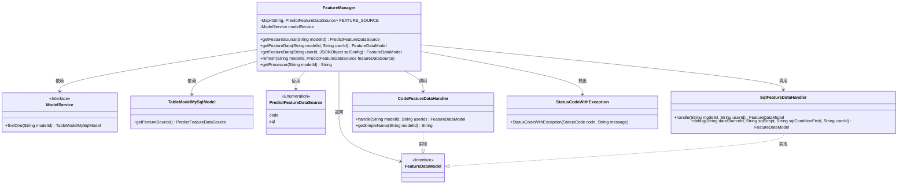
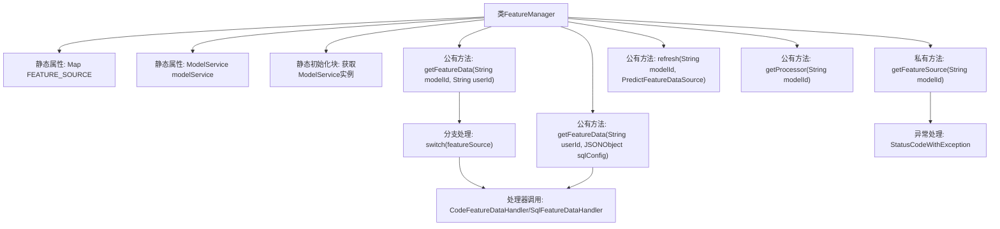

# 基础信息

|      |      |
|------|------|
| 名称 | FeatureManager |
| 编码语言 | .java |
| 代码路径 | WeFe/serving/serving-service/src/main/java/com/welab/wefe/serving/service/manager/FeatureManager.java |
| 包名 | com.welab.wefe.serving.service.manager |
| 依赖项 | ['com.alibaba.fastjson.JSONObject', 'com.welab.wefe.common.StatusCode', 'com.welab.wefe.common.exception.StatusCodeWithException', 'com.welab.wefe.common.web.Launcher', 'com.welab.wefe.common.wefe.enums.PredictFeatureDataSource', 'com.welab.wefe.serving.sdk.model.FeatureDataModel', 'com.welab.wefe.serving.service.database.entity.TableModelMySqlModel', 'com.welab.wefe.serving.service.feature.CodeFeatureDataHandler', 'com.welab.wefe.serving.service.feature.SqlFeatureDataHandler', 'com.welab.wefe.serving.service.service.ModelService', 'java.util.HashMap', 'java.util.Map', 'com.welab.wefe.common.StatusCode.UNEXPECTED_ENUM_CASE'] |
| 概述说明 | FeatureManager类管理特征数据源，提供获取特征数据的方法，支持代码和SQL两种来源，包含缓存机制和刷新功能。 |

# 说明

FeatureManager类是一个管理特征数据的工具类，主要功能包括获取特征数据源和处理特征数据。它使用静态Map缓存特征数据源，通过modelId获取对应的数据源。类中包含同步方法确保线程安全，支持通过代码、SQL查询等方式获取特征数据。还提供了刷新缓存和获取处理器名称的方法。整个类设计为静态方法调用，依赖于ModelService进行数据查询。

# 类列表 Class Summary

| 名称   | 类型  | 说明 |
|-------|------|-------------|
| FeatureManager | class | FeatureManager类管理特征数据源，提供获取特征数据的方法，支持代码和SQL两种方式，包含缓存机制和刷新功能。 |

## 类 FeatureManager

|      |      |
|------|------|
| 访问范围 | public |
| 类型 | class |
| 名称 | FeatureManager |
| 说明 | FeatureManager类管理特征数据源，提供获取特征数据的方法，支持代码和SQL两种方式，包含缓存机制和刷新功能。 |

### UML类图

该代码展示了一个特征管理器(FeatureManager)的核心结构，它通过静态缓存(FEATURE_SOURCE)管理不同模型的特征数据源。主要功能包括：通过模型ID获取特征数据源、根据不同类型(代码/SQL)处理特征数据、支持动态刷新缓存等。系统采用策略模式，通过CodeFeatureDataHandler和SqlFeatureDataHandler分别处理不同来源的特征数据，同时依赖ModelService接口获取模型元数据。整个设计体现了缓存管理、策略模式和依赖注入的思想。

### 内部方法调用关系图

流程图描述了FeatureManager类的核心结构和调用关系。该类主要管理特征数据源缓存(FEATURE_SOURCE)和模型服务(modelService)，提供四种关键方法：通过modelId获取特征源(getFeatureSource)、获取特征数据(getFeatureData的两个重载版本)、刷新缓存(refresh)以及获取处理器名称(getProcessor)。其中getFeatureData方法会根据特征源类型(code/sql)选择不同的处理器(CodeFeatureDataHandler/SqlFeatureDataHandler)进行处理，并包含完整的异常处理机制。静态初始化块确保modelService在类加载时完成初始化。

### 字段列表 Field List

| 名称  | 类型  | 说明 |
|-------|-------|------|
| modelService | ModelService | 私有静态不可变模型服务实例。 |
| FEATURE_SOURCE = new HashMap<>() | Map<String, PredictFeatureDataSource> | 定义静态哈希映射FEATURE_SOURCE，键为字符串，值为PredictFeatureDataSource类型。 |

### 方法列表

| 名称  | 类型  | 说明 |
|-------|-------|------|
| getFeatureData | FeatureDataModel | 静态方法getFeatureData通过userId和sqlConfig获取特征数据，解析dataSourceId、sqlScript和sqlConditionField后调用SqlFeatureDataHandler.debug返回结果。 |
| getFeatureSource | PredictFeatureDataSource | 方法getFeatureSource根据modelId获取特征数据源。若缓存中存在则直接返回，否则同步查询数据库并缓存结果。若modelId无效则抛出异常。 |
| getFeatureData | FeatureDataModel | 静态方法getFeatureData根据modelId和userId获取特征数据，通过判断特征源类型（代码或SQL）调用对应处理器，异常时抛出StatusCodeWithException。 |
| refresh | void | 同步方法refresh更新模型ID对应的特征数据源。 |
| getProcessor | String | 静态方法getProcessor通过modelId调用CodeFeatureDataHandler的getSimpleName方法，返回简化名称字符串。 |

