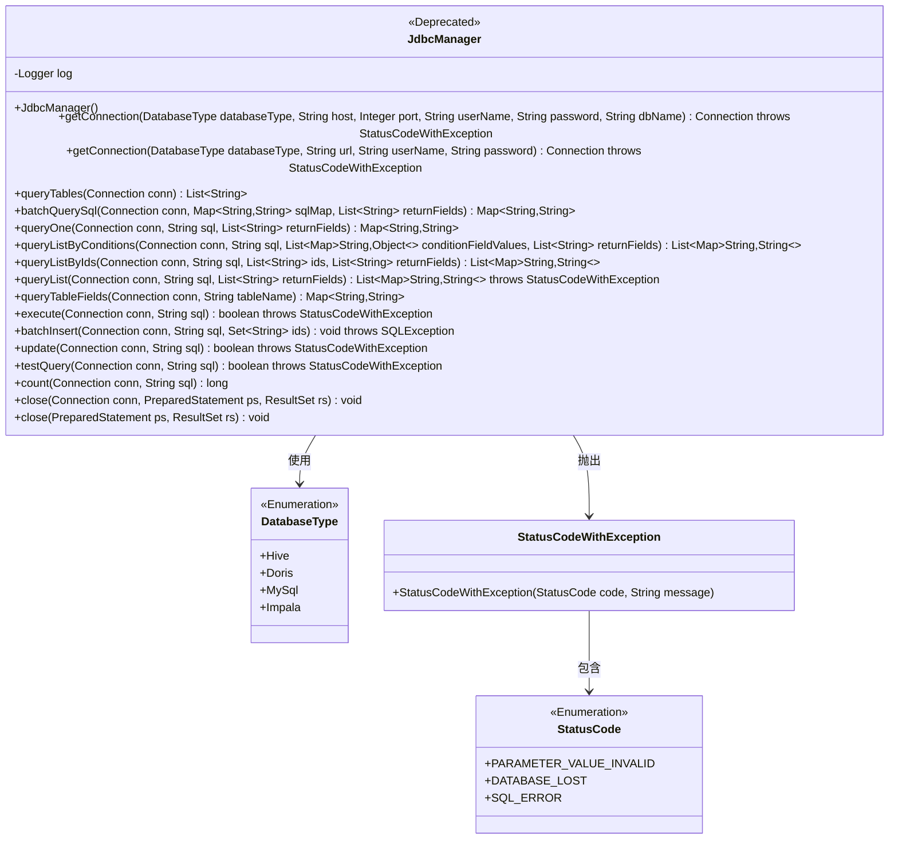

# 基础信息

|      |      |
|------|------|
| 名称 | JdbcManager |
| 编码语言 | .java |
| 代码路径 | WeFe/serving/serving-service/src/main/java/com/welab/wefe/serving/service/manager/JdbcManager.java |
| 包名 | com.welab.wefe.serving.service.manager |
| 依赖项 | ['java.sql.Connection', 'java.sql.DriverManager', 'java.sql.PreparedStatement', 'java.sql.ResultSet', 'java.sql.SQLException', 'java.util.ArrayList', 'java.util.HashMap', 'java.util.LinkedHashMap', 'java.util.List', 'java.util.Map', 'java.util.Set', 'org.slf4j.Logger', 'org.slf4j.LoggerFactory', 'com.nimbusds.jose.shaded.json.JSONObject', 'com.welab.wefe.common.StatusCode', 'com.welab.wefe.common.exception.StatusCodeWithException', 'com.welab.wefe.common.jdbc.base.DatabaseType'] |
| 概述说明 | 废弃的JdbcManager类，提供多种数据库连接和查询方法，支持Hive、Doris、MySQL等，包含连接管理、批量查询、表字段查询等功能。 |

# 说明

JdbcManager是一个已标记为过时的Java类，用于管理多种数据库连接和操作。它支持Hive、Doris、MySQL和Impala数据库，提供基于IP端口或URL的连接建立方法。类包含查询表结构、批量查询、条件查询、分页查询、数据插入更新等核心功能，所有操作都记录执行时间。通过PreparedStatement防止SQL注入，使用连接池管理资源，包含完善的异常处理和资源释放机制。类采用日志记录关键操作信息，支持事务处理和批量插入优化。

# 类列表 Class Summary

| 名称   | 类型  | 说明 |
|-------|------|-------------|
| JdbcManager | class | 废弃的JdbcManager类，提供多种数据库连接和查询方法，支持Hive、Doris、MySQL等，包含连接管理、表查询、批量操作等功能。 |

## 类 JdbcManager

|      |      |
|------|------|
| 访问范围 | @Deprecated;public |
| 类型 | class |
| 名称 | JdbcManager |
| 说明 | 废弃的JdbcManager类，提供多种数据库连接和查询方法，支持Hive、Doris、MySQL等，包含连接管理、表查询、批量操作等功能。 |

### UML类图

这段代码展示了一个已标记为@Deprecated的JdbcManager类，主要用于管理JDBC数据库连接和执行SQL操作。该类支持多种数据库类型（Hive/Doris/MySQL/Impala），提供连接获取、表查询、批量操作、字段查询等功能，并通过枚举类型DatabaseType和StatusCode进行类型安全控制。所有数据库操作都包含完善的异常处理和资源关闭机制，通过日志记录执行时间，但设计上已不推荐使用，可能被更现代的持久层方案替代。

### 内部方法调用关系图

```mermaid
graph TD
    A["类JdbcManager"]
    B["属性: Logger log"]
    C["构造方法: JdbcManager()"]
    D["方法: getConnection(DatabaseType, String, Integer, String, String, String)"]
    E["方法: getConnection(DatabaseType, String, String, String)"]
    F["方法: queryTables(Connection)"]
    G["方法: batchQuerySql(Connection, Map, List)"]
    H["方法: queryOne(Connection, String, List)"]
    I["方法: queryListByConditions(Connection, String, List, List)"]
    J["方法: queryListByIds(Connection, String, List, List)"]
    K["方法: queryList(Connection, String, List)"]
    L["方法: queryTableFields(Connection, String)"]
    M["方法: execute(Connection, String)"]
    N["方法: batchInsert(Connection, String, Set)"]
    O["方法: update(Connection, String)"]
    P["方法: testQuery(Connection, String)"]
    Q["方法: count(Connection, String)"]
    R["方法: close(Connection, PreparedStatement, ResultSet)"]
    S["方法: close(PreparedStatement, ResultSet)"]

    A --> B
    A --> C
    A --> D
    A --> E
    A --> F
    A --> G
    A --> H
    A --> I
    A --> J
    A --> K
    A --> L
    A --> M
    A --> N
    A --> O
    A --> P
    A --> Q
    A --> R
    A --> S
```

这段代码定义了一个已弃用的JDBC管理类JdbcManager，主要用于处理多种数据库（如Hive、Doris、MySQL、Impala）的连接和操作。它提供了丰富的数据库操作方法，包括获取连接、查询表结构、执行SQL语句、批量插入数据等。所有方法都包含详细的日志记录和资源清理机制，通过try-catch-finally结构确保资源释放。类中特别处理了多种数据库驱动加载和URL生成逻辑，并针对不同数据库类型进行了适配。异常处理机制完善，通过StatusCodeWithException抛出特定状态码的异常。

### 字段列表 Field List

| 名称  | 类型  | 说明 |
|-------|-------|------|
| log = LoggerFactory.getLogger(JdbcManager.class) | Logger | 声明一个静态不可变日志对象，用于JdbcManager类的日志记录。 |

### 方法列表

| 名称  | 类型  | 说明 |
|-------|-------|------|
| queryTables | List<String> | 该方法通过JDBC连接查询数据库表名列表，记录开始时间，执行SQL并处理结果集，异常时记录错误，最后关闭资源并记录耗时。 |
| getConnection | Connection | 该方法根据数据库类型生成连接URL并获取数据库连接，支持Hive、Doris、MySql和Impala，失败时抛出异常。 |
| batchInsert | void | 方法batchInsert批量插入数据，关闭自动提交，每5万条执行一次批处理并提交，最后关闭连接记录耗时。 |
| execute | boolean | 该方法执行SQL语句，记录开始时间和耗时，成功返回true，失败返回false并关闭资源。 |
| testQuery | boolean | 方法testQuery测试数据库查询，记录开始时间和耗时，执行SQL并返回结果是否存在，异常时记录错误并返回false，最后关闭资源。 |
| queryListByIds | List<Map<String, String>> | Java方法：批量查询数据库，每10个ID一组执行SQL，返回字段映射列表，记录耗时并处理异常。 |
| queryListByConditions | List<Map<String, String>> | 该方法通过SQL查询数据库，根据条件列表和返回字段列表生成结果集。使用预处理语句防止SQL注入，记录执行时间，处理异常并确保资源释放。返回字段名和值的映射列表。 |
| queryList | List<Map<String, String>> | 该方法执行SQL查询并返回字段映射列表。使用流式获取数据，处理异常并记录耗时。返回结果包含指定字段的值。 |
| queryTableFields | Map<String, String> | 该方法通过JDBC查询数据库表结构，返回字段名和类型的映射。记录执行时间，处理异常并确保资源释放。 |
| getConnection | Connection | 该方法根据数据库类型加载驱动并建立连接，支持Hive、Doris、MySQL和Impala，失败时抛出异常。 |
| queryOne | Map<String, String> | 方法queryOne执行SQL查询，返回字段映射。记录开始时间、错误处理和耗时，最后关闭连接。 |
| count | long | 该方法通过JDBC执行SQL查询统计记录数，替换原SQL为count(*)，设置结果集参数，捕获异常并记录耗时，最后返回总数。 |
| close | void | 关闭数据库连接、预处理语句和结果集，捕获并记录异常。 |
| update | boolean | 该方法通过JDBC执行SQL更新操作，记录开始时间，创建预处理语句执行更新，返回是否成功，捕获异常记录错误，最后关闭资源并记录耗时。 |
| batchQuerySql | Map<String, String> | 批量查询SQL方法，使用JDBC连接执行多个SQL语句，返回字段映射的JSON字符串，处理空结果并记录查询耗时。 |
| close | void | 关闭数据库资源：先关闭ResultSet，再关闭PreparedStatement，捕获并记录异常。 |

