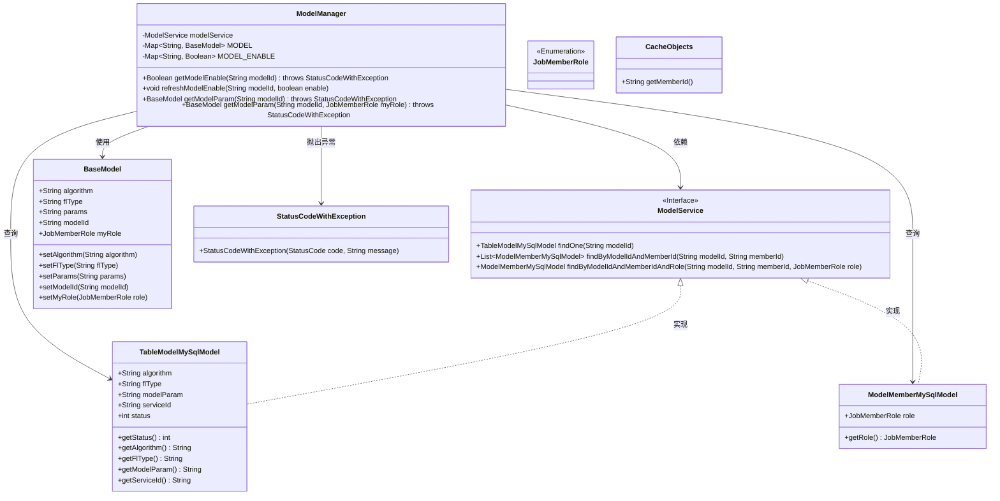
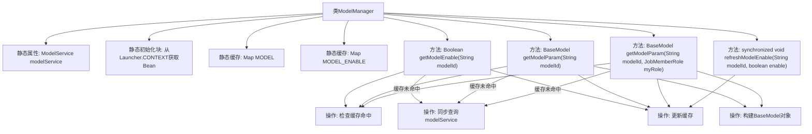

# 基础信息

|      |      |
|------|------|
| 名称 | ModelManager |
| 编码语言 | .java |
| 代码路径 | WeFe/serving/serving-service/src/main/java/com/welab/wefe/serving/service/manager/ModelManager.java |
| 包名 | com.welab.wefe.serving.service.manager |
| 依赖项 | ['com.welab.wefe.common.StatusCode', 'com.welab.wefe.common.exception.StatusCodeWithException', 'com.welab.wefe.common.web.Launcher', 'com.welab.wefe.common.wefe.enums.JobMemberRole', 'com.welab.wefe.serving.sdk.model.BaseModel', 'com.welab.wefe.serving.service.database.entity.ModelMemberMySqlModel', 'com.welab.wefe.serving.service.database.entity.TableModelMySqlModel', 'com.welab.wefe.serving.service.service.CacheObjects', 'com.welab.wefe.serving.service.service.ModelService', 'java.util.HashMap', 'java.util.List', 'java.util.Map'] |
| 概述说明 | ModelManager类管理模型状态和参数，通过静态缓存提升性能。提供获取模型启用状态、模型参数及刷新状态的方法，确保线程安全并处理异常情况。 |

# 说明

ModelManager类是一个管理模型及其状态的工具类，包含静态的ModelService实例和两个缓存Map（MODEL和MODEL_ENABLE）。它提供了三个主要方法：getModelEnable用于获取模型启用状态，若缓存不存在则从数据库查询并更新缓存；refreshModelEnable用于手动刷新模型状态缓存；getModelParam有两个重载方法，用于获取模型参数信息，支持通过模型ID或模型ID加角色查询，若缓存不存在则从数据库查询并构建BaseModel对象存入缓存。所有方法都包含线程同步机制，确保数据一致性，并在模型不存在时抛出异常。

# 类列表 Class Summary

| 名称   | 类型  | 说明 |
|-------|------|-------------|
| ModelManager | class | ModelManager类管理模型状态和参数，使用静态缓存提升性能。提供获取模型启用状态、模型参数及刷新状态的方法，确保线程安全。若模型不存在抛出异常。 |

## 类 ModelManager

|      |      |
|------|------|
| 访问范围 | public |
| 类型 | class |
| 名称 | ModelManager |
| 说明 | ModelManager类管理模型状态和参数，使用静态缓存提升性能。提供获取模型启用状态、模型参数及刷新状态的方法，确保线程安全。若模型不存在抛出异常。 |

### UML类图

这段代码展示了一个模型管理器`ModelManager`，它通过静态缓存`MODEL`和`MODEL_ENABLE`来管理模型参数和状态。类图清晰地呈现了`ModelManager`与多个数据模型（如`BaseModel`、`TableModelMySqlModel`等）和服务接口`ModelService`之间的关系，以及异常处理机制。`ModelManager`通过同步块保证线程安全，并依赖`ModelService`从数据库获取模型数据，同时使用`CacheObjects`获取成员ID。整体设计体现了缓存优化和线程安全的考虑。

### 内部方法调用关系图

该流程图展示了ModelManager类的核心结构和数据流向。类通过静态初始化块加载ModelService，维护两个静态缓存(MODEL和MODEL_ENABLE)来存储模型数据和状态。四个主要方法都遵循"检查缓存->未命中则查询服务->更新缓存"的模式，其中getModelEnable处理模型状态，两个getModelParam重载方法处理模型参数，refreshModelEnable用于强制刷新状态。同步块确保多线程环境下的数据一致性，异常处理保障参数有效性。

### 字段列表 Field List

| 名称  | 类型  | 说明 |
|-------|-------|------|
| MODEL_ENABLE = new HashMap<>() | Map<String, Boolean> | 定义静态哈希表MODEL_ENABLE，键为字符串，值为布尔型。 |
| modelService | ModelService | 私有静态不可变模型服务实例。 |
| MODEL = new HashMap<>() | Map<String, BaseModel> | 定义静态Map变量MODEL，键为String，值为BaseModel。 |

### 方法列表

| 名称  | 类型  | 说明 |
|-------|-------|------|
| getModelEnable | Boolean | 静态方法getModelEnable根据modelId检查模型是否启用。若缓存中存在结果则直接返回，否则加锁查询数据库，若模型不存在则抛出异常，否则缓存并返回状态（1为启用）。 |
| refreshModelEnable | void | 同步方法refreshModelEnable更新模型启用状态，将modelId和enable存入MODEL_ENABLE。 |
| getModelParam | BaseModel | 静态方法通过模型ID获取模型参数，若缓存不存在则查询数据库并缓存结果，不存在时抛出异常。 |
| getModelParam | BaseModel | 静态方法getModelParam根据modelId和用户角色获取模型参数。先检查缓存，无则查询数据库并校验权限，最后返回模型数据或抛出异常。 |

