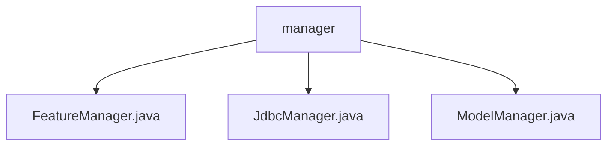

# 基础信息

|      |      |
|------|------|
| 名称 | manager |
| 编码语言 | .java |
| 代码路径 | WeFe/serving/serving-service/src/main/java/com/welab/wefe/serving/service/manager |
| 包名 | docs.serving.serving-service.src.main.java.com.welab.wefe.serving.service.manager |
| 概述说明 | FeatureManager管理特征数据，缓存数据源，线程安全。JdbcManager已过时，支持多数据库连接和操作。ModelManager管理模型状态，提供缓存和同步方法。 |

# 说明

## 概述  
该模块是面向特征数据与模型管理的服务层工具集，核心职责为统一管理特征数据源、多数据库连接及模型状态缓存。接口规范遵循静态方法调用模式，采用线程安全设计，例如FeatureManager通过同步方法保障数据一致性。关键数据结构包括静态Map缓存（MODEL/MODEL_ENABLE）、BaseModel对象及数据库连接池。外部依赖涉及ModelService、Hive/Doris等数据库驱动及Jdbc连接池。例如JdbcManager通过PreparedStatement防SQL注入。

## 主要业务场景  
模块支持特征数据动态获取（如通过SQL查询）、多库异构数据操作（类似JDBC抽象层）及模型生命周期管理。业务流程涵盖：特征数据缓存加载→模型状态校验→跨库查询执行，例如ModelManager通过双重检查锁更新缓存。典型交互模式为静态方法链式调用，如getModelParam().refreshCache()。API类型包括数据查询（分页/批量）、事务控制及缓存刷新，集成案例表现为特征计算与模型推理的协同，例如先校验模型状态再获取特征数据。

### 包内部结构视图

该流程图展示了WeFe项目中serving-service模块下manager目录的结构关系。manager作为父节点，包含三个Java类文件：FeatureManager.java、JdbcManager.java和ModelManager.java，分别对应不同的管理功能模块。这种层级结构清晰体现了业务逻辑的模块化划分。

# 文件列表

| 名称   | 类型  | 说明 |
|-------|------|-------------|
| [FeatureManager.java](FeatureManager.md) | file | FeatureManager类管理特征数据源，提供获取特征数据的方法，支持代码和SQL两种来源，包含缓存机制和刷新功能。 |
| [JdbcManager.java](JdbcManager.md) | file | 废弃的JdbcManager类，提供多种数据库连接和查询方法，支持Hive、Doris、MySQL等，包含连接管理、批量查询、表字段查询等功能。 |
| [ModelManager.java](ModelManager.md) | file | ModelManager类管理模型状态和参数，通过静态缓存提升性能。提供获取模型启用状态、模型参数及刷新状态的方法，确保线程安全并处理异常情况。 |

