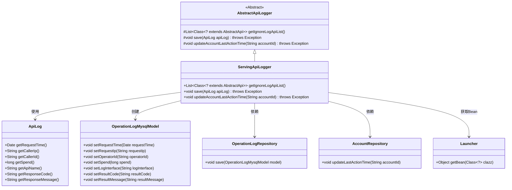
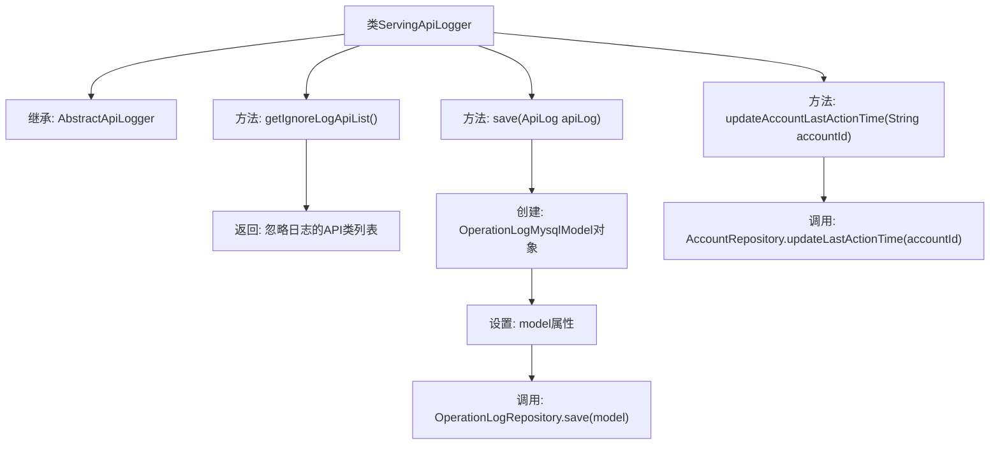

# 基础信息

|      |      |
|------|------|
| 名称 | ServingApiLogger |
| 编码语言 | .java |
| 代码路径 | WeFe/serving/serving-service/src/main/java/com/welab/wefe/serving/service/operation/ServingApiLogger.java |
| 包名 | com.welab.wefe.serving.service.operation |
| 依赖项 | ['java.util.Arrays', 'java.util.List', 'com.welab.wefe.common.web.Launcher', 'com.welab.wefe.common.web.api.base.AbstractApi', 'com.welab.wefe.common.web.delegate.api_log.AbstractApiLogger', 'com.welab.wefe.common.web.delegate.api_log.ApiLog', 'com.welab.wefe.serving.service.api.pir.PrivateInformationRetrievalForNaorPinkasResultsApi', 'com.welab.wefe.serving.service.api.pir.PrivateInformationRetrievalForRandomApi', 'com.welab.wefe.serving.service.api.pir.PrivateInformationRetrievalForRandomLegalApi', 'com.welab.wefe.serving.service.api.pir.PrivateInformationRetrievalForResultsApi', 'com.welab.wefe.serving.service.api.sa.SecureAggregationForResultApi', 'com.welab.wefe.serving.service.database.entity.OperationLogMysqlModel', 'com.welab.wefe.serving.service.database.repository.AccountRepository', 'com.welab.wefe.serving.service.database.repository.OperationLogRepository'] |
| 概述说明 | ServingApiLogger继承AbstractApiLogger，忽略特定API日志记录，保存操作日志到数据库并更新账户最后操作时间。 |

# 说明

ServingApiLogger类继承AbstractApiLogger，实现三个核心功能：定义忽略日志的API列表（包含五个隐私相关API），将API日志保存到MySQL数据库（记录请求时间、IP、操作者ID、耗时、接口名、响应码和消息），以及更新账户最后操作时间。通过Spring的Launcher获取Repository实例进行数据库操作。

# 类列表 Class Summary

| 名称   | 类型  | 说明 |
|-------|------|-------------|
| ServingApiLogger | class | ServingApiLogger继承AbstractApiLogger，忽略特定API日志，记录操作日志到数据库并更新账户最后操作时间。 |

## 类 ServingApiLogger

|      |      |
|------|------|
| 访问范围 | public |
| 类型 | class |
| 名称 | ServingApiLogger |
| 说明 | ServingApiLogger继承AbstractApiLogger，忽略特定API日志，记录操作日志到数据库并更新账户最后操作时间。 |

### UML类图

这段类图展示了ServingApiLogger继承自AbstractApiLogger，并实现了三个核心方法：获取忽略日志的API列表、保存API日志到数据库、更新账户最后操作时间。它通过Launcher获取Repository实例，与OperationLogMysqlModel和ApiLog进行数据交互，形成完整的API日志处理流程。系统通过分层设计将日志记录、数据转换和持久化操作解耦，体现了良好的扩展性和维护性。

### 内部方法调用关系图

这段代码是ServingApiLogger类的实现，继承自AbstractApiLogger抽象类。主要功能包括：1) 定义需要忽略日志记录的API类列表；2) 将API调用日志保存到数据库，通过创建OperationLogMysqlModel对象并设置相关属性后调用Repository保存；3) 更新账户的最后操作时间。整个流程清晰地展示了日志记录和账户更新的处理过程，体现了日志系统的核心功能。

### 字段列表 Field List

| 名称  | 类型  | 说明 |
|-------|-------|------|

### 方法列表

| 名称  | 类型  | 说明 |
|-------|-------|------|
| save | void | 该方法将ApiLog对象转换为OperationLogMysqlModel并保存到数据库，包含请求时间、IP、操作者ID、耗时、接口名、响应码和消息等字段。 |
| getIgnoreLogApiList | List<Class<? extends AbstractApi>> | 该方法返回一个忽略日志记录的API类列表，包含五个私有信息检索和安全聚合相关API类。 |
| updateAccountLastActionTime | void | 该方法用于更新账户最后操作时间，通过AccountRepository调用updateLastActionTime实现。 |

