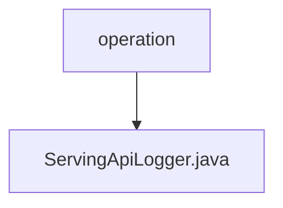

# 基础信息

|      |      |
|------|------|
| 名称 | operation |
| 编码语言 | .java |
| 代码路径 | WeFe/serving/serving-service/src/main/java/com/welab/wefe/serving/service/operation |
| 包名 | docs.serving.serving-service.src.main.java.com.welab.wefe.serving.service.operation |
| 概述说明 | ServingApiLogger继承AbstractApiLogger，忽略特定API日志记录，保存操作日志到数据库并更新账户最后操作时间。 |

# 说明

ServingApiLogger类继承AbstractApiLogger，实现三个核心功能：定义忽略日志的API列表（包含五个隐私相关API），将API日志保存到MySQL数据库（记录请求时间、IP、操作者ID、耗时、接口名、响应码和消息），以及更新账户最后操作时间。通过Spring的Launcher获取Repository实例进行数据库操作。

### 包内部结构视图

该流程图展示了WeFe项目中serving-service模块的operation包与ServingApiLogger.java文件之间的层级关系。operation作为父级目录，包含一个子文件ServingApiLogger.java，这是典型的Java项目文件结构，表示一个操作包中包含的API日志服务类文件。

# 文件列表

| 名称   | 类型  | 说明 |
|-------|------|-------------|
| [ServingApiLogger.java](ServingApiLogger.md) | file | ServingApiLogger继承AbstractApiLogger，忽略特定API日志记录，保存操作日志到数据库并更新账户最后操作时间。 |

