# 基础信息

|      |      |
|------|------|
| 名称 | Predictor |
| 编码语言 | .java |
| 代码路径 | WeFe/serving/serving-service/src/main/java/com/welab/wefe/serving/service/predicter/Predictor.java |
| 包名 | com.welab.wefe.serving.service.predicter |
| 依赖项 | ['com.alibaba.fastjson.JSONObject', 'com.welab.wefe.common.StatusCode', 'com.welab.wefe.common.exception.StatusCodeWithException', 'com.welab.wefe.common.web.Launcher', 'com.welab.wefe.common.wefe.enums.FederatedLearningType', 'com.welab.wefe.common.wefe.enums.JobMemberRole', 'com.welab.wefe.common.wefe.enums.PredictFeatureDataSource', 'com.welab.wefe.serving.sdk.dto.PredictResult', 'com.welab.wefe.serving.sdk.model.lr.LrPredictResultModel', 'com.welab.wefe.serving.sdk.model.xgboost.XgboostPredictResultModel', 'com.welab.wefe.serving.sdk.predicter.AbstractBasePredictor', 'com.welab.wefe.serving.service.database.entity.ModelMemberMySqlModel', 'com.welab.wefe.serving.service.database.entity.TableModelMySqlModel', 'com.welab.wefe.serving.service.dto.ServiceResultOutput', 'com.welab.wefe.serving.service.predicter.batch.BatchPromoterPredictor', 'com.welab.wefe.serving.service.predicter.batch.BatchProviderPredictor', 'com.welab.wefe.serving.service.predicter.single.DebugPromoterPredictor', 'com.welab.wefe.serving.service.predicter.single.DebugProviderPredictor', 'com.welab.wefe.serving.service.predicter.single.PromoterPredictor', 'com.welab.wefe.serving.service.predicter.single.ProviderPredictor', 'com.welab.wefe.serving.service.service.CacheObjects', 'com.welab.wefe.serving.service.service.ModelMemberService', 'com.welab.wefe.serving.service.service.ModelPredictScoreStatisticsService', 'com.welab.wefe.serving.service.service.ModelService', 'org.apache.commons.collections4.CollectionUtils', 'java.util.List', 'java.util.Map'] |
| 概述说明 | Predictor类提供预测功能，包含单次和批量预测方法，支持调试模式，根据角色和联邦学习类型选择不同预测器，记录预测分数并处理敏感数据。 |

# 说明

Predictor类是一个用于预测的静态工具类，通过静态初始化块加载ModelMemberService、ModelService和ModelPredictScoreStatisticsService等依赖服务，并初始化Launcher配置。提供predict、batch和debug三个核心方法，分别处理单次预测、批量预测和调试预测。predict方法通过constructPredictor构造具体预测器（PromoterPredictor或ProviderPredictor），执行预测后记录分数并处理敏感数据。batch方法类似但支持批量用户预测。debug方法用于调试场景，构造DebugPromoterPredictor或DebugProviderPredictor。内部方法findMyRole和findFlType用于查询成员角色和联邦学习类型，recordPredictScoreIncrement根据预测结果类型记录分数增量，makeSensitiveData处理敏感数据。

# 类列表 Class Summary

| 名称   | 类型  | 说明 |
|-------|------|-------------|
| Predictor | class | Predictor类提供预测功能，通过静态方法初始化服务，支持单例模式。包含predict、batch和debug方法，根据角色和模型类型选择不同预测器，记录预测分数并处理敏感数据。 |

## 类 Predictor

|      |      |
|------|------|
| 访问范围 | public |
| 类型 | class |
| 名称 | Predictor |
| 说明 | Predictor类提供预测功能，通过静态方法初始化服务，支持单例模式。包含predict、batch和debug方法，根据角色和模型类型选择不同预测器，记录预测分数并处理敏感数据。 |

### UML类图

```mermaid
classDiagram
    class Predictor {
        -ModelMemberService modelMemberService
        -ModelService modelService
        -ModelPredictScoreStatisticsService modelPredictScoreStatisticsService
        +predict(String requestId, String modelId, String userId, Map~String, Object~ featureData) PredictResult
        +batch(String requestId, String modelId, List~String~ userIds, Map~String, Map~String, Object~~ featureDataMap) PredictResult
        +debug(String modelId, String userId, Map~String, Object~ featureData, PredictFeatureDataSource featureSource, JSONObject extendParams) PredictResult
        -recordPredictScoreIncrement(String modelId, PredictResult result)
        -makeSensitiveData(PredictResult result)
        -constructPredictor(String requestId, String modelId, String userId, Map~String, Object~ featureData) AbstractBasePredictor
        -constructPredictor(String requestId, String modelId, List~String~ userIds, Map~String, Map~String, Object~~ featureDataMap) AbstractBasePredictor
        -findMyRole(String modelId) JobMemberRole
        -findFlType(String modelId) FederatedLearningType
        -constructDebugPredictor(String modelId, String userId, Map~String, Object~ featureData, PredictFeatureDataSource featureDataSource, JSONObject extendParams) AbstractBasePredictor
    }

    class AbstractBasePredictor {
        <<Abstract>>
        +predict() PredictResult
    }

    class PromoterPredictor {
        +PromoterPredictor(String requestId, String modelId, String userId, Map~String, Object~ featureData)
    }

    class ProviderPredictor {
        +ProviderPredictor(String modelId, String userId, Map~String, Object~ featureData)
    }

    class BatchPromoterPredictor {
        +BatchPromoterPredictor(String requestId, String modelId, List~String~ userIds, Map~String, Map~String, Object~~ featureDataMap)
    }

    class BatchProviderPredictor {
        +BatchProviderPredictor(String modelId, List~String~ userIds, Map~String, Map~String, Object~~ featureDataMap)
    }

    class DebugPromoterPredictor {
        +DebugPromoterPredictor(String id, String modelId, String userId, Map~String, Object~ featureData, PredictFeatureDataSource featureDataSource, JSONObject extendParams)
    }

    class DebugProviderPredictor {
        +DebugProviderPredictor(String modelId, String userId, Map~String, Object~ featureData, PredictFeatureDataSource featureDataSource, JSONObject extendParams)
    }

    class ModelMemberService {
        <<Interface>>
        +findListByModelIdAndMemberId(String modelId, String memberId) List~ModelMemberMySqlModel~
    }

    class ModelService {
        <<Interface>>
        +findOne(String modelId) TableModelMySqlModel
    }

    class ModelPredictScoreStatisticsService {
        <<Interface>>
        +asyncIncrement(String modelId, Double score)
    }

    Predictor --> AbstractBasePredictor : 创建
    AbstractBasePredictor <|-- PromoterPredictor
    AbstractBasePredictor <|-- ProviderPredictor
    AbstractBasePredictor <|-- BatchPromoterPredictor
    AbstractBasePredictor <|-- BatchProviderPredictor
    AbstractBasePredictor <|-- DebugPromoterPredictor
    AbstractBasePredictor <|-- DebugProviderPredictor
    Predictor --> ModelMemberService : 依赖
    Predictor --> ModelService : 依赖
    Predictor --> ModelPredictScoreStatisticsService : 依赖
```

这段代码展示了一个预测器类`Predictor`，它通过静态初始化块加载服务实例，并提供预测功能。该类依赖于三个服务接口（`ModelMemberService`、`ModelService`、`ModelPredictScoreStatisticsService`）和抽象基类`AbstractBasePredictor`，后者有多个具体实现类（如`PromoterPredictor`、`ProviderPredictor`等）。`Predictor`根据模型ID、用户角色和联邦学习类型动态创建不同的预测器实例，处理单次和批量预测请求，并记录预测分数。类图清晰地展示了这些类之间的继承和依赖关系。

### 内部方法调用关系图

这段代码实现了一个预测器类，通过静态初始化块注入服务并初始化系统。主要提供predict、batch和debug三个预测方法，内部通过构造不同的预测器实现类（Promoter/Provider）来处理不同类型的联邦学习任务。核心逻辑包括角色判断、模型类型检查、预测结果处理和敏感数据清理，通过服务层获取模型元数据，支持单条和批量预测场景。

### 字段列表 Field List

| 名称  | 类型  | 说明 |
|-------|-------|------|
| modelPredictScoreStatisticsService | ModelPredictScoreStatisticsService | 私有静态模型预测分数统计服务实例。 |
| modelMemberService | ModelMemberService | 声明一个静态私有ModelMemberService类变量modelMemberService。 |
| modelService | ModelService | 声明一个私有的静态ModelService类实例变量modelService。 |

### 方法列表

| 名称  | 类型  | 说明 |
|-------|-------|------|
| recordPredictScoreIncrement | void | 方法记录预测分数增量：若角色为provider且类型为vertical则返回；处理Xgboost和Lr预测结果并异步更新分数统计。 |
| batch | PredictResult | 静态方法batch接收请求ID、模型ID、用户ID列表和特征数据映射，构造预测器并返回预测结果，待补充预测分数记录功能。 |
| constructPredictor | AbstractBasePredictor | 静态方法根据角色和类型构造预测器：发起者角色且非横向联邦时返回PromoterPredictor，否则返回ProviderPredictor。 |
| constructPredictor | AbstractBasePredictor | 静态方法根据角色和联邦学习类型构造预测器：发起者且非横向联邦时返回BatchPromoterPredictor，否则返回BatchProviderPredictor。 |
| makeSensitiveData | void | 该方法检查预测结果类型，若为LrPredictResultModel则清空其评分卡数据并重置结果。 |
| predict | PredictResult | 静态方法predict接收请求ID、模型ID、用户ID和特征数据，构造预测器执行预测，记录分数增量并处理敏感数据后返回结果。可能抛出StatusCodeWithException异常。 |
| findMyRole | JobMemberRole | 查找用户在当前模型中的角色，若无数据则抛出异常。 |
| findFlType | FederatedLearningType | 该方法通过模型ID查询数据库获取模型数据，若不存在则抛出异常，存在则返回其联邦学习类型。 |
| debug | PredictResult | 静态方法debug接收模型ID、用户ID、特征数据等参数，构造预测器并返回预测结果。 |
| constructDebugPredictor | AbstractBasePredictor | 静态方法根据角色和联邦学习类型构造调试预测器：发起者且非横向联邦时返回DebugPromoterPredictor，否则返回DebugProviderPredictor。 |

