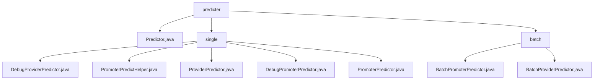

# 基础信息

|      |      |
|------|------|
| 名称 | predicter |
| 编码语言 | .java |
| 代码路径 | WeFe/serving/serving-service/src/main/java/com/welab/wefe/serving/service/predicter |
| 包名 | docs.serving.serving-service.src.main.java.com.welab.wefe.serving.service.predicter |
| 概述说明 | 该模块提供联邦学习预测功能，支持标准/调试模式，含单用户/批量预测、协作方API调用及特征获取。关键类包括Predictor、PromoterPredictHelper等，依赖模型和特征管理服务。适用于金融风控等多方数据协作场景。 |

# 说明

## 概述  
该模块是联邦学习环境下的预测引擎，核心职责是协调多方数据完成联合预测，支持标准模式、批量处理和调试场景。通过Predictor类族统一接口规范，包括单次预测（predict）、批量预测（batch）和调试预测（debug）三类方法，关键数据结构涵盖PredictFeatureDataSource特征源、FederatedPredictParam请求参数及模型/用户ID映射表。外部依赖涉及ModelManager、FeatureManager、HTTP客户端及JNI调用。例如DebugProviderPredictor支持SQL特征回放，BatchPromoterPredictor通过federatedResultByProviders实现跨节点批量预测。

## 主要业务场景  
模块处理三种典型流程：1）标准预测通过PromoterPredictor协调多协作方计算；2）批量预测由Batch前缀类处理用户列表；3）调试流程通过Debug类本地模拟。交互模式类似主从架构，遵循"初始化→获取模型/特征→联邦调用→聚合结果"链路，异常处理和日志审计贯穿始终。例如金融风控场景中，银行（发起方）联合协作方完成信用评分预测，使用PromoterPredictHelper的重试机制保障通信可靠性。API集成涵盖模型获取、特征查询和联邦通信三类接口，形成完整预测闭环。

### 包内部结构视图

该流程图展示了WeFe项目中预测器模块的层级结构。顶层是predicter目录，包含Predictor.java主类和两个子目录：single（单例预测器）和batch（批量预测器）。single目录下包含5个具体预测器实现类，batch目录下包含2个批量预测器实现类，清晰地反映了预测器模块的文件组织结构。

# 文件列表

| 名称   | 类型  | 说明 |
|-------|------|-------------|
| [Predictor.java](Predictor.md) | file | Predictor类提供预测功能，包含单次和批量预测方法，支持调试模式，根据角色和联邦学习类型选择不同预测器，记录预测分数并处理敏感数据。 |
| [single](single/_module.md) | package | DebugProviderPredictor用于调试模式预测，含featureSource和extendParams属性。PromoterPredictHelper处理预测调用，含API调用、参数构建和日志记录。ProviderPredictor提供预测功能，通过ModelManager获取模型。DebugPromoterPredictor用于调试场景，支持多种特征数据获取方式。PromoterPredictor实现预测功能，涉及模型管理和协作方调用。 |
| [batch](batch/_module.md) | package | BatchPromoterPredictor是纵向联邦学习的发起方批量预测器，处理模型获取、联邦预测和特征查找。BatchProviderPredictor是批量预测器，封装模型和特征数据获取逻辑。两者均继承自抽象类，支持批量用户预测。 |

