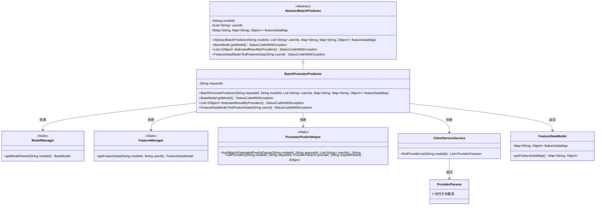

# 基础信息

|      |      |
|------|------|
| 名称 | BatchPromoterPredictor |
| 编码语言 | .java |
| 代码路径 | WeFe/serving/serving-service/src/main/java/com/welab/wefe/serving/service/predicter/batch/BatchPromoterPredictor.java |
| 包名 | com.welab.wefe.serving.service.predicter.batch |
| 依赖项 | ['com.welab.wefe.common.StatusCode', 'com.welab.wefe.common.exception.StatusCodeWithException', 'com.welab.wefe.common.util.JObject', 'com.welab.wefe.common.web.Launcher', 'com.welab.wefe.serving.sdk.dto.ProviderParams', 'com.welab.wefe.serving.sdk.model.BaseModel', 'com.welab.wefe.serving.sdk.model.FeatureDataModel', 'com.welab.wefe.serving.sdk.predicter.batch.AbstractBatchPredictor', 'com.welab.wefe.serving.service.manager.FeatureManager', 'com.welab.wefe.serving.service.manager.ModelManager', 'com.welab.wefe.serving.service.predicter.single.PromoterPredictHelper', 'com.welab.wefe.serving.service.service.ClientServiceService', 'org.apache.commons.collections4.CollectionUtils', 'org.apache.commons.collections4.MapUtils', 'java.util.ArrayList', 'java.util.List', 'java.util.Map'] |
| 概述说明 | BatchPromoterPredictor类继承AbstractBatchPredictor，实现批量预测功能。包含requestId，通过getModel获取模型，federatedResultByProviders调用协作方进行联邦预测，findFeatureData获取用户特征数据。 |

# 说明

BatchPromoterPredictor是一个继承自AbstractBatchPredictor的批量预测器类，主要用于处理纵向联邦学习中的发起方预测任务。该类包含一个requestId成员变量，并通过构造函数初始化父类的modelId、userIds和featureDataMap参数。主要功能包括：通过getModel方法从ModelManager获取模型参数；通过federatedResultByProviders方法与协作方进行联邦预测，调用PromoterPredictHelper工具类构建请求参数并获取响应；通过findFeatureData方法查找用户特征数据，优先使用本地参数，不存在时从FeatureManager获取。该类在协作方列表为空时会抛出DATA_NOT_FOUND异常。

# 类列表 Class Summary

| 名称   | 类型  | 说明 |
|-------|------|-------------|
| BatchPromoterPredictor | class | BatchPromoterPredictor类继承AbstractBatchPredictor，实现批量预测功能。包含requestId、模型获取、联邦结果处理和特征数据查询方法。 |

## 类 BatchPromoterPredictor

|      |      |
|------|------|
| 访问范围 | public |
| 类型 | class |
| 名称 | BatchPromoterPredictor |
| 说明 | BatchPromoterPredictor类继承AbstractBatchPredictor，实现批量预测功能。包含requestId、模型获取、联邦结果处理和特征数据查询方法。 |

### UML类图

类图描述：BatchPromoterPredictor继承自抽象类AbstractBatchPredictor，实现了批量预测功能。它通过ModelManager获取模型参数，通过FeatureManager获取特征数据，使用PromoterPredictHelper构建预测参数并调用协作方服务。ClientServiceService用于查找协作方列表，ProviderParams表示协作方参数。FeatureDataModel封装特征数据。整个类图展示了纵向联邦预测场景中各组件间的协作关系。

### 内部方法调用关系图

这段代码展示了一个批处理预测器类`BatchPromoterPredictor`，它继承自`AbstractBatchPredictor`，主要用于处理联邦学习中的预测任务。类中包含三个核心方法：`getModel()`用于获取模型参数，`federatedResultByProviders()`通过调用协作方服务获取联邦预测结果，`findFeatureData()`用于查找用户特征数据。流程图清晰地展示了类继承关系、属性定义、方法调用链及循环处理逻辑，特别是联邦预测过程中与多个外部组件的交互过程。

### 字段列表 Field List

| 名称  | 类型  | 说明 |
|-------|-------|------|
| requestId | String | 私有字符串变量requestId，用于唯一标识请求。 |

### 方法列表

| 名称  | 类型  | 说明 |
|-------|-------|------|
| findFeatureData | FeatureDataModel | 方法根据用户ID查找特征数据：若批次预测参数中存在该用户特征数据则返回，否则从特征管理器获取。 |
| getModel | BaseModel | 获取指定ID的模型参数，失败时抛出异常。 |
| federatedResultByProviders | List<JObject> | 该方法通过服务获取协作方列表，若为空则抛出异常。遍历协作方，构建预测参数并调用其接口，汇总结果后返回。 |

