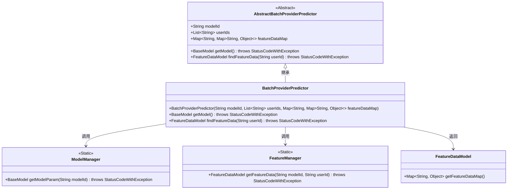
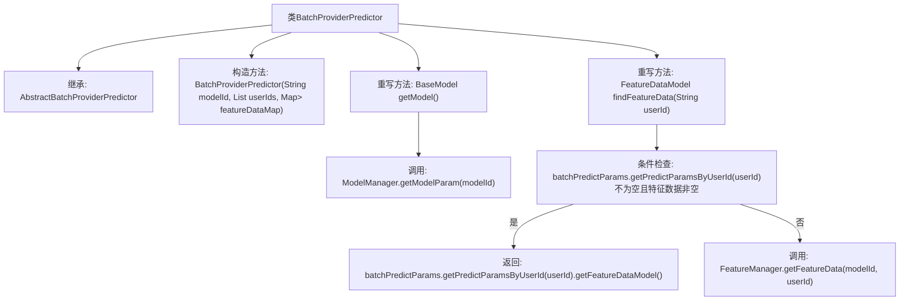

# 基础信息

|      |      |
|------|------|
| 名称 | BatchProviderPredictor |
| 编码语言 | .java |
| 代码路径 | WeFe/serving/serving-service/src/main/java/com/welab/wefe/serving/service/predicter/batch/BatchProviderPredictor.java |
| 包名 | com.welab.wefe.serving.service.predicter.batch |
| 依赖项 | ['com.welab.wefe.common.exception.StatusCodeWithException', 'com.welab.wefe.serving.sdk.model.BaseModel', 'com.welab.wefe.serving.sdk.model.FeatureDataModel', 'com.welab.wefe.serving.sdk.predicter.batch.AbstractBatchProviderPredictor', 'com.welab.wefe.serving.service.manager.FeatureManager', 'com.welab.wefe.serving.service.manager.ModelManager', 'org.apache.commons.collections4.MapUtils', 'java.util.List', 'java.util.Map'] |
| 概述说明 | BatchProviderPredictor类继承AbstractBatchProviderPredictor，通过modelId、userIds和featureDataMap初始化。提供获取模型和用户特征数据的方法，优先从batchPredictParams读取，不存在则从FeatureManager获取。 |

# 说明

BatchProviderPredictor类继承自AbstractBatchProviderPredictor，用于批量预测。构造函数接收模型ID、用户ID列表和特征数据映射。提供两个核心方法：getModel通过ModelManager获取模型参数；findFeatureData根据用户ID查找特征数据，优先从batchPredictParams中获取，若不存在则通过FeatureManager获取。该类封装了模型和特征数据的获取逻辑，支持批量用户预测场景。

# 类列表 Class Summary

| 名称   | 类型  | 说明 |
|-------|------|-------------|
| BatchProviderPredictor | class | BatchProviderPredictor类继承AbstractBatchProviderPredictor，提供批量预测功能。构造函数接收模型ID、用户ID列表和特征数据。重写getModel方法获取模型参数，findFeatureData方法根据用户ID查找特征数据，优先使用批量预测参数中的特征数据，不存在则从FeatureManager获取。 |

## 类 BatchProviderPredictor

|      |      |
|------|------|
| 访问范围 | public |
| 类型 | class |
| 名称 | BatchProviderPredictor |
| 说明 | BatchProviderPredictor类继承AbstractBatchProviderPredictor，提供批量预测功能。构造函数接收模型ID、用户ID列表和特征数据。重写getModel方法获取模型参数，findFeatureData方法根据用户ID查找特征数据，优先使用批量预测参数中的特征数据，不存在则从FeatureManager获取。 |

### UML类图

该类图展示了BatchProviderPredictor继承自AbstractBatchProviderPredictor，并实现了获取模型和特征数据的核心功能。通过ModelManager和FeatureManager两个静态工具类获取模型参数和特征数据，最终返回FeatureDataModel对象。图中清晰体现了类之间的继承关系和依赖调用，其中FeatureDataModel作为数据载体被多个类使用。

### 内部方法调用关系图

该流程图描述了BatchProviderPredictor类的结构和方法调用关系。该类继承自AbstractBatchProviderPredictor，包含构造方法和两个重写方法。getModel()方法通过ModelManager获取模型参数，findFeatureData()方法首先检查用户预测参数和特征数据是否存在，存在则返回本地数据，否则通过FeatureManager获取特征数据。流程清晰展示了条件分支和外部依赖调用。

### 字段列表 Field List

| 名称  | 类型  | 说明 |
|-------|-------|------|

### 方法列表

| 名称  | 类型  | 说明 |
|-------|-------|------|
| findFeatureData | FeatureDataModel | 方法根据用户ID查找特征数据，优先返回批预测参数中的特征数据，若不存在则从特征管理器获取。 |
| getModel | BaseModel | 方法getModel调用ModelManager获取指定modelId的模型参数，可能抛出StatusCodeWithException异常。 |

