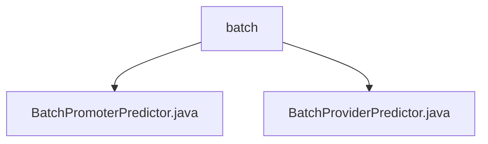

# 基础信息

|      |      |
|------|------|
| 名称 | batch |
| 编码语言 | .java |
| 代码路径 | WeFe/serving/serving-service/src/main/java/com/welab/wefe/serving/service/predicter/batch |
| 包名 | docs.serving.serving-service.src.main.java.com.welab.wefe.serving.service.predicter.batch |
| 概述说明 | BatchPromoterPredictor是纵向联邦学习的发起方批量预测器，处理模型获取、联邦预测和特征查找。BatchProviderPredictor是批量预测器，封装模型和特征数据获取逻辑。两者均继承自抽象类，支持批量用户预测。 |

# 说明

## 概述  
该模块是纵向联邦学习中的批量预测器组件，包含发起方(BatchPromoterPredictor)和协作方(BatchProviderPredictor)两类预测器，核心职责是协调多方特征数据与模型参数完成联合预测。接口规范包括：通过getModel统一从ModelManager获取模型参数；通过findFeatureData按优先级（本地缓存→FeatureManager）获取特征数据；发起方需通过PromoterPredictHelper构建联邦请求。关键数据结构包括模型ID、用户ID列表和特征数据映射表。外部依赖包括ModelManager、FeatureManager和PromoterPredictHelper工具类。例如BatchPromoterPredictor会通过federatedResultByProviders发起跨节点预测。

## 主要业务场景  
典型流程为：1）初始化时加载模型和用户特征；2）发起方通过JNI调用协作方数据；3）聚合结果返回预测值。交互模式类似主从架构，发起方作为协调节点驱动流程。功能完整性体现在支持批量用户处理、本地缓存优化和异常处理（如空协作方列表抛出DATA_NOT_FOUND）。应用场景包括金融风控联合建模，例如银行（发起方）联合多家机构（协作方）完成客户信用评分预测。API类型涵盖模型获取、特征查询和联邦通信三类接口。

### 包内部结构视图

该流程图展示了WeFe项目中批处理预测器的文件结构关系。根节点"batch"包含两个Java实现类：BatchPromoterPredictor和BatchProviderPredictor，这两个类都位于serving-service模块的批处理预测器包下，用于实现不同类型的批量预测功能。

# 文件列表

| 名称   | 类型  | 说明 |
|-------|------|-------------|
| [BatchPromoterPredictor.java](BatchPromoterPredictor.md) | file | BatchPromoterPredictor类继承AbstractBatchPredictor，实现批量预测功能。包含requestId，通过getModel获取模型，federatedResultByProviders调用协作方进行联邦预测，findFeatureData获取用户特征数据。 |
| [BatchProviderPredictor.java](BatchProviderPredictor.md) | file | BatchProviderPredictor类继承AbstractBatchProviderPredictor，通过modelId、userIds和featureDataMap初始化。提供获取模型和用户特征数据的方法，优先从batchPredictParams读取，不存在则从FeatureManager获取。 |

