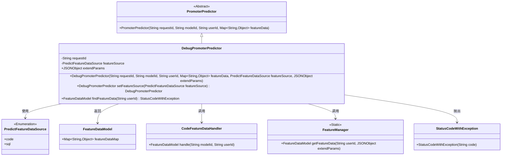

# 基础信息

|      |      |
|------|------|
| 名称 | DebugPromoterPredictor |
| 编码语言 | .java |
| 代码路径 | WeFe/serving/serving-service/src/main/java/com/welab/wefe/serving/service/predicter/single/DebugPromoterPredictor.java |
| 包名 | com.welab.wefe.serving.service.predicter.single |
| 依赖项 | ['com.alibaba.fastjson.JSONObject', 'com.welab.wefe.common.exception.StatusCodeWithException', 'com.welab.wefe.common.wefe.enums.PredictFeatureDataSource', 'com.welab.wefe.serving.sdk.model.FeatureDataModel', 'com.welab.wefe.serving.service.feature.CodeFeatureDataHandler', 'com.welab.wefe.serving.service.manager.FeatureManager', 'org.apache.commons.collections4.MapUtils', 'java.util.Map', 'com.welab.wefe.common.StatusCode.UNEXPECTED_ENUM_CASE'] |
| 概述说明 | DebugPromoterPredictor继承PromoterPredictor，用于调试预测器。包含requestId、featureSource和extendParams属性，提供设置featureSource方法和根据不同来源获取特征数据的功能。支持代码和SQL两种特征数据来源。 |

# 说明

DebugPromoterPredictor是PromoterPredictor的子类，用于调试场景下的预测功能。它包含requestId、featureSource和extendParams属性，通过构造函数初始化这些属性及父类参数。提供了setFeatureSource方法设置特征数据源。重写了findFeatureData方法，根据featureSource枚举值选择不同方式获取特征数据：若已有特征数据则直接返回，否则通过code或sql方式获取，否则抛出异常。

# 类列表 Class Summary

| 名称   | 类型  | 说明 |
|-------|------|-------------|
| DebugPromoterPredictor | class | DebugPromoterPredictor继承PromoterPredictor，用于调试预测器。包含requestId、featureSource和extendParams属性。构造函数初始化参数，setFeatureSource方法设置数据源。findFeatureData方法根据featureSource选择处理方式：code时调用CodeFeatureDataHandler，sql时调用FeatureManager，否则抛出异常。 |


## 类 DebugPromoterPredictor

|      |      |
|------|------|
| 访问范围 | public |
| 类型 | class |
| 名称 | DebugPromoterPredictor |
| 说明 | DebugPromoterPredictor继承PromoterPredictor，用于调试预测器。包含requestId、featureSource和extendParams属性。构造函数初始化参数，setFeatureSource方法设置数据源。findFeatureData方法根据featureSource选择处理方式：code时调用CodeFeatureDataHandler，sql时调用FeatureManager，否则抛出异常。 |


### UML类图



类图描述：DebugPromoterPredictor继承自抽象类PromoterPredictor，包含枚举类型PredictFeatureDataSource用于标识特征数据来源。通过CodeFeatureDataHandler和FeatureManager获取特征数据，返回FeatureDataModel对象。当出现异常情况时，会抛出StatusCodeWithException。该类主要用于调试场景下的特征数据预测处理。


### 内部方法调用关系图

```mermaid
graph TD
    A["类DebugPromoterPredictor"]
    B["继承自: PromoterPredictor"]
    C["属性: String requestId"]
    D["属性: PredictFeatureDataSource featureSource"]
    E["属性: JSONObject extendParams"]
    F["构造方法: DebugPromoterPredictor(String requestId, String modelId, String userId, Map<String, Object> featureData, PredictFeatureDataSource featureSource, JSONObject extendParams)"]
    G["方法: setFeatureSource(PredictFeatureDataSource featureSource)"]
    H["重写方法: findFeatureData(String userId)"]
    I["条件判断: MapUtils.isNotEmpty(featureDataMap)"]
    J["分支: featureSource == code"]
    K["分支: featureSource == sql"]
    L["异常处理: throw StatusCodeWithException"]

    A --> B
    A --> C
    A --> D
    A --> E
    A --> F
    A --> G
    A --> H
    H --> I
    I --"是"--> H
    I --"否"--> J
    J --"code"--> K
    J --"sql"--> L
    K --> "new CodeFeatureDataHandler().handle()"
    L --> "FeatureManager.getFeatureData()"
    J --"default"--> "throw UNEXPECTED_ENUM_CASE"
```

这段代码展示了一个调试用的预测器类，继承自基础预测器类。核心功能是通过findFeatureData方法根据不同的特征数据源（code/sql）获取特征数据，包含空值检查、枚举分支处理和异常抛出机制。流程图清晰呈现了属性继承关系、构造方法链式调用以及特征数据获取的分支逻辑，特别是对featureSource枚举值的三种处理路径。类设计采用建造者模式(setFeatureSource返回this)，并严格处理了边缘情况(空特征数据/非法枚举值)。

### 字段列表 Field List

| 名称  | 类型  | 说明 |
|-------|-------|------|
| extendParams | JSONObject | 扩展参数字段，类型为JSON对象。 |
| featureSource | PredictFeatureDataSource | 保护类型PredictFeatureDataSource变量featureSource。 |
| requestId | String | 保护字符串类型请求ID。 |

### 方法列表

| 名称  | 类型  | 说明 |
|-------|-------|------|
| setFeatureSource | DebugPromoterPredictor | 这是一个Java方法，用于设置特征数据源并返回当前对象实例，支持链式调用。 |
| findFeatureData | FeatureDataModel | 方法根据用户ID查找特征数据。若已有数据则直接返回，否则按来源处理：code调用CodeFeatureDataHandler，sql调用FeatureManager，其他情况抛出异常。 |


