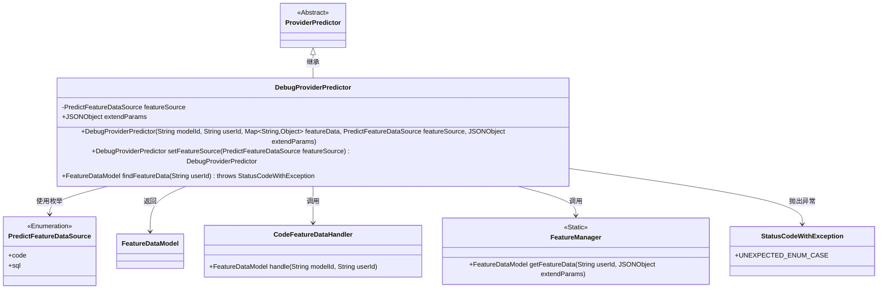
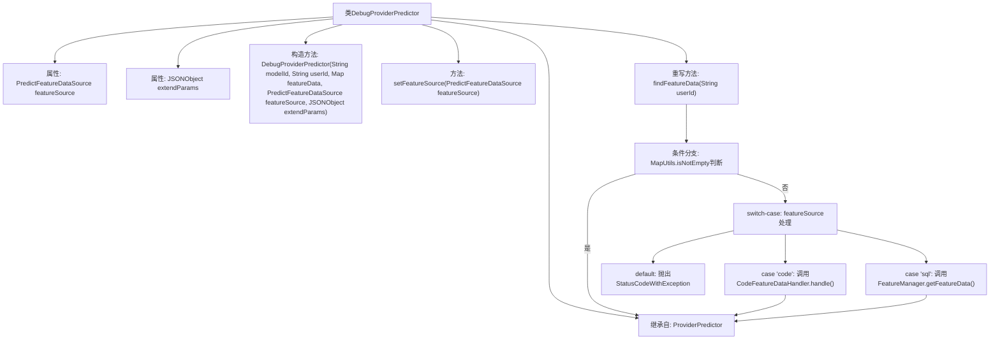

# 基础信息

|      |      |
|------|------|
| 名称 | DebugProviderPredictor |
| 编码语言 | .java |
| 代码路径 | WeFe/serving/serving-service/src/main/java/com/welab/wefe/serving/service/predicter/single/DebugProviderPredictor.java |
| 包名 | com.welab.wefe.serving.service.predicter.single |
| 依赖项 | ['com.alibaba.fastjson.JSONObject', 'com.welab.wefe.common.exception.StatusCodeWithException', 'com.welab.wefe.common.wefe.enums.PredictFeatureDataSource', 'com.welab.wefe.serving.sdk.model.FeatureDataModel', 'com.welab.wefe.serving.service.feature.CodeFeatureDataHandler', 'com.welab.wefe.serving.service.manager.FeatureManager', 'org.apache.commons.collections4.MapUtils', 'java.util.Map', 'com.welab.wefe.common.StatusCode.UNEXPECTED_ENUM_CASE'] |
| 概述说明 | DebugProviderPredictor继承ProviderPredictor，用于调试预测功能。包含特征数据源featureSource和扩展参数extendParams。构造函数初始化模型ID、用户ID等参数。提供设置特征数据源方法，重写findFeatureData方法根据数据源类型处理特征数据。 |

# 说明

DebugProviderPredictor是ProviderPredictor的子类，用于调试模式下预测功能。它包含PredictFeatureDataSource类型的featureSource和JSONObject类型的extendParams属性。构造函数接收modelId、userId、featureData、featureSource和extendParams参数。提供了setFeatureSource方法用于设置featureSource并返回当前对象。重写了findFeatureData方法，根据featureSource的不同来源（code或sql）获取特征数据，若featureDataMap不为空则直接返回，否则抛出异常。

# 类列表 Class Summary

| 名称   | 类型  | 说明 |
|-------|------|-------------|
| DebugProviderPredictor | class | DebugProviderPredictor继承ProviderPredictor，包含featureSource和extendParams属性，提供设置数据源方法，根据数据源类型返回特征数据，支持代码和SQL两种处理方式。 |

## 类 DebugProviderPredictor

|      |      |
|------|------|
| 访问范围 | public |
| 类型 | class |
| 名称 | DebugProviderPredictor |
| 说明 | DebugProviderPredictor继承ProviderPredictor，包含featureSource和extendParams属性，提供设置数据源方法，根据数据源类型返回特征数据，支持代码和SQL两种处理方式。 |

### UML类图

这段代码展示了一个调试用的预测器类`DebugProviderPredictor`，它继承自抽象类`ProviderPredictor`。主要功能是根据不同的特征数据源（枚举`PredictFeatureDataSource`）获取特征数据，支持通过代码或SQL两种方式。类中包含链式设置方法`setFeatureSource`，并可能抛出`StatusCodeWithException`异常。通过`CodeFeatureDataHandler`和`FeatureManager`两个辅助类实现具体的数据获取逻辑，最终返回`FeatureDataModel`对象。整体设计体现了策略模式的思想，通过枚举值切换不同的数据处理方式。

### 内部方法调用关系图

这段代码流程图展示了DebugProviderPredictor类的结构和工作流程。该类继承自ProviderPredictor，包含两个主要属性和三个核心方法。重点描述了findFeatureData方法的执行逻辑：首先检查特征数据映射是否非空，若否则根据featureSource枚举值分别处理code/sql两种数据源情况，默认情况抛出异常。构造方法和链式调用方法setFeatureSource用于初始化对象状态。整个流程体现了对特征数据获取的灵活处理和异常控制机制。

### 字段列表 Field List

| 名称  | 类型  | 说明 |
|-------|-------|------|
| featureSource | PredictFeatureDataSource | 保护成员变量featureSource，类型为PredictFeatureDataSource。 |
| extendParams | JSONObject | 扩展参数字段，用于存储JSON格式的额外参数。 |

### 方法列表

| 名称  | 类型  | 说明 |
|-------|-------|------|
| setFeatureSource | DebugProviderPredictor | 设置特征数据源并返回当前对象实例。 |
| findFeatureData | FeatureDataModel | 方法根据用户ID查找特征数据：若predictParams中有数据则直接返回；否则按featureSource选择处理方式（code调用CodeFeatureDataHandler，sql调用FeatureManager），无匹配则抛出异常。 |

