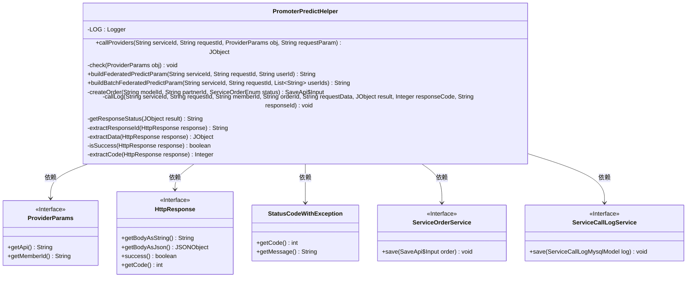
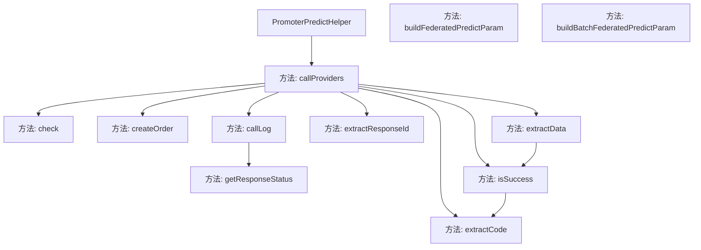
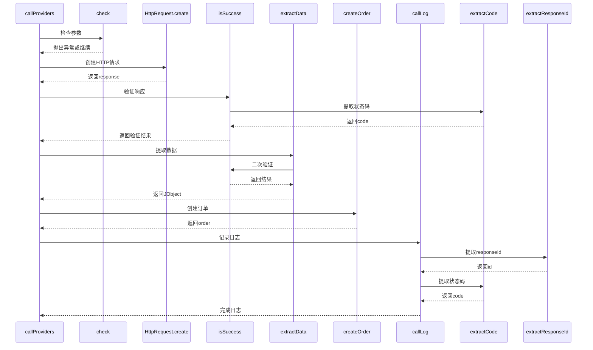

# 基础信息

|      |      |
|------|------|
| 名称 | PromoterPredictHelper |
| 编码语言 | .java |
| 代码路径 | WeFe/serving/serving-service/src/main/java/com/welab/wefe/serving/service/predicter/single/PromoterPredictHelper.java |
| 包名 | com.welab.wefe.serving.service.predicter.single |
| 依赖项 | ['com.alibaba.fastjson.JSONObject', 'com.welab.wefe.common.StatusCode', 'com.welab.wefe.common.exception.StatusCodeWithException', 'com.welab.wefe.common.http.HttpRequest', 'com.welab.wefe.common.http.HttpResponse', 'com.welab.wefe.common.util.JObject', 'com.welab.wefe.common.util.RSAUtil', 'com.welab.wefe.common.util.SignUtil', 'com.welab.wefe.common.util.StringUtil', 'com.welab.wefe.common.web.Launcher', 'com.welab.wefe.serving.sdk.config.Config', 'com.welab.wefe.serving.sdk.dto.ProviderParams', 'com.welab.wefe.serving.service.api.serviceorder.SaveApi', 'com.welab.wefe.serving.service.database.entity.ServiceCallLogMysqlModel', 'com.welab.wefe.serving.service.enums.CallByMeEnum', 'com.welab.wefe.serving.service.enums.ServiceCallStatusEnum', 'com.welab.wefe.serving.service.enums.ServiceOrderEnum', 'com.welab.wefe.serving.service.enums.ServiceTypeEnum', 'com.welab.wefe.serving.service.service.CacheObjects', 'com.welab.wefe.serving.service.service.ServiceCallLogService', 'com.welab.wefe.serving.service.service.ServiceOrderService', 'com.welab.wefe.serving.service.utils.ServiceUtil', 'org.slf4j.Logger', 'org.slf4j.LoggerFactory', 'java.util.List', 'java.util.TreeMap'] |
| 概述说明 | PromoterPredictHelper类提供协作方预测服务调用功能，包括参数校验、HTTP请求、响应处理、订单和日志记录。支持单用户和批量用户预测请求，使用签名确保数据安全。 |

# 说明

PromoterPredictHelper类是一个用于处理服务预测调用的工具类，主要功能包括调用协作方API、构建请求参数、记录订单和日志等。类中定义了callProviders方法，负责发送HTTP请求并处理响应，包括参数校验、重试机制和错误处理。此外，提供了buildFederatedPredictParam和buildBatchFederatedPredictParam方法用于构建单用户和批量用户的预测请求参数，包含签名生成和数据封装。订单和调用日志的记录通过createOrder和callLog方法实现，保存服务调用详情和状态。辅助方法如extractData和isSuccess用于解析和验证响应数据。整体设计注重异常处理和日志追踪，确保服务调用的可靠性和可审计性。

# 类列表 Class Summary

| 名称   | 类型  | 说明 |
|-------|------|-------------|
| PromoterPredictHelper | class | PromoterPredictHelper类提供协作方预测服务调用功能，包含请求参数校验、HTTP调用、响应处理、订单和日志记录。支持单用户和批量用户预测，使用签名确保数据安全。处理异常并记录状态。 |

## 类 PromoterPredictHelper

|      |      |
|------|------|
| 访问范围 | public |
| 类型 | class |
| 名称 | PromoterPredictHelper |
| 说明 | PromoterPredictHelper类提供协作方预测服务调用功能，包含请求参数校验、HTTP调用、响应处理、订单和日志记录。支持单用户和批量用户预测，使用签名确保数据安全。处理异常并记录状态。 |

### UML类图

这段代码是一个名为PromoterPredictHelper的工具类，主要用于处理与预测服务相关的操作。它提供了调用协作方服务、构建请求参数、创建订单、记录日志等功能。类中包含多个静态方法，涉及参数校验、HTTP请求处理、数据提取、状态判断等逻辑。该类依赖多个外部接口，如ProviderParams、HttpResponse等，并与ServiceOrderService和ServiceCallLogService交互以持久化订单和日志数据。整体设计体现了服务调用流程的完整处理链，包括异常处理和事后日志记录。

### 内部方法调用关系图

流程图展示了PromoterPredictHelper类的核心方法调用关系，callProviders作为主入口，依次调用参数检查、HTTP请求、响应验证、数据提取等子方法，最终完成订单创建和日志记录。时序图详细描述了callProviders执行时的交互流程，包括异常处理路径和关键数据提取步骤，体现了远程服务调用的完整生命周期管理。

### 字段列表 Field List

| 名称  | 类型  | 说明 |
|-------|-------|------|
| LOG = LoggerFactory.getLogger(PromoterPredictHelper.class) | Logger | 类PromoterPredictHelper中定义了一个受保护的静态常量LOG，用于记录日志。 |

### 方法列表

| 名称  | 类型  | 说明 |
|-------|-------|------|
| buildBatchFederatedPredictParam | String | 构建批量联合预测参数，包含服务ID、请求ID和用户ID列表，使用TreeMap确保参数有序，生成JSON数据后签名，最终返回包含成员代码、签名和数据的JSON字符串。 |
| createOrder | SaveApi.Input | 创建订单方法：根据模型ID、合作方ID和状态构建订单对象，设置服务信息、合作方信息及订单类型，保存并返回订单。 |
| callLog | void | 方法callLog记录服务调用日志，包括服务类型、订单ID、请求数据、响应码等，并保存到数据库。 |
| callProviders | JObject | 调用服务提供者方法，检查参数后发送HTTP请求，处理成功返回数据，失败抛异常并记录日志。 |
| getResponseStatus | String | 方法根据结果对象返回响应状态：若结果为null返回错误状态，否则返回成功状态。 |
| buildFederatedPredictParam | String | 构建联邦预测参数，包含serviceId、requestId、userId等，排序后生成JSON数据并签名，最终返回包含签名和数据的JSON字符串。 |
| check | void | 检查协作方请求地址是否为空，若为空则报错并提示配置地址。 |
| extractResponseId | String | 从HTTP响应中提取responseId，若响应无效或不存在则返回空字符串。 |
| extractData | JObject | 提取HTTP响应数据，成功时返回JSON的data字段，失败返回空对象。 |
| isSuccess | boolean | 检查HTTP响应是否成功：响应非空、状态码200、JSON数据中code为0且含data字段。 |
| extractCode | Integer | 该方法从HTTP响应中提取状态码，若响应无效或非200则返回系统错误码，否则返回JSON体中的"code"字段值。 |

