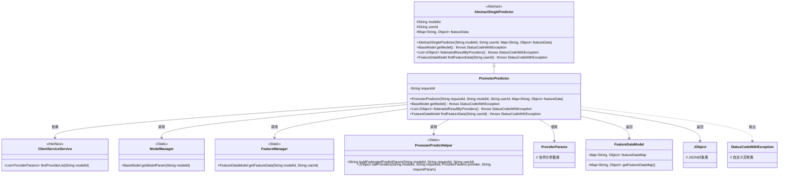
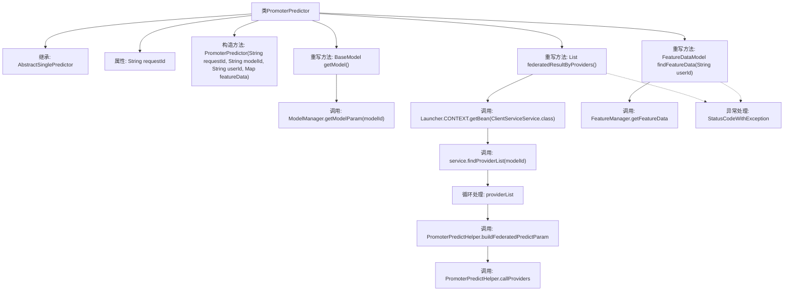

# 基础信息

|      |      |
|------|------|
| 名称 | PromoterPredictor |
| 编码语言 | .java |
| 代码路径 | WeFe/serving/serving-service/src/main/java/com/welab/wefe/serving/service/predicter/single/PromoterPredictor.java |
| 包名 | com.welab.wefe.serving.service.predicter.single |
| 依赖项 | ['com.welab.wefe.common.StatusCode', 'com.welab.wefe.common.exception.StatusCodeWithException', 'com.welab.wefe.common.util.JObject', 'com.welab.wefe.common.web.Launcher', 'com.welab.wefe.serving.sdk.dto.ProviderParams', 'com.welab.wefe.serving.sdk.model.BaseModel', 'com.welab.wefe.serving.sdk.model.FeatureDataModel', 'com.welab.wefe.serving.sdk.predicter.single.AbstractSinglePredictor', 'com.welab.wefe.serving.service.manager.FeatureManager', 'com.welab.wefe.serving.service.manager.ModelManager', 'com.welab.wefe.serving.service.service.ClientServiceService', 'org.apache.commons.collections4.CollectionUtils', 'org.apache.commons.collections4.MapUtils', 'java.util.ArrayList', 'java.util.List', 'java.util.Map'] |
| 概述说明 | PromoterPredictor类继承AbstractSinglePredictor，实现纵向联邦预测功能。包含requestId初始化、获取模型参数、调用协作方计算联邦结果及查询特征数据方法。关键点：联邦结果聚合、异常处理及特征数据管理。 |

# 说明

PromoterPredictor类继承自AbstractSinglePredictor，用于实现预测功能。构造函数接收requestId、modelId、userId和featureData参数。类中包含三个主要方法：getModel用于获取模型参数；federatedResultByProviders通过调用协作方服务获取联邦预测结果，若协作方列表为空则抛出异常；findFeatureData用于查找特征数据，优先使用predictParams中的特征数据，若不存在则从FeatureManager获取。该类涉及模型管理、协作方调用和特征数据处理等功能。

# 类列表 Class Summary

| 名称   | 类型  | 说明 |
|-------|------|-------------|
| PromoterPredictor | class | PromoterPredictor类继承AbstractSinglePredictor，实现纵向联邦预测功能，包含请求ID处理、模型获取、协作方结果聚合及特征数据查询方法。 |

## 类 PromoterPredictor

|      |      |
|------|------|
| 访问范围 | public |
| 类型 | class |
| 名称 | PromoterPredictor |
| 说明 | PromoterPredictor类继承AbstractSinglePredictor，实现纵向联邦预测功能，包含请求ID处理、模型获取、协作方结果聚合及特征数据查询方法。 |

### UML类图

该类图展示了PromoterPredictor继承自AbstractSinglePredictor，并实现了联邦预测功能的核心结构。PromoterPredictor通过ClientServiceService获取协作方列表，使用PromoterPredictHelper构建请求参数并调用协作方服务，同时依赖ModelManager和FeatureManager获取模型参数和特征数据。整个设计体现了纵向联邦预测的协作流程，包含异常处理和多种数据类型的交互。

### 内部方法调用关系图

该流程图展示了PromoterPredictor类的结构和主要方法调用关系。该类继承自AbstractSinglePredictor，包含requestId属性和构造方法，并重写了三个核心方法：getModel()通过ModelManager获取模型参数，federatedResultByProviders()通过ClientServiceService获取提供者列表并进行联邦预测，findFeatureData()从FeatureManager获取特征数据。图中清晰呈现了方法间的调用链和异常处理路径，特别是联邦预测时的循环处理流程。

### 字段列表 Field List

| 名称  | 类型  | 说明 |
|-------|-------|------|
| requestId | String | 私有字符串变量requestId，用于唯一标识请求。 |

### 方法列表

| 名称  | 类型  | 说明 |
|-------|-------|------|
| getModel | BaseModel | 该方法重写getModel，调用ModelManager获取指定modelId的参数，可能抛出StatusCodeWithException异常。 |
| federatedResultByProviders | List<JObject> | 该方法通过服务获取协作方列表，若为空则抛出异常。遍历协作方，构建预测参数并调用其接口，汇总结果后返回。 |
| findFeatureData | FeatureDataModel | 方法`findFeatureData`根据用户ID查找特征数据。若`predictParams`中的特征数据非空则直接返回，否则调用`FeatureManager`获取数据。可能抛出`StatusCodeWithException`异常。 |

