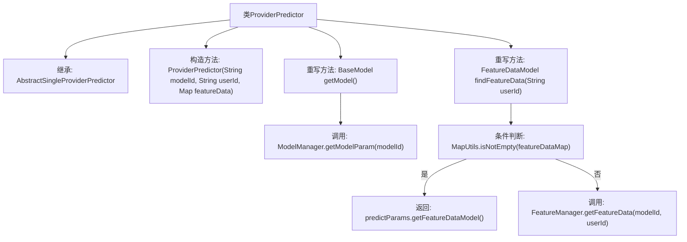

# 基础信息

|      |      |
|------|------|
| 名称 | ProviderPredictor |
| 编码语言 | .java |
| 代码路径 | WeFe/serving/serving-service/src/main/java/com/welab/wefe/serving/service/predicter/single/ProviderPredictor.java |
| 包名 | com.welab.wefe.serving.service.predicter.single |
| 依赖项 | ['com.welab.wefe.common.exception.StatusCodeWithException', 'com.welab.wefe.serving.sdk.model.BaseModel', 'com.welab.wefe.serving.sdk.model.FeatureDataModel', 'com.welab.wefe.serving.sdk.predicter.single.AbstractSingleProviderPredictor', 'com.welab.wefe.serving.service.manager.FeatureManager', 'com.welab.wefe.serving.service.manager.ModelManager', 'org.apache.commons.collections4.MapUtils', 'java.util.Map'] |
| 概述说明 | ProviderPredictor类继承AbstractSingleProviderPredictor，提供获取模型和特征数据的方法，通过modelId和userId查询ModelManager和FeatureManager。 |

# 说明

ProviderPredictor类继承自AbstractSingleProviderPredictor，用于提供预测功能。构造函数接收模型ID、用户ID和特征数据。重写getModel方法通过ModelManager获取模型参数。重写findFeatureData方法优先使用预测参数中的特征数据，若不存在则通过FeatureManager获取指定模型和用户的特征数据。

# 类列表 Class Summary

| 名称   | 类型  | 说明 |
|-------|------|-------------|
| ProviderPredictor | class | ProviderPredictor类继承AbstractSingleProviderPredictor，提供获取模型和特征数据的方法，通过ModelManager和FeatureManager实现。 |


## 类 ProviderPredictor

|      |      |
|------|------|
| 访问范围 | public |
| 类型 | class |
| 名称 | ProviderPredictor |
| 说明 | ProviderPredictor类继承AbstractSingleProviderPredictor，提供获取模型和特征数据的方法，通过ModelManager和FeatureManager实现。 |


### UML类图

```mermaid
classDiagram
    class AbstractSingleProviderPredictor {
        <<Abstract>>
        +String modelId
        +String userId
        +Map~String, Object~ featureData
        +PredictParams predictParams
        +BaseModel getModel()*
        +FeatureDataModel findFeatureData(String userId)*
    }
    // AbstractSingleProviderPredictor 是抽象基类，定义核心预测参数和抽象方法

    class ProviderPredictor {
        +ProviderPredictor(String modelId, String userId, Map~String, Object~ featureData)
        +BaseModel getModel() throws StatusCodeWithException
        +FeatureDataModel findFeatureData(String userId) throws StatusCodeWithException
    }
    // ProviderPredictor 实现具体模型和特征数据获取逻辑

    class ModelManager {
        <<Static>>
        +BaseModel getModelParam(String modelId) throws StatusCodeWithException
    }
    // ModelManager 提供静态模型获取方法

    class FeatureManager {
        <<Static>>
        +FeatureDataModel getFeatureData(String modelId, String userId) throws StatusCodeWithException
    }
    // FeatureManager 提供静态特征数据获取方法

    class BaseModel {
        <<Interface>>
    }
    // BaseModel 是模型参数基础接口

    class FeatureDataModel {
        -Map~String, Object~ featureDataMap
        +Map~String, Object~ getFeatureDataMap()
    }
    // FeatureDataModel 封装特征数据映射结构

    class PredictParams {
        -FeatureDataModel featureDataModel
        +FeatureDataModel getFeatureDataModel()
    }
    // PredictParams 包含特征数据模型引用

    AbstractSingleProviderPredictor <|-- ProviderPredictor : 继承
    ProviderPredictor --> ModelManager : 调用\n: getModelParam()
    ProviderPredictor --> FeatureManager : 调用\n: getFeatureData()
    ProviderPredictor --> PredictParams : 访问\n: featureDataModel
    ModelManager ..> BaseModel : 返回
    FeatureManager ..> FeatureDataModel : 返回
    PredictParams --> FeatureDataModel : 聚合
```

类图描述：该结构展示了一个预测器实现的核心层级，ProviderPredictor继承抽象类AbstractSingleProviderPredictor并实现其抽象方法，通过静态类ModelManager和FeatureManager分别获取模型参数和特征数据。PredictParams聚合FeatureDataModel存储特征数据映射，整体形成模块化的预测服务架构，各组件职责明确且通过异常机制处理错误。


### 内部方法调用关系图



该流程图展示了ProviderPredictor类的结构，它继承自AbstractSingleProviderPredictor，包含构造方法和两个重写方法。getModel()方法通过ModelManager获取模型参数，findFeatureData()方法首先检查特征数据映射是否非空，若为空则通过FeatureManager获取数据。流程清晰展现了条件分支和外部调用关系，完整覆盖了类的主要行为逻辑。

### 字段列表 Field List

| 名称  | 类型  | 说明 |
|-------|-------|------|

### 方法列表

| 名称  | 类型  | 说明 |
|-------|-------|------|
| findFeatureData | FeatureDataModel | 方法根据用户ID查找特征数据。若predictParams中的特征数据非空则直接返回，否则通过FeatureManager获取。可能抛出StatusCodeWithException异常。 |
| getModel | BaseModel | 方法重写，调用ModelManager获取指定modelId的模型参数，可能抛出StatusCodeWithException异常。 |


