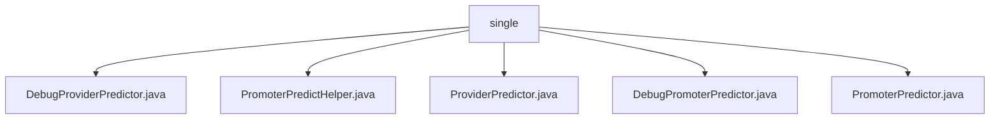

# 基础信息

|      |      |
|------|------|
| 名称 | single |
| 编码语言 | .java |
| 代码路径 | WeFe/serving/serving-service/src/main/java/com/welab/wefe/serving/service/predicter/single |
| 包名 | docs.serving.serving-service.src.main.java.com.welab.wefe.serving.service.predicter.single |
| 概述说明 | DebugProviderPredictor用于调试模式预测，含featureSource和extendParams属性。PromoterPredictHelper处理预测调用，含API调用、参数构建和日志记录。ProviderPredictor提供预测功能，通过ModelManager获取模型。DebugPromoterPredictor用于调试场景，支持多种特征数据获取方式。PromoterPredictor实现预测功能，涉及模型管理和协作方调用。 |

# 说明

## 概述  
该模块核心职责是提供联邦学习环境下的预测功能，包含标准模式和调试模式实现。接口规范统一通过Predictor类族实现，支持单用户/批量预测、协作方API调用及特征数据获取。关键数据结构包括PredictFeatureDataSource特征源、JSONObject扩展参数和FederatedPredictParam请求参数。外部依赖涉及ModelManager模型管理、FeatureManager特征管理及HTTP客户端。例如DebugProviderPredictor通过code/sql方式获取调试数据，PromoterPredictHelper实现类似网关模式的协作方调用编排。

## 主要业务场景  
模块主要处理两种业务流：标准预测流程通过PromoterPredictor协调多协作方计算，调试流程由Debug前缀类实现本地化模拟。典型交互模式为"初始化预测器→获取模型→查询特征→调用协作方API→聚合结果"，异常处理贯穿全流程。例如PromoterPredictHelper的callProviders方法集成重试机制和日志审计，DebugPromoterPredictor支持SQL特征回放。整体形成"预测请求→参数封装→联邦计算→结果返回"的闭环，适用于金融风控等需要多方数据协作的场景。

### 包内部结构视图

该流程图展示了WeFe项目中预测器模块的类文件结构。根节点"single"包含5个Java类文件，包括调试提供者预测器、提供者预测器、调试发起者预测器等核心组件，这些类共同构成了单例预测服务的实现基础。

# 文件列表

| 名称   | 类型  | 说明 |
|-------|------|-------------|
| [DebugProviderPredictor.java](DebugProviderPredictor.md) | file | DebugProviderPredictor继承ProviderPredictor，用于调试预测功能。包含特征数据源featureSource和扩展参数extendParams。构造函数初始化模型ID、用户ID等参数。提供设置特征数据源方法，重写findFeatureData方法根据数据源类型处理特征数据。 |
| [PromoterPredictHelper.java](PromoterPredictHelper.md) | file | PromoterPredictHelper类提供协作方预测服务调用功能，包括参数校验、HTTP请求、响应处理、订单和日志记录。支持单用户和批量用户预测请求，使用签名确保数据安全。 |
| [ProviderPredictor.java](ProviderPredictor.md) | file | ProviderPredictor类继承AbstractSingleProviderPredictor，提供获取模型和特征数据的方法，通过modelId和userId查询ModelManager和FeatureManager。 |
| [DebugPromoterPredictor.java](DebugPromoterPredictor.md) | file | DebugPromoterPredictor继承PromoterPredictor，用于调试预测器。包含requestId、featureSource和extendParams属性，提供设置featureSource方法和根据不同来源获取特征数据的功能。支持代码和SQL两种特征数据来源。 |
| [PromoterPredictor.java](PromoterPredictor.md) | file | PromoterPredictor类继承AbstractSinglePredictor，实现纵向联邦预测功能。包含requestId初始化、获取模型参数、调用协作方计算联邦结果及查询特征数据方法。关键点：联邦结果聚合、异常处理及特征数据管理。 |

