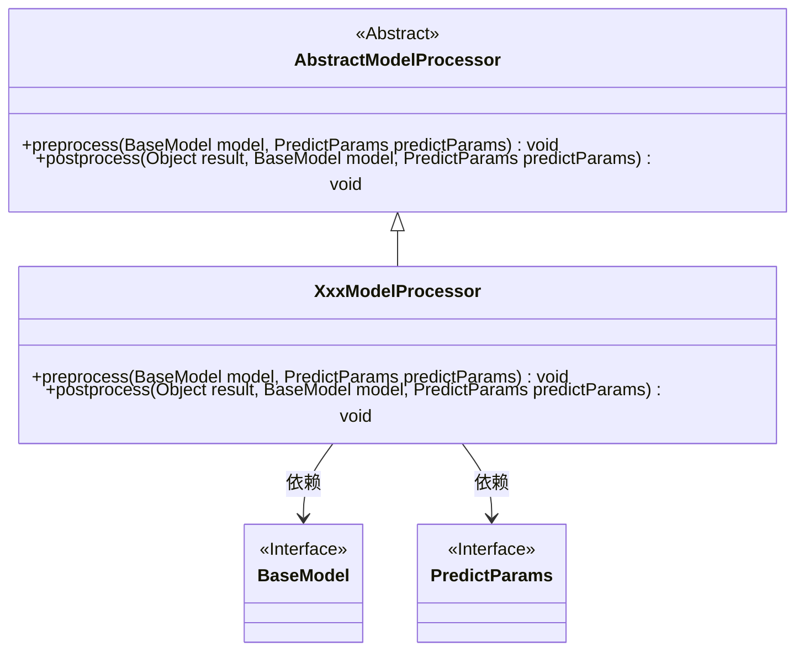
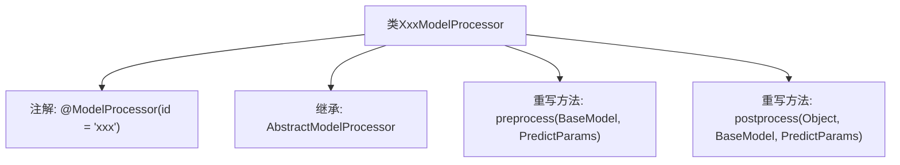

# 基础信息

|      |      |
|------|------|
| 名称 | XxxModelProcessor |
| 编码语言 | .java |
| 代码路径 | WeFe/serving/serving-service/src/main/java/com/welab/wefe/serving/service/processor/XxxModelProcessor.java |
| 包名 | com.welab.wefe.serving.service.processor |
| 依赖项 | ['com.welab.wefe.serving.sdk.dto.PredictParams', 'com.welab.wefe.serving.sdk.model.BaseModel', 'com.welab.wefe.serving.sdk.processor.AbstractModelProcessor', 'com.welab.wefe.serving.sdk.processor.ModelProcessor'] |
| 概述说明 | 这是一个名为XxxModelProcessor的模型处理器类，继承自AbstractModelProcessor，包含预处理preprocess和后处理postprocess方法，用于处理模型预测前后的逻辑。 |

# 说明

该内容描述了一个名为XxxModelProcessor的Java类，继承自AbstractModelProcessor抽象类，并使用@ModelProcessor注解标识其ID为"xxx"。该类实现了两个核心方法：preprocess用于模型预测前的预处理，接收BaseModel和PredictParams参数；postprocess用于预测后的后处理，接收结果对象、BaseModel和PredictParams参数。当前两个方法均为空实现，需根据业务逻辑填充具体处理逻辑。

# 类列表 Class Summary

| 名称   | 类型  | 说明 |
|-------|------|-------------|
| XxxModelProcessor | class | 这是一个模型处理器类，继承自抽象模型处理器，包含预处理和后处理方法，用于处理模型预测前后的逻辑。 |

## 类 XxxModelProcessor

|      |      |
|------|------|
| 访问范围 | @ModelProcessor(id = "xxx");public |
| 类型 | class |
| 名称 | XxxModelProcessor |
| 说明 | 这是一个模型处理器类，继承自抽象模型处理器，包含预处理和后处理方法，用于处理模型预测前后的逻辑。 |

### UML类图

该类图展示了XxxModelProcessor继承自抽象类AbstractModelProcessor，并实现了预处理和后处理方法。XxxModelProcessor依赖于BaseModel和PredictParams接口，这两个接口作为方法参数类型。类图清晰地体现了继承关系和依赖关系，XxxModelProcessor作为具体实现类，需要实现父类中的抽象方法。

### 内部方法调用关系图

该流程图展示了XxxModelProcessor类的结构，它是一个带有特定注解的模型处理器，继承自AbstractModelProcessor基类。类中重写了两个关键方法：preprocess用于模型预测前的预处理，postprocess用于结果的后处理。注解@ModelProcessor定义了该处理器的唯一标识符"xxx"，表明这是一个可插拔的组件。整个设计符合模板方法模式，通过继承实现特定处理逻辑的扩展点。

### 字段列表 Field List

| 名称  | 类型  | 说明 |
|-------|-------|------|

### 方法列表

| 名称  | 类型  | 说明 |
|-------|-------|------|
| preprocess | void | 方法preprocess重写，接收BaseModel和PredictParams参数，无具体实现。 |
| postprocess | void | Java方法重写，用于后处理预测结果，接收结果对象、基础模型和预测参数。 |

