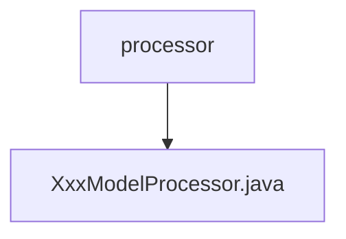

# 基础信息

|      |      |
|------|------|
| 名称 | processor |
| 编码语言 | .java |
| 代码路径 | WeFe/serving/serving-service/src/main/java/com/welab/wefe/serving/service/processor |
| 包名 | docs.serving.serving-service.src.main.java.com.welab.wefe.serving.service.processor |
| 概述说明 | 这是一个名为XxxModelProcessor的模型处理器类，继承自AbstractModelProcessor，包含预处理preprocess和后处理postprocess方法，用于处理模型预测前后的逻辑。 |

# 说明

该内容描述了一个名为XxxModelProcessor的Java类，继承自AbstractModelProcessor抽象类，并使用@ModelProcessor注解标识其ID为"xxx"。该类实现了两个核心方法：preprocess用于模型预测前的预处理，接收BaseModel和PredictParams参数；postprocess用于预测后的后处理，接收结果对象、BaseModel和PredictParams参数。当前两个方法均为空实现，需根据业务逻辑填充具体处理逻辑。

### 包内部结构视图

该流程图展示了WeFe项目中serving-service模块的处理器包结构。processor文件夹作为父节点，包含一个具体的处理器实现文件XxxModelProcessor.java。这种结构是典型的企业级Java项目组织方式，其中processor包通常用于存放业务逻辑处理类，而XxxModelProcessor则代表某个具体模型的处理实现类。

# 文件列表

| 名称   | 类型  | 说明 |
|-------|------|-------------|
| [XxxModelProcessor.java](XxxModelProcessor.md) | file | 这是一个名为XxxModelProcessor的模型处理器类，继承自AbstractModelProcessor，包含预处理preprocess和后处理postprocess方法，用于处理模型预测前后的逻辑。 |

