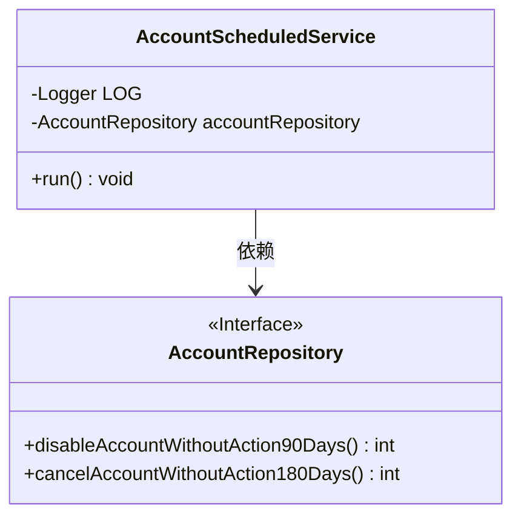
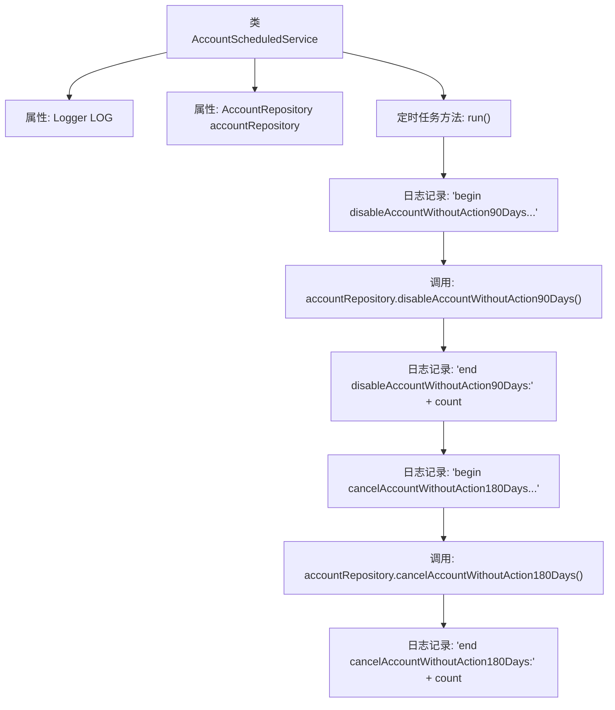

# 基础信息

|      |      |
|------|------|
| 名称 | AccountScheduledService |
| 编码语言 | .java |
| 代码路径 | WeFe/serving/serving-service/src/main/java/com/welab/wefe/serving/service/scheduler/AccountScheduledService.java |
| 包名 | com.welab.wefe.serving.service.scheduler |
| 依赖项 | ['org.slf4j.Logger', 'org.slf4j.LoggerFactory', 'org.springframework.beans.factory.annotation.Autowired', 'org.springframework.context.annotation.Lazy', 'org.springframework.scheduling.annotation.Scheduled', 'org.springframework.stereotype.Component', 'com.welab.wefe.serving.service.database.repository.AccountRepository'] |
| 概述说明 | AccountScheduledService定时任务类，每10分钟执行一次，自动禁用90天未活动的账户和注销180天未活动的账户。 |

# 说明

这是一个名为AccountScheduledService的Spring组件类，用于执行定时任务。该类被标记为非延迟初始化，包含一个自动注入的AccountRepository实例。核心方法run()通过@Scheduled注解配置为每10分钟执行一次，首次延迟10秒。方法主要功能是处理长期未活跃的账户：先禁用90天未活动的账户，再注销180天未活动的账户。每个操作都通过日志记录开始和结束时间，并输出处理账户数量。整个流程通过Logger记录详细执行信息。

# 类列表 Class Summary

| 名称   | 类型  | 说明 |
|-------|------|-------------|
| AccountScheduledService | class | AccountScheduledService定时任务类，每10分钟执行一次，自动禁用90天未活跃账户和注销180天未活跃账户，并记录日志。 |

## 类 AccountScheduledService

|      |      |
|------|------|
| 访问范围 | @Component;@Lazy(false);public |
| 类型 | class |
| 名称 | AccountScheduledService |
| 说明 | AccountScheduledService定时任务类，每10分钟执行一次，自动禁用90天未活跃账户和注销180天未活跃账户，并记录日志。 |

### UML类图

这段代码展示了一个Spring定时任务服务`AccountScheduledService`，它通过`@Scheduled`注解配置了每10分钟执行一次的定时任务。该服务依赖`AccountRepository`接口来执行两个核心操作：禁用90天无活动的账户和注销180天无活动的账户。类图中清晰地显示了服务类与仓库接口之间的依赖关系，以及接口中定义的两个关键业务方法。定时任务通过日志记录操作开始/结束时间和影响记录数，体现了良好的可观测性设计。

### 内部方法调用关系图

这段代码展示了一个Spring定时任务服务类，通过@Scheduled注解配置了每10分钟执行一次的定时任务。流程图清晰呈现了任务执行的两个主要阶段：先禁用90天无活动的账户，再注销180天无活动的账户。每个阶段都包含开始日志记录、调用Repository层方法执行数据库操作、结束日志记录三个步骤，体现了完整的任务执行流程和日志监控机制。

### 字段列表 Field List

| 名称  | 类型  | 说明 |
|-------|-------|------|
| accountRepository | AccountRepository | 使用@Autowired自动注入AccountRepository实例。 |
| LOG = LoggerFactory.getLogger(this.getClass()) | Logger | 类中定义了一个受保护且不可变的日志记录器实例，用于记录当前类的日志。 |

### 方法列表

| 名称  | 类型  | 说明 |
|-------|-------|------|
| run | void | 定时任务：每10秒启动，间隔10分钟。执行两步操作：禁用90天未活跃账户和注销180天未活跃账户，并记录处理数量。 |

