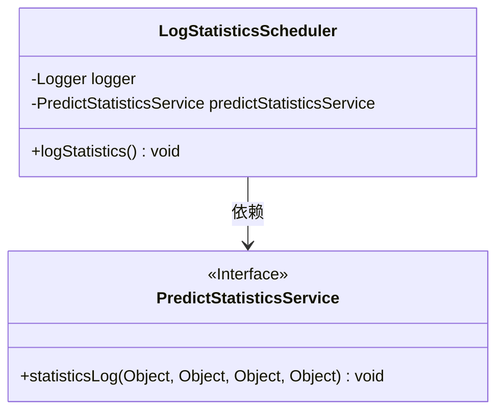
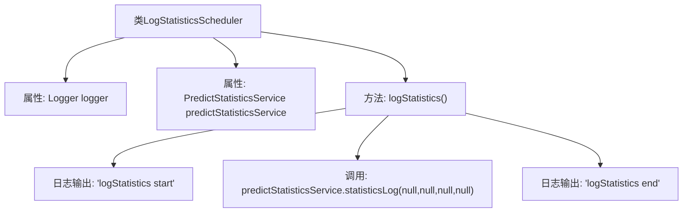

# 基础信息

|      |      |
|------|------|
| 名称 | LogStatisticsScheduler |
| 编码语言 | .java |
| 代码路径 | WeFe/serving/serving-service/src/main/java/com/welab/wefe/serving/service/scheduler/LogStatisticsScheduler.java |
| 包名 | com.welab.wefe.serving.service.scheduler |
| 依赖项 | ['com.welab.wefe.serving.service.service.PredictStatisticsService', 'org.slf4j.Logger', 'org.slf4j.LoggerFactory', 'org.springframework.beans.factory.annotation.Autowired', 'org.springframework.scheduling.annotation.Scheduled', 'org.springframework.stereotype.Component'] |
| 概述说明 | LogStatisticsScheduler类通过定时任务调用predictStatisticsService统计日志，记录开始和结束信息。 |

# 说明

LogStatisticsScheduler是一个用于记录统计信息的调度类，包含Logger日志记录器和自动注入的PredictStatisticsService服务。类中定义了一个logStatistics方法，方法开始时记录日志，调用predictStatisticsService的statisticsLog方法进行统计处理，最后记录结束日志。当前调度功能被注释掉，初始延迟5秒，固定延迟120秒。

# 类列表 Class Summary

| 名称   | 类型  | 说明 |
|-------|------|-------------|
| LogStatisticsScheduler | class | LogStatisticsScheduler类通过定时任务调用predictStatisticsService统计日志，包含开始和结束日志记录。 |

## 类 LogStatisticsScheduler

|      |      |
|------|------|
| 访问范围 | public |
| 类型 | class |
| 名称 | LogStatisticsScheduler |
| 说明 | LogStatisticsScheduler类通过定时任务调用predictStatisticsService统计日志，包含开始和结束日志记录。 |

### UML类图

这段类图展示了LogStatisticsScheduler与PredictStatisticsService之间的依赖关系。LogStatisticsScheduler是一个定时任务类，通过@Autowired注入PredictStatisticsService接口实现，并调用其statisticsLog方法进行日志统计。其中PredictStatisticsService被标记为接口，包含一个接收四个Object参数的统计方法。类图清晰地反映了服务调用的层级结构和依赖方向。

### 内部方法调用关系图

这段代码展示了一个定时任务类`LogStatisticsScheduler`，通过`@Autowired`注入`PredictStatisticsService`服务，并在`logStatistics()`方法中调用其统计日志功能。方法执行前后会打印开始和结束日志，核心逻辑是调用`statisticsLog`方法（当前参数全为null）。流程图清晰呈现了类结构和方法调用链。

### 字段列表 Field List

| 名称  | 类型  | 说明 |
|-------|-------|------|
| predictStatisticsService | PredictStatisticsService | 自动注入预测统计服务实例。 |
| logger = LoggerFactory.getLogger(LogStatisticsScheduler.class) | Logger | 定义私有日志记录器，使用指定类名初始化。 |

### 方法列表

| 名称  | 类型  | 说明 |
|-------|-------|------|
| logStatistics | void | 方法logStatistics记录统计日志，调用predictStatisticsService的statisticsLog方法，参数全为null，前后添加开始和结束日志。 |

