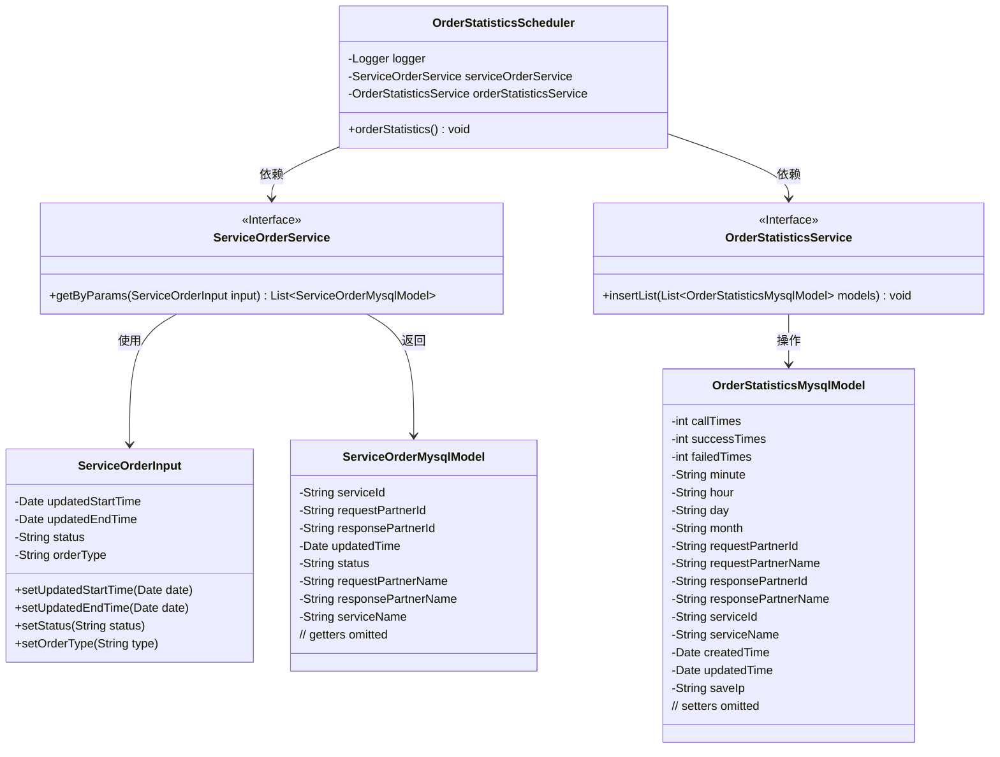
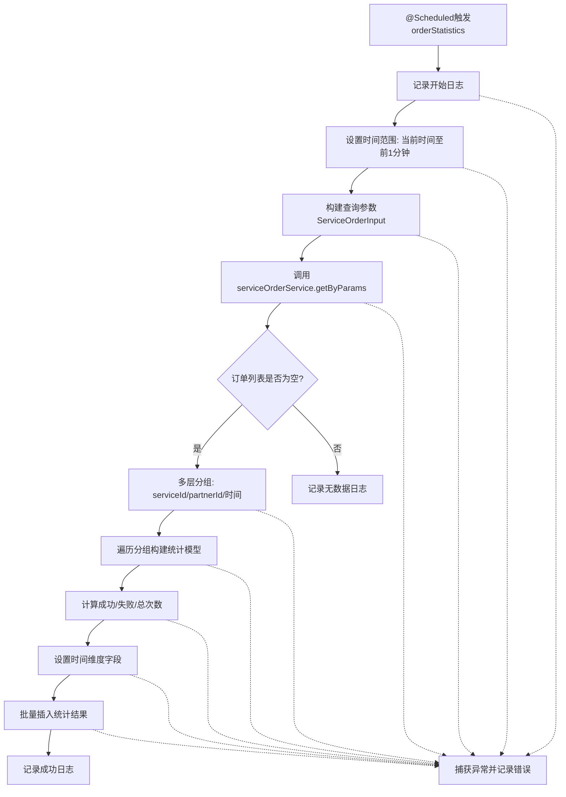

# 基础信息

|      |      |
|------|------|
| 名称 | OrderStatisticsScheduler |
| 编码语言 | .java |
| 代码路径 | WeFe/serving/serving-service/src/main/java/com/welab/wefe/serving/service/scheduler/OrderStatisticsScheduler.java |
| 包名 | com.welab.wefe.serving.service.scheduler |
| 依赖项 | ['com.welab.wefe.common.util.DateUtil', 'com.welab.wefe.common.util.HostUtil', 'com.welab.wefe.common.web.util.HttpServletRequestUtil', 'com.welab.wefe.serving.service.database.entity.OrderStatisticsMysqlModel', 'com.welab.wefe.serving.service.database.entity.ServiceOrderMysqlModel', 'com.welab.wefe.serving.service.dto.ServiceOrderInput', 'com.welab.wefe.serving.service.enums.CallByMeEnum', 'com.welab.wefe.serving.service.enums.ServiceOrderEnum', 'com.welab.wefe.serving.service.service.OrderStatisticsService', 'com.welab.wefe.serving.service.service.ServiceOrderService', 'org.slf4j.Logger', 'org.slf4j.LoggerFactory', 'org.springframework.beans.factory.annotation.Autowired', 'org.springframework.scheduling.annotation.Scheduled', 'org.springframework.stereotype.Component', 'java.util', 'java.util.stream.Collectors'] |
| 概述说明 | 定时任务类OrderStatisticsScheduler，每分钟统计前一分钟的非我方订单数据，按服务ID、合作伙伴等分组计算成功、失败次数，并存储统计结果。 |

# 说明

OrderStatisticsScheduler是一个定时任务组件，每分钟触发一次订单统计。它通过ServiceOrderService获取前一分钟的非我方生成订单数据，按服务ID、请求方ID、响应方ID和时间分组统计。统计内容包括调用次数、成功次数和失败次数，并将结果存入OrderStatisticsService。整个过程包含异常处理和日志记录，确保统计数据的准确性和可靠性。

# 类列表 Class Summary

| 名称   | 类型  | 说明 |
|-------|------|-------------|
| OrderStatisticsScheduler | class | 定时任务类OrderStatisticsScheduler每分钟执行一次订单统计，按服务ID、请求方、响应方和时间分组计算成功、失败及调用次数，结果存入数据库。 |

## 类 OrderStatisticsScheduler

|      |      |
|------|------|
| 访问范围 | @Component;public |
| 类型 | class |
| 名称 | OrderStatisticsScheduler |
| 说明 | 定时任务类OrderStatisticsScheduler每分钟执行一次订单统计，按服务ID、请求方、响应方和时间分组计算成功、失败及调用次数，结果存入数据库。 |

### UML类图

该代码实现了一个定时统计订单数据的调度任务。OrderStatisticsScheduler类通过@ServiceOrderService获取订单数据，按服务ID、合作伙伴ID和时间进行多级分组统计，计算成功/失败次数等指标，最后通过@OrderStatisticsService存储统计结果。整个流程涉及5个核心类，包含时间处理、数据分组聚合和异常处理等逻辑，主要用于生成分钟级的订单统计报表。

### 内部方法调用关系图

该流程图描述了订单统计定时任务的完整执行流程。系统每分钟触发任务后，首先设置统计时间范围（当前分钟和前1分钟），然后查询符合条件的订单数据。当存在数据时，会按照服务ID、合作伙伴ID和时间维度进行四级分组统计，计算各分组的调用次数、成功和失败次数，最后将统计结果批量入库。整个过程包含完善的日志记录和异常处理机制，确保统计任务的可靠性。

### 字段列表 Field List

| 名称  | 类型  | 说明 |
|-------|-------|------|
| logger = LoggerFactory.getLogger(OrderStatisticsScheduler.class) | Logger | 定义私有日志记录器，使用OrderStatisticsScheduler类初始化。 |
| serviceOrderService | ServiceOrderService | 使用@Autowired自动注入ServiceOrderService实例。 |
| orderStatisticsService | OrderStatisticsService | 使用@Autowired自动注入OrderStatisticsService实例。 |

### 方法列表

| 名称  | 类型  | 说明 |
|-------|-------|------|
| orderStatistics | void | 每分钟统计非我方订单数据，按服务ID、合作伙伴等分组计算成功、失败次数，存储统计结果并记录日志。 |

