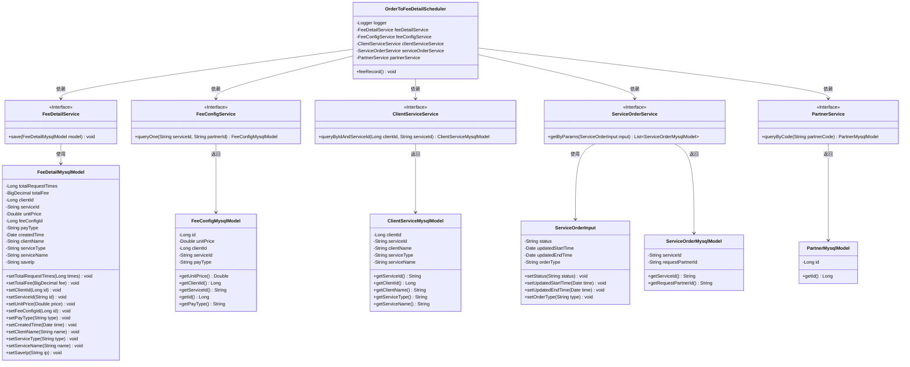
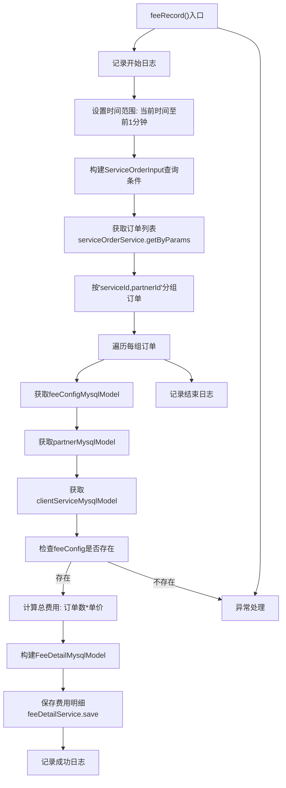

# 基础信息

|      |      |
|------|------|
| 名称 | OrderToFeeDetailScheduler |
| 编码语言 | .java |
| 代码路径 | WeFe/serving/serving-service/src/main/java/com/welab/wefe/serving/service/scheduler/OrderToFeeDetailScheduler.java |
| 包名 | com.welab.wefe.serving.service.scheduler |
| 依赖项 | ['java.math.BigDecimal', 'java.util.ArrayList', 'java.util.Calendar', 'java.util.Date', 'java.util.List', 'java.util.Map', 'java.util.TimeZone', 'java.util.stream.Collectors', 'org.slf4j.Logger', 'org.slf4j.LoggerFactory', 'org.springframework.beans.factory.annotation.Autowired', 'org.springframework.scheduling.annotation.Scheduled', 'org.springframework.stereotype.Component', 'com.welab.wefe.common.util.DateUtil', 'com.welab.wefe.common.util.HostUtil', 'com.welab.wefe.serving.service.database.entity.ClientServiceMysqlModel', 'com.welab.wefe.serving.service.database.entity.FeeConfigMysqlModel', 'com.welab.wefe.serving.service.database.entity.FeeDetailMysqlModel', 'com.welab.wefe.serving.service.database.entity.PartnerMysqlModel', 'com.welab.wefe.serving.service.database.entity.ServiceOrderMysqlModel', 'com.welab.wefe.serving.service.dto.ServiceOrderInput', 'com.welab.wefe.serving.service.enums.CallByMeEnum', 'com.welab.wefe.serving.service.enums.ServiceOrderEnum', 'com.welab.wefe.serving.service.service.ClientServiceService', 'com.welab.wefe.serving.service.service.FeeConfigService', 'com.welab.wefe.serving.service.service.FeeDetailService', 'com.welab.wefe.serving.service.service.PartnerService', 'com.welab.wefe.serving.service.service.ServiceOrderService'] |
| 概述说明 | 定时任务类OrderToFeeDetailScheduler，每小时执行一次，统计前一分钟非我方发起的订单，按服务ID和合作方分组计算费用并保存明细，记录日志和异常。 |

# 说明

OrderToFeeDetailScheduler是一个定时任务组件，每小时执行一次费用记录处理。它通过注入多个服务类获取数据，包括FeeDetailService、FeeConfigService等。任务逻辑为：获取前一分钟的非我方发起且状态为进行中的订单，按服务ID和合作方ID分组。查询每个分组对应的费用配置和合作方信息，计算总费用并保存到费用明细表。过程中会记录日志，包括开始结束时间、服务ID、合作方ID等关键信息。异常时会捕获并记录错误日志。

# 类列表 Class Summary

| 名称   | 类型  | 说明 |
|-------|------|-------------|
| OrderToFeeDetailScheduler | class | 定时任务类OrderToFeeDetailScheduler，每小时执行一次，统计前一分钟非我方发起的订单，按服务ID和合作方分组计算总费用并保存到费用明细表，包含异常处理和日志记录。 |

## 类 OrderToFeeDetailScheduler

|      |      |
|------|------|
| 访问范围 | @Component;public |
| 类型 | class |
| 名称 | OrderToFeeDetailScheduler |
| 说明 | 定时任务类OrderToFeeDetailScheduler，每小时执行一次，统计前一分钟非我方发起的订单，按服务ID和合作方分组计算总费用并保存到费用明细表，包含异常处理和日志记录。 |

### UML类图

这段代码实现了一个定时任务调度器`OrderToFeeDetailScheduler`，主要功能是每小时执行一次费用记录处理。该调度器通过多个服务接口获取订单数据、费用配置、客户服务信息和合作伙伴信息，计算总费用后保存到费用明细表中。核心流程包括：获取前一分钟的订单数据、按服务ID和合作伙伴分组、查询相关配置信息、计算总费用、保存费用明细记录。整个过程涉及6个服务接口和5个数据模型类，通过依赖注入方式实现松耦合架构。

### 内部方法调用关系图

这段代码实现了一个定时任务，每小时执行一次费用明细记录功能。主要流程包括：设置时间范围查询条件，获取特定状态的订单数据，按服务ID和合作方ID分组后，计算每组订单的总费用并保存到费用明细表。过程中会校验费用配置是否存在，记录详细的操作日志，并包含完整的异常处理机制。该流程涉及多个服务调用和数据转换操作，最终生成结构化的费用明细记录。

### 字段列表 Field List

| 名称  | 类型  | 说明 |
|-------|-------|------|
| partnerService | PartnerService | 使用@Autowired自动注入PartnerService实例。 |
| logger = LoggerFactory.getLogger(OrderToFeeDetailScheduler.class) | Logger | 定义私有日志记录器，使用OrderToFeeDetailScheduler类初始化。 |
| feeDetailService | FeeDetailService | 自动注入FeeDetailService服务实例。 |
| feeConfigService | FeeConfigService | 使用@Autowired自动注入FeeConfigService实例。 |
| serviceOrderService | ServiceOrderService | 使用@Autowired自动注入ServiceOrderService实例。 |
| clientServiceService | ClientServiceService | 使用@Autowired自动注入ClientServiceService实例。 |

### 方法列表

| 名称  | 类型  | 说明 |
|-------|-------|------|
| feeRecord | void | 定时任务每分钟执行，统计前一分钟非我方发起的订单，按服务ID和合作方分组计算费用并保存明细，记录日志和异常。 |

