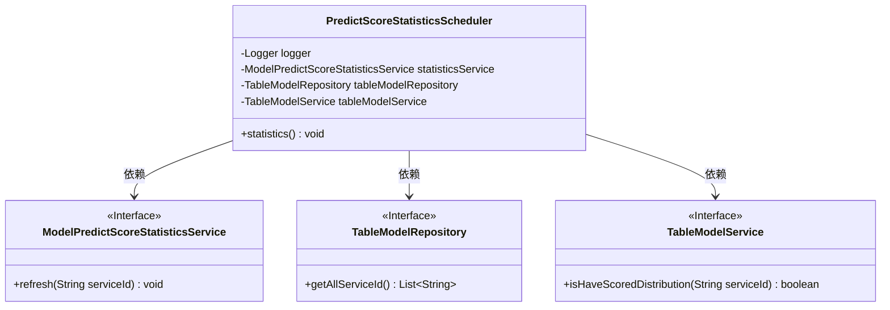
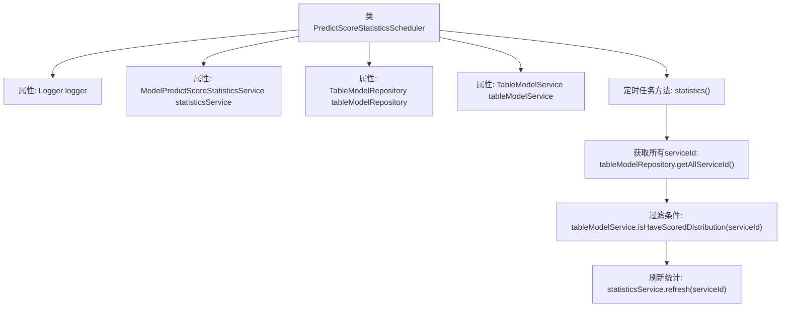

# 基础信息

|      |      |
|------|------|
| 名称 | PredictScoreStatisticsScheduler |
| 编码语言 | .java |
| 代码路径 | WeFe/serving/serving-service/src/main/java/com/welab/wefe/serving/service/scheduler/PredictScoreStatisticsScheduler.java |
| 包名 | com.welab.wefe.serving.service.scheduler |
| 依赖项 | ['com.welab.wefe.serving.service.database.repository.TableModelRepository', 'com.welab.wefe.serving.service.service.ModelPredictScoreStatisticsService', 'com.welab.wefe.serving.service.service.TableModelService', 'org.slf4j.Logger', 'org.slf4j.LoggerFactory', 'org.springframework.beans.factory.annotation.Autowired', 'org.springframework.scheduling.annotation.Scheduled', 'org.springframework.stereotype.Component', 'java.util.List'] |
| 概述说明 | 定时任务类，每5分钟执行一次，筛选有评分分布的服务ID并刷新统计信息。依赖统计服务、模型仓库和模型服务。 |

# 说明

这是一个名为PredictScoreStatisticsScheduler的Spring组件类，用于定时执行预测分数统计任务。该类通过@Scheduled注解配置了每5分钟执行一次的定时任务。主要功能是获取所有服务ID，筛选出具有评分分布的服务，然后调用statisticsService刷新每个服务的统计信息。类中注入了三个依赖：日志记录器、统计服务和两个与表模型相关的服务。定时任务方法statistics()会遍历所有符合条件的服务ID并逐一刷新统计信息。

# 类列表 Class Summary

| 名称   | 类型  | 说明 |
|-------|------|-------------|
| PredictScoreStatisticsScheduler | class | PredictScoreStatisticsScheduler类定时每5分钟执行一次，查询所有serviceId并过滤出有评分分布的，调用statisticsService刷新数据。 |

## 类 PredictScoreStatisticsScheduler

|      |      |
|------|------|
| 访问范围 | @Component;public |
| 类型 | class |
| 名称 | PredictScoreStatisticsScheduler |
| 说明 | PredictScoreStatisticsScheduler类定时每5分钟执行一次，查询所有serviceId并过滤出有评分分布的，调用statisticsService刷新数据。 |

### UML类图

这段代码展示了一个定时任务类PredictScoreStatisticsScheduler，它通过依赖注入的方式使用三个服务接口。该类每5分钟执行一次statistics()方法，首先获取所有serviceId，然后过滤出需要统计的serviceId，最后调用统计服务进行刷新。类图中清晰地展示了主类与三个接口之间的依赖关系，其中ModelPredictScoreStatisticsService、TableModelRepository和TableModelService都被标记为接口，主类通过Spring的依赖注入机制使用这些接口提供的服务。

### 内部方法调用关系图

这段代码是一个Spring组件类，主要实现定时统计预测分数的功能。流程图展示了类结构及核心方法调用链：通过`@Scheduled`注解每5分钟触发`statistics()`方法，首先获取所有服务ID，然后过滤出需要统计分布的服务，最后调用刷新统计服务。各组件通过`@Autowired`自动注入，包含日志记录、数据访问和业务逻辑处理功能。

### 字段列表 Field List

| 名称  | 类型  | 说明 |
|-------|-------|------|
| tableModelService | TableModelService | 自动注入TableModelService实例。 |
| tableModelRepository | TableModelRepository | 代码片段使用@Autowired注解自动注入TableModelRepository实例。 |
| statisticsService | ModelPredictScoreStatisticsService | 代码片段使用@Autowired自动注入ModelPredictScoreStatisticsService实例到statisticsService变量中。 |
| logger = LoggerFactory.getLogger(PredictScoreStatisticsScheduler.class) | Logger | 私有日志记录器实例，用于PredictScoreStatisticsScheduler类的日志输出。 |

### 方法列表

| 名称  | 类型  | 说明 |
|-------|-------|------|
| statistics | void | 定时任务每5分钟执行，筛选有评分分布的服务ID并刷新统计。 |

