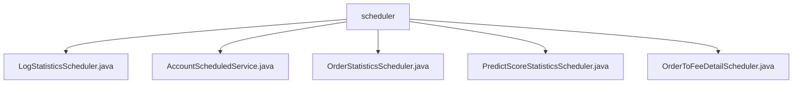

# 基础信息

|      |      |
|------|------|
| 名称 | scheduler |
| 编码语言 | .java |
| 代码路径 | WeFe/serving/serving-service/src/main/java/com/welab/wefe/serving/service/scheduler |
| 包名 | docs.serving.serving-service.src.main.java.com.welab.wefe.serving.service.scheduler |
| 概述说明 | LogStatisticsScheduler记录统计信息，初始延迟5秒，固定延迟120秒。AccountScheduledService每10分钟处理不活跃账户，首次延迟10秒。OrderStatisticsScheduler每分钟统计订单数据。PredictScoreStatisticsScheduler每5分钟刷新预测分数统计。OrderToFeeDetailScheduler每小时处理费用记录。 |

# 说明

## 概述  
该模块是定时任务调度系统，负责执行各类周期性统计与状态维护任务，类似后台守护进程。核心职责包括日志统计、账户状态管理、订单分析、预测评分统计和费用明细处理。接口规范统一采用Spring的@Scheduled注解配置执行周期，均包含开始/结束日志记录和异常处理机制。关键数据结构涉及服务ID、合作方ID、时间分组等维度。外部依赖包括PredictStatisticsService、AccountRepository等8个服务类。例如LogStatisticsScheduler调用统计服务，OrderToFeeDetailScheduler依赖5个费用相关服务。

## 主要业务场景  
模块实现五类定时任务：1）账户生命周期管理（如禁用90天未活跃账户）；2）订单多维统计（如每分钟统计调用成功率）；3）预测评分分布刷新（每5分钟遍历服务）；4）费用明细生成（每小时计算合作方费用）；5）日志聚合处理。采用固定延迟触发模式，例如AccountScheduledService每10分钟执行。典型交互为"查询-分组计算-存储"流程，如OrderStatisticsScheduler分组统计订单数据后持久化。API类型均为后台定时任务，集成案例包含统计服务调用（PredictScoreStatisticsScheduler）与仓储操作（AccountScheduledService）。

### 包内部结构视图

该流程图展示了WeFe项目中scheduler目录下的5个调度类文件关系。所有Java文件均为scheduler的直接子节点，包括日志统计、账户服务、订单统计、预测分数统计和订单费用明细等调度任务实现类，形成扁平化的文件结构关系。

# 文件列表

| 名称   | 类型  | 说明 |
|-------|------|-------------|
| [LogStatisticsScheduler.java](LogStatisticsScheduler.md) | file | LogStatisticsScheduler类通过定时任务调用predictStatisticsService统计日志，记录开始和结束信息。 |
| [AccountScheduledService.java](AccountScheduledService.md) | file | AccountScheduledService定时任务类，每10分钟执行一次，自动禁用90天未活动的账户和注销180天未活动的账户。 |
| [OrderStatisticsScheduler.java](OrderStatisticsScheduler.md) | file | 定时任务类OrderStatisticsScheduler，每分钟统计前一分钟的非我方订单数据，按服务ID、合作伙伴等分组计算成功、失败次数，并存储统计结果。 |
| [PredictScoreStatisticsScheduler.java](PredictScoreStatisticsScheduler.md) | file | 定时任务类，每5分钟执行一次，筛选有评分分布的服务ID并刷新统计信息。依赖统计服务、模型仓库和模型服务。 |
| [OrderToFeeDetailScheduler.java](OrderToFeeDetailScheduler.md) | file | 定时任务类OrderToFeeDetailScheduler，每小时执行一次，统计前一分钟非我方发起的订单，按服务ID和合作方分组计算费用并保存明细，记录日志和异常。 |

