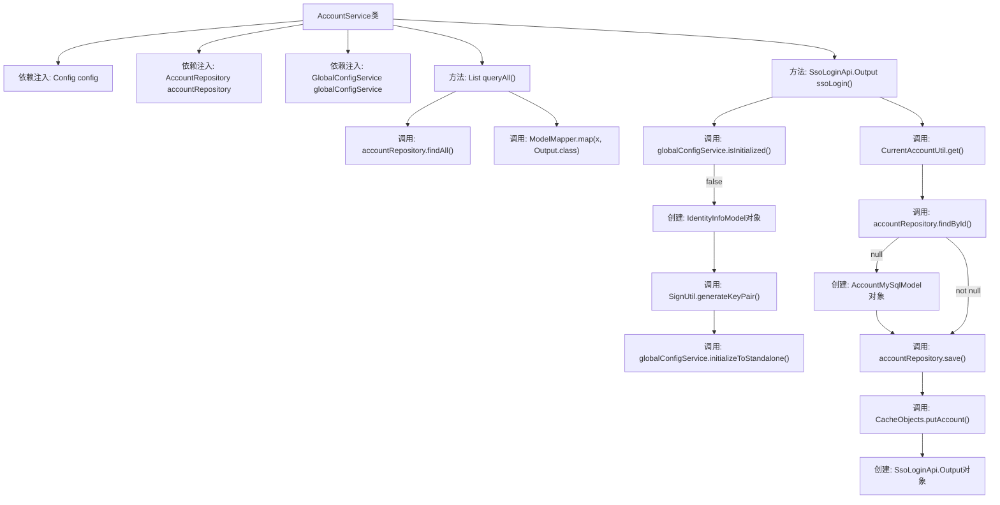
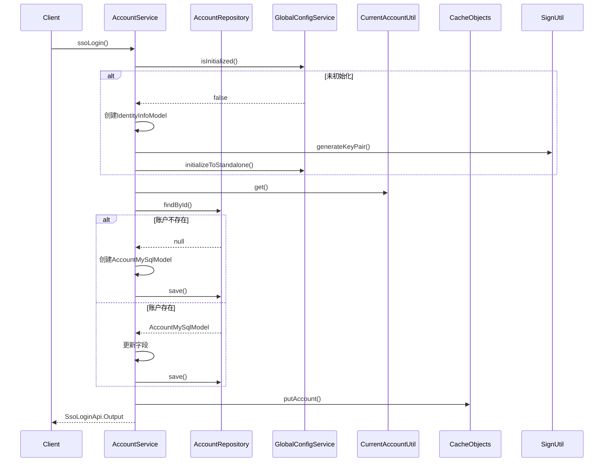

# 基础信息

|      |      |
|------|------|
| 名称 | AccountService |
| 编码语言 | .java |
| 代码路径 | WeFe/serving/serving-service/src/main/java/com/welab/wefe/serving/service/service/AccountService.java |
| 包名 | com.welab.wefe.serving.service.service |
| 依赖项 | ['java.security.NoSuchAlgorithmException', 'java.util.Date', 'java.util.List', 'java.util.UUID', 'java.util.stream.Collectors', 'com.welab.wefe.serving.service.config.Config', 'org.springframework.beans.factory.annotation.Autowired', 'org.springframework.stereotype.Service', 'com.welab.wefe.common.SecurityUtil', 'com.welab.wefe.common.constant.SecretKeyType', 'com.welab.wefe.common.exception.StatusCodeWithException', 'com.welab.wefe.common.util.Sha1', 'com.welab.wefe.common.util.SignUtil', 'com.welab.wefe.common.util.StringUtil', 'com.welab.wefe.common.web.service.account.SsoAccountInfo', 'com.welab.wefe.common.web.util.CurrentAccountUtil', 'com.welab.wefe.common.wefe.enums.AuditStatus', 'com.welab.wefe.serving.service.api.account.SsoLoginApi', 'com.welab.wefe.serving.service.database.entity.AccountMySqlModel', 'com.welab.wefe.serving.service.database.repository.AccountRepository', 'com.welab.wefe.serving.service.dto.globalconfig.IdentityInfoModel', 'com.welab.wefe.serving.service.enums.ServingModeEnum', 'com.welab.wefe.serving.service.service.globalconfig.GlobalConfigService', 'com.welab.wefe.serving.service.api.account.QueryAllApi.Output'] |
| 概述说明 | AccountService提供查询账户和SSO登录功能。查询所有账户数据并映射输出。SSO登录时检查全局配置，未初始化则生成密钥对并保存；根据账户信息更新或创建账户，最后返回登录结果。 |

# 说明

AccountService是一个Spring服务类，包含查询所有账户和SSO登录功能。queryAll方法通过accountRepository获取所有账户并映射为Output对象列表。ssoLogin方法首先检查系统是否初始化，未初始化则生成RSA密钥对并设置独立模式身份信息。接着获取当前账户信息，若不存在则创建新账户并设置随机密码和盐值；若存在则检查并更新昵称、手机号和邮箱等字段。最后将账户信息存入缓存并返回包含ID、令牌、手机号和昵称的输出对象。

# 类列表 Class Summary

| 名称   | 类型  | 说明 |
|-------|------|-------------|
| AccountService | class | AccountService提供查询账户和SSO登录功能。查询所有账户并映射为输出对象。SSO登录时检查全局配置，未初始化则生成密钥并保存。根据账户信息更新或创建账户，返回登录输出。 |


## 类 AccountService

|      |      |
|------|------|
| 访问范围 | @Service;public |
| 类型 | class |
| 名称 | AccountService |
| 说明 | AccountService提供查询账户和SSO登录功能。查询所有账户并映射为输出对象。SSO登录时检查全局配置，未初始化则生成密钥并保存。根据账户信息更新或创建账户，返回登录输出。 |


### UML类图

```mermaid
classDiagram
    class AccountService {
        -Config config
        -AccountRepository accountRepository
        -GlobalConfigService globalConfigService
        +queryAll() List~Output~
        +ssoLogin() SsoLoginApi$Output
    }

    class Config {
        <<Interface>>
        +getInitializeSecretKeyType() String
    }

    class AccountRepository {
        <<Interface>>
        +findAll() List~AccountMySqlModel~
        +findById(String id) Optional~AccountMySqlModel~
        +save(AccountMySqlModel entity) AccountMySqlModel
    }

    class GlobalConfigService {
        <<Interface>>
        +isInitialized() boolean
        +initializeToStandalone(IdentityInfoModel model) void
    }

    class AccountMySqlModel {
        -String id
        -String nickname
        -String phoneNumber
        -String password
        -String salt
        -boolean superAdminRole
        -boolean adminRole
        -AuditStatus auditStatus
        -boolean enable
        -String email
        -Date updatedTime
        +setId(String id)
        +setNickname(String nickname)
        +setPhoneNumber(String phoneNumber)
        +setPassword(String password)
        +setSalt(String salt)
        +setSuperAdminRole(boolean superAdminRole)
        +setAdminRole(boolean adminRole)
        +setAuditStatus(AuditStatus auditStatus)
        +setEnable(boolean enable)
        +setEmail(String email)
        +setUpdatedTime(Date updatedTime)
        +getNickname() String
        +getPhoneNumber() String
        +getEmail() String
    }

    class IdentityInfoModel {
        -String memberId
        -String memberName
        -String mode
        -String rsaPrivateKey
        -String rsaPublicKey
        -SecretKeyType secretKeyType
        +setMemberId(String memberId)
        +setMemberName(String memberName)
        +setMode(String mode)
        +setRsaPrivateKey(String rsaPrivateKey)
        +setRsaPublicKey(String rsaPublicKey)
        +setSecretKeyType(SecretKeyType secretKeyType)
    }

    class SsoLoginApi$Output {
        -String id
        -String token
        -String phoneNumber
        -String nickname
        +setId(String id)
        +setToken(String token)
        +setPhoneNumber(String phoneNumber)
        +setNickname(String nickname)
    }

    class CurrentAccountUtil {
        <<Utility>>
        +get() SsoAccountInfo
    }

    class CacheObjects {
        <<Utility>>
        +putAccount(AccountMySqlModel account) void
    }

    AccountService --> Config : 依赖
    AccountService --> AccountRepository : 依赖
    AccountService --> GlobalConfigService : 依赖
    AccountService --> CurrentAccountUtil : 调用
    AccountService --> CacheObjects : 调用
    GlobalConfigService --> IdentityInfoModel : 使用
    AccountRepository --> AccountMySqlModel : 操作
    SsoLoginApi$Output --> SsoAccountInfo : 数据来源
```

该图展示了AccountService的核心类关系，包含6个主要类和2个工具类。AccountService通过依赖注入使用Config、AccountRepository和GlobalConfigService，并调用CurrentAccountUtil和CacheObjects工具类。IdentityInfoModel用于初始化配置，AccountMySqlModel存储账户数据，SsoLoginApi$Output封装登录响应。类图清晰呈现了SSO登录流程中的数据流转和依赖关系。


### 内部方法调用关系图





流程图描述：该流程图展示了AccountService类的核心方法调用关系，重点描述了ssoLogin()方法的完整执行流程。当系统未初始化时，会创建身份信息并生成密钥对；接着获取当前账户信息，若账户不存在则创建新账户模型并保存，若存在则检查并更新必要字段；最后缓存账户信息并返回登录输出结果。整个过程包含条件判断、数据操作和外部服务调用等关键步骤。

### 字段列表 Field List

| 名称  | 类型  | 说明 |
|-------|-------|------|
| globalConfigService | GlobalConfigService | 使用@Autowired自动注入GlobalConfigService实例。 |
| config | Config | 使用@Autowired自动注入Config配置类实例。 |
| accountRepository | AccountRepository | 使用@Autowired自动注入AccountRepository实例。 |

### 方法列表

| 名称  | 类型  | 说明 |
|-------|-------|------|
| queryAll | List<Output> | 查询所有账户数据并转换为输出对象列表。 |
| ssoLogin | SsoLoginApi.Output | 方法ssoLogin处理单点登录：未初始化时生成密钥对并创建独立身份信息；检查账户存在性，不存在则创建新账户并设置随机密码，存在则更新信息；最后返回包含ID、令牌、电话和昵称的输出对象。 |


