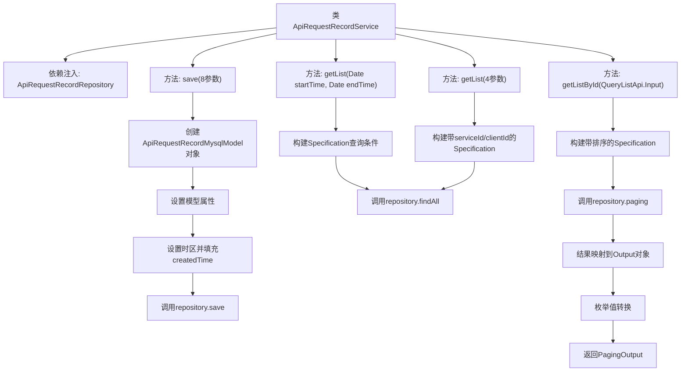

# 基础信息

|      |      |
|------|------|
| 名称 | ApiRequestRecordService |
| 编码语言 | .java |
| 代码路径 | WeFe/serving/serving-service/src/main/java/com/welab/wefe/serving/service/service/ApiRequestRecordService.java |
| 包名 | com.welab.wefe.serving.service.service |
| 依赖项 | ['java.util.ArrayList', 'java.util.Calendar', 'java.util.Date', 'java.util.List', 'java.util.TimeZone', 'org.springframework.beans.factory.annotation.Autowired', 'org.springframework.data.jpa.domain.Specification', 'org.springframework.stereotype.Service', 'com.welab.wefe.common.data.mysql.Where', 'com.welab.wefe.common.data.mysql.enums.OrderBy', 'com.welab.wefe.common.web.util.ModelMapper', 'com.welab.wefe.serving.service.api.apirequestrecord.QueryListApi', 'com.welab.wefe.serving.service.database.entity.ApiRequestRecordMysqlModel', 'com.welab.wefe.serving.service.database.repository.ApiRequestRecordRepository', 'com.welab.wefe.serving.service.dto.PagingOutput', 'com.welab.wefe.serving.service.enums.ServiceResultEnum', 'com.welab.wefe.serving.service.enums.ServiceTypeEnum'] |
| 概述说明 | ApiRequestRecordService类提供API请求记录管理功能，包含保存记录、按时间范围查询、按服务ID和客户端ID查询，以及分页查询并转换输出格式的方法。 |

# 说明

ApiRequestRecordService是一个服务类，用于处理API请求记录的存储和查询。它通过ApiRequestRecordRepository与数据库交互，提供保存记录和多种查询功能。保存方法接收服务ID、名称、类型、客户端信息、耗时、IP地址和请求结果等参数，构建模型并存储。查询功能包括按时间范围获取记录、按服务ID和客户端ID及时间范围筛选，以及分页查询并转换输出格式。所有查询都支持时间范围筛选，部分支持排序和分页。输出结果会映射为特定格式并包含枚举值的转换。

# 类列表 Class Summary

| 名称   | 类型  | 说明 |
|-------|------|-------------|
| ApiRequestRecordService | class | ApiRequestRecordService类提供API请求记录操作，包括保存记录、按时间范围查询、按服务ID和客户端ID查询，以及分页查询并映射输出结果。 |


## 类 ApiRequestRecordService

|      |      |
|------|------|
| 访问范围 | @Service;public |
| 类型 | class |
| 名称 | ApiRequestRecordService |
| 说明 | ApiRequestRecordService类提供API请求记录操作，包括保存记录、按时间范围查询、按服务ID和客户端ID查询，以及分页查询并映射输出结果。 |


### UML类图

```mermaid
classDiagram
    class ApiRequestRecordService {
        -ApiRequestRecordRepository apiRequestRecordRepository
        +save(String serviceId, String serviceName, Integer serviceType, String clientName, String clientId, Long spend, String ipAdd, Integer requestResult) void
        +getList(Date startTime, Date endTime) List~ApiRequestRecordMysqlModel~
        +getList(String serviceId, String clientId, Date startTime, Date endTime) List~ApiRequestRecordMysqlModel~
        +getListById(QueryListApi.Input input) PagingOutput~QueryListApi.Output~
    }

    class ApiRequestRecordRepository {
        <<Interface>>
        +save(ApiRequestRecordMysqlModel model) void
        +findAll(Specification~ApiRequestRecordMysqlModel~ where) List~ApiRequestRecordMysqlModel~
        +paging(Specification~ApiRequestRecordMysqlModel~ where, QueryListApi.Input input) PagingOutput~ApiRequestRecordMysqlModel~
    }

    class ApiRequestRecordMysqlModel {
        -String serviceId
        -String clientId
        -String serviceName
        -String clientName
        -Integer serviceType
        -Integer requestResult
        -Long spend
        -String ipAdd
        -Date createdTime
        +setters/getters
    }

    class QueryListApi {
        class Input {
            +String serviceId
            +String clientId
            +Date startTime
            +Date endTime
            +getters
        }
        class Output {
            +String serviceType
            +String requestResult
            +setters/getters
        }
    }

    class Where {
        +create() Builder
        <<static>>
    }

    class Builder {
        +equal(String field, Object value) Builder
        +betweenAndDate(String field, Long start, Long end) Builder
        +orderBy(String field, OrderBy order) Builder
        +build(Class~T~ clazz) Specification~T~
    }

    class PagingOutput~T~ {
        -Long total
        -List~T~ list
        +of(Long total, List~T~ list) PagingOutput~T~
        +getters
    }

    class ModelMapper {
        <<static>>
        +map(Object source, Class~D~ destinationClass) D
    }

    class ServiceTypeEnum {
        <<Enum>>
        +getValue(Integer code) String
    }

    class ServiceResultEnum {
        <<Enum>>
        +getValueByCode(Integer code) String
    }

    ApiRequestRecordService --> ApiRequestRecordRepository : 依赖
    ApiRequestRecordService --> ApiRequestRecordMysqlModel : 操作
    ApiRequestRecordService --> QueryListApi : 使用
    ApiRequestRecordService --> Where : 使用
    ApiRequestRecordService --> PagingOutput : 返回
    ApiRequestRecordService --> ModelMapper : 使用
    ApiRequestRecordService --> ServiceTypeEnum : 使用
    ApiRequestRecordService --> ServiceResultEnum : 使用
    Where --> Builder : 创建
    Builder --> Specification : 生成
```

这段代码展示了一个API请求记录服务类，主要功能包括保存请求记录、按时间范围查询记录、按服务ID和客户端ID查询记录，以及分页查询记录并转换输出格式。该类通过JPA规范与数据库交互，使用Where构建查询条件，并涉及多个枚举类和模型映射工具。整体设计体现了分层架构思想，服务层负责业务逻辑处理，与数据访问层解耦，同时支持多种查询方式和结果转换。


### 内部方法调用关系图



该流程图展示了ApiRequestRecordService类的核心方法调用链。服务类通过Repository操作数据库，包含四种主要操作：保存记录、两种条件查询和分页查询。其中分页查询方法涉及复杂的结果映射和枚举转换，所有方法都围绕ApiRequestRecordMysqlModel实体展开，体现了典型的Spring Data JPA使用模式。

### 字段列表 Field List

| 名称  | 类型  | 说明 |
|-------|-------|------|
| apiRequestRecordRepository | ApiRequestRecordRepository | 自动注入ApiRequestRecordRepository实例。 |

### 方法列表

| 名称  | 类型  | 说明 |
|-------|-------|------|
| getList | List<ApiRequestRecordMysqlModel> | 该方法通过服务ID、客户端ID和时间范围查询API请求记录列表，使用条件构造器生成查询条件并返回结果。 |
| save | void | 方法save用于保存API请求记录，接收服务ID、名称、类型、客户名、ID、耗时、IP、结果等参数，创建模型对象并设置属性，包括当前上海时区时间，最后通过repository保存。 |
| getListById | PagingOutput<QueryListApi.Output> | 方法getListById根据输入条件查询API请求记录，返回分页结果。通过serviceId、clientId和时间范围筛选，按创建时间降序排序。查询结果映射为输出对象并转换枚举值，最后返回分页数据。 |
| getList | List<ApiRequestRecordMysqlModel> | 获取指定时间范围内的API请求记录列表，使用创建时间进行筛选。 |


