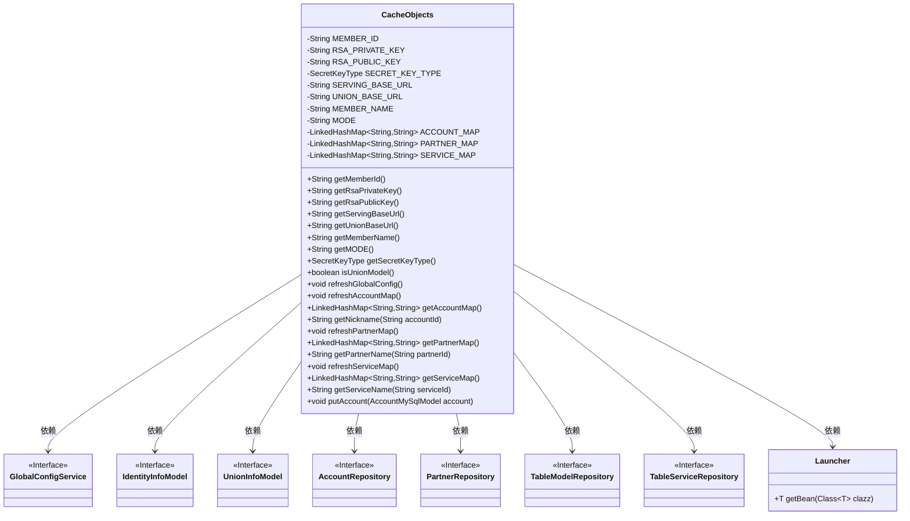
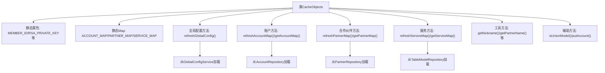
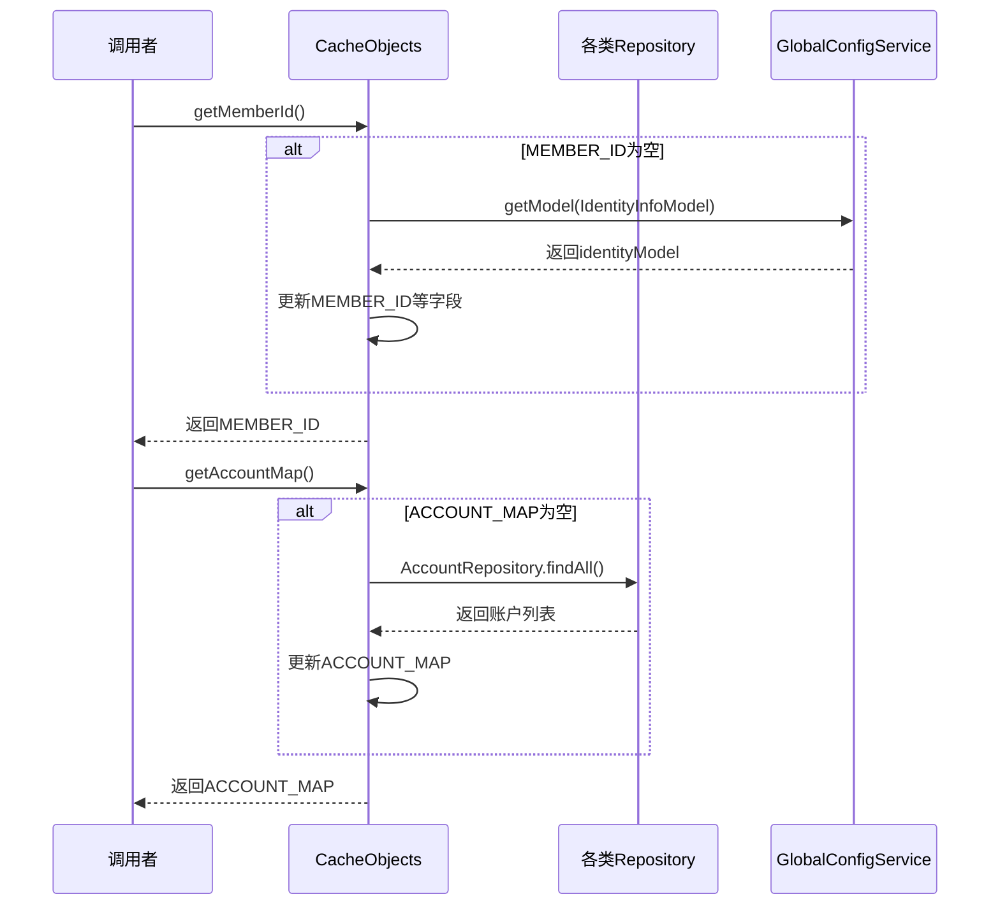

# 基础信息

|      |      |
|------|------|
| 名称 | CacheObjects |
| 编码语言 | .java |
| 代码路径 | WeFe/serving/serving-service/src/main/java/com/welab/wefe/serving/service/service/CacheObjects.java |
| 包名 | com.welab.wefe.serving.service.service |
| 依赖项 | ['com.welab.wefe.common.constant.SecretKeyType', 'com.welab.wefe.common.web.Launcher', 'com.welab.wefe.serving.service.database.entity', 'com.welab.wefe.serving.service.database.repository.AccountRepository', 'com.welab.wefe.serving.service.database.repository.PartnerRepository', 'com.welab.wefe.serving.service.database.repository.TableModelRepository', 'com.welab.wefe.serving.service.database.repository.TableServiceRepository', 'com.welab.wefe.serving.service.dto.globalconfig.IdentityInfoModel', 'com.welab.wefe.serving.service.dto.globalconfig.UnionInfoModel', 'com.welab.wefe.serving.service.enums.ServingModeEnum', 'com.welab.wefe.serving.service.service.globalconfig.GlobalConfigService', 'org.springframework.data.domain.Sort', 'java.util.LinkedHashMap', 'java.util.List'] |
| 概述说明 | CacheObjects类存储系统配置信息，包括成员ID、公私钥、服务地址等，并提供刷新和获取方法。支持独立和联邦模式，管理账户、合作伙伴和服务映射。 |

# 说明

CacheObjects类是一个用于缓存系统配置和各类映射关系的工具类。它包含静态成员变量存储系统ID、RSA公私钥、服务地址、运行模式等全局配置信息，并通过LinkedHashMap缓存账户、合作伙伴和服务信息。类提供了获取这些配置和映射的静态方法，并在数据为空时自动调用refresh方法从数据库重新加载。所有刷新操作都通过Launcher获取对应的Repository或Service来执行数据库查询。该类还包含判断当前是否为联邦模式的工具方法，并提供了线程安全的账户信息更新方法。

# 类列表 Class Summary

| 名称   | 类型  | 说明 |
|-------|------|-------------|
| CacheObjects | class | CacheObjects类管理缓存数据，包括系统ID、公私钥、服务地址、运行模式及账户、合作伙伴和服务映射表，提供获取和刷新方法。 |

## 类 CacheObjects

|      |      |
|------|------|
| 访问范围 | public |
| 类型 | class |
| 名称 | CacheObjects |
| 说明 | CacheObjects类管理缓存数据，包括系统ID、公私钥、服务地址、运行模式及账户、合作伙伴和服务映射表，提供获取和刷新方法。 |

### UML类图

这段代码定义了一个名为`CacheObjects`的类，主要用于缓存和管理系统配置信息、账户信息、合作伙伴信息和服务信息。该类通过静态变量存储这些信息，并提供了一系列静态方法来获取和刷新这些缓存数据。`CacheObjects`依赖于多个接口和`Launcher`类来获取和更新数据，确保数据的实时性和一致性。通过懒加载机制，只有在需要时才刷新数据，提高了系统性能。

### 内部方法调用关系图

这段代码实现了一个缓存管理类，主要功能包括：1) 通过静态变量缓存系统配置信息；2) 维护账户、合作伙伴和服务三个核心数据集的映射表；3) 提供按需加载机制，在首次访问时自动刷新数据；4) 封装了各类数据的获取和更新方法。采用懒加载模式优化性能，通过同步方法保证线程安全，并提供了默认值处理等健壮性设计。

### 字段列表 Field List

| 名称  | 类型  | 说明 |
|-------|-------|------|
| SERVICE_MAP = new LinkedHashMap<>() | LinkedHashMap<String, String> | 定义静态有序哈希映射SERVICE_MAP，键值均为字符串类型。 |
| PARTNER_MAP = new LinkedHashMap<>() | LinkedHashMap<String, String> | 私有静态LinkedHashMap变量PARTNER_MAP，键值对类型均为String。 |
| ACCOUNT_MAP = new LinkedHashMap<>() | LinkedHashMap<String, String> | 私有静态LinkedHashMap变量ACCOUNT_MAP，键值均为String类型。 |
| SERVING_BASE_URL | String | 定义静态字符串变量SERVING_BASE_URL，用于存储基础URL。 |
| MEMBER_NAME | String | 私有静态字符串成员变量MEMBER_NAME。 |
| MEMBER_ID | String | 私有静态字符串变量MEMBER_ID。 |
| UNION_BASE_URL | String | 私有静态字符串变量，存储基础URL。 |
| RSA_PUBLIC_KEY | String | 私有静态字符串变量RSA_PUBLIC_KEY，用于存储RSA公钥。 |
| SECRET_KEY_TYPE | SecretKeyType | 静态私有密钥类型变量SECRET_KEY_TYPE。 |
| RSA_PRIVATE_KEY | String | 私有静态字符串变量RSA_PRIVATE_KEY，用于存储RSA私钥。 |
| MODE | String | 私有静态字符串变量MODE。 |

### 方法列表

| 名称  | 类型  | 说明 |
|-------|-------|------|
| getServingBaseUrl | String | 该方法检查SERVING_BASE_URL是否为空，若为空则调用refreshGlobalConfig更新配置，最后返回该URL。 |
| getAccountMap | LinkedHashMap<String, String> | 这是一个Java方法，检查ACCOUNT_MAP是否为空，若空则调用refreshAccountMap刷新，最后返回该映射。 |
| getMemberId | String | 静态方法getMemberId检查MEMBER_ID是否为空，若为空则调用refreshGlobalConfig更新，最后返回MEMBER_ID。 |
| getSecretKeyType | SecretKeyType | 检查SECRET_KEY_TYPE是否为空，若为空则刷新配置，最终返回SECRET_KEY_TYPE或默认的rsa类型。 |
| getRsaPrivateKey | String | 获取RSA私钥的方法：若私钥为空则刷新全局配置，最后返回私钥。 |
| getRsaPublicKey | String | 获取RSA公钥方法：若公钥为空则刷新配置，最后返回公钥。 |
| getUnionBaseUrl | String | 静态方法`getUnionBaseUrl`检查`UNION_BASE_URL`是否为空，若为空则调用`refreshGlobalConfig`刷新配置，最后返回该URL。 |
| refreshPartnerMap | void | 该方法刷新合作伙伴映射表：从数据库获取所有按名称排序的合作伙伴，清空现有映射后，将ID和名称存入全局映射表PARTNER_MAP。 |
| refreshGlobalConfig | void | 刷新全局配置：从GlobalConfigService获取身份和联合信息，更新成员ID、RSA密钥、名称、模式、服务URL和密钥类型；若联合信息存在，更新联合基础URL。 |
| refreshAccountMap | void | 刷新账户映射表：从数据库获取所有账户，按昵称排序后存入内存映射表，键为ID，值为昵称。 |
| getPartnerMap | LinkedHashMap<String, String> | 这是一个Java方法，用于获取合作伙伴映射。如果映射为空，则调用refreshPartnerMap方法刷新。最后返回PARTNER_MAP。 |
| isUnionModel | boolean | 检查当前模式是否为联合模式。 |
| getMODE | String | 该方法检查静态变量MODE是否为null，若为null则调用refreshGlobalConfig()更新配置，最后返回MODE值。 |
| getPartnerName | String | 根据partnerId获取合作方名称，若id为空或未找到则返回null或"未知"。 |
| getMemberName | String | 这是一个Java静态方法，用于获取成员名称。若成员名称为空则刷新全局配置，最后返回成员名称。 |
| getNickname | String | 静态方法getNickname根据accountId从AccountMap获取昵称，若accountId为空或未找到则返回null或"未知"。 |
| putAccount | void | 静态同步方法putAccount接收AccountMySqlModel参数，非空时将账号ID和昵称存入ACCOUNT_MAP。 |
| refreshServiceMap | void | 刷新服务映射表：从两个MySQL表中获取数据，按名称排序后存入全局SERVICE_MAP，键为服务ID，值为服务名称。 |
| getServiceMap | LinkedHashMap<String, String> | 该方法检查服务映射SERVICE_MAP是否为空，若空则调用refreshServiceMap刷新，最后返回该映射。 |
| getServiceName | String | 静态方法根据serviceId获取服务名，若ID为空或未找到则返回null或"未知"。 |

