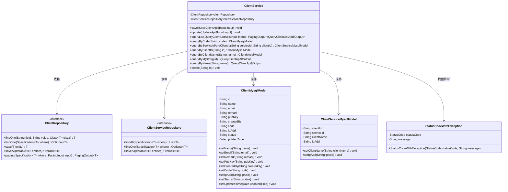
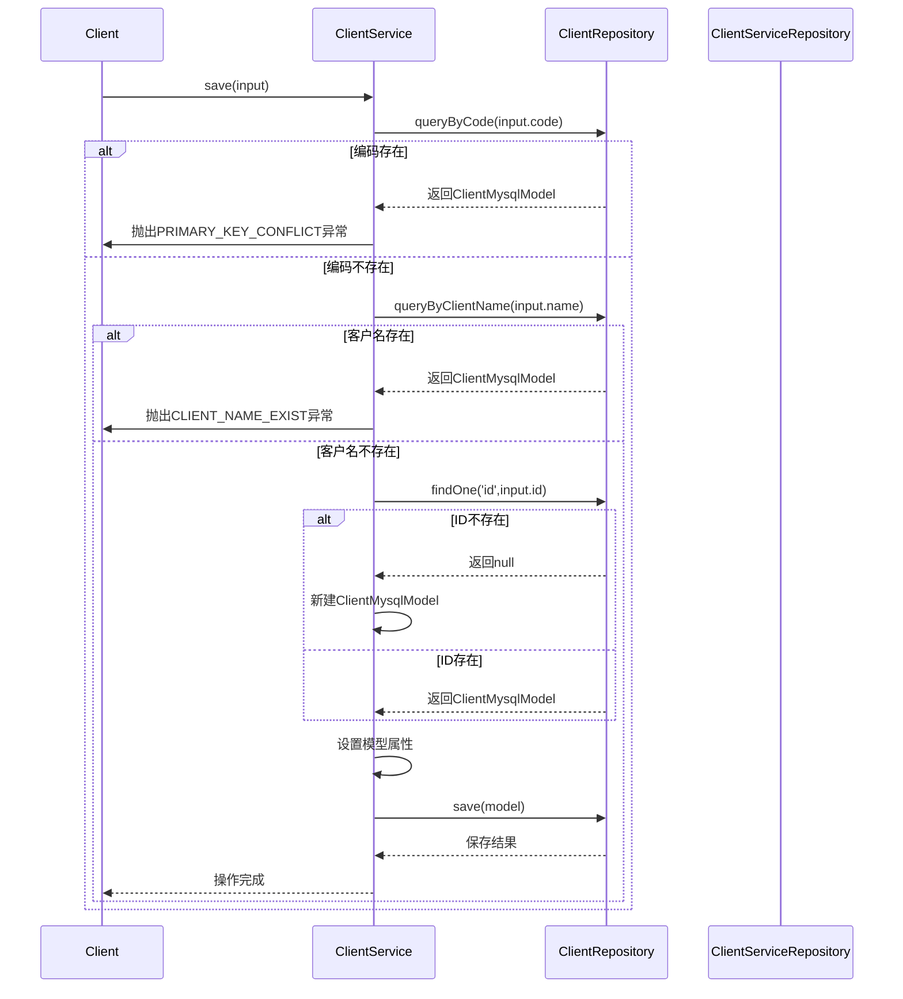

# 基础信息

|      |      |
|------|------|
| 名称 | ClientService |
| 编码语言 | .java |
| 代码路径 | WeFe/serving/serving-service/src/main/java/com/welab/wefe/serving/service/service/ClientService.java |
| 包名 | com.welab.wefe.serving.service.service |
| 依赖项 | ['com.welab.wefe.common.StatusCode', 'com.welab.wefe.common.data.mysql.Where', 'com.welab.wefe.common.exception.StatusCodeWithException', 'com.welab.wefe.common.util.StringUtil', 'com.welab.wefe.common.web.util.ModelMapper', 'com.welab.wefe.serving.service.api.client.QueryClientApi', 'com.welab.wefe.serving.service.api.client.QueryClientListApi', 'com.welab.wefe.serving.service.api.client.SaveClientApi', 'com.welab.wefe.serving.service.api.client.UpdateApi', 'com.welab.wefe.serving.service.database.entity.ClientMysqlModel', 'com.welab.wefe.serving.service.database.entity.ClientServiceMysqlModel', 'com.welab.wefe.serving.service.database.repository.ClientRepository', 'com.welab.wefe.serving.service.database.repository.ClientServiceRepository', 'com.welab.wefe.serving.service.dto.PagingOutput', 'com.welab.wefe.serving.service.enums.ClientStatusEnum', 'org.springframework.beans.factory.annotation.Autowired', 'org.springframework.data.jpa.domain.Specification', 'org.springframework.stereotype.Service', 'java.util.Date', 'java.util.List', 'java.util.stream.Collectors'] |
| 概述说明 | ClientService类提供客户数据管理功能，包括保存、更新、查询和删除操作。保存时检查客户编码和名称唯一性，更新时同步客户服务表数据，查询支持分页和模糊搜索，删除标记状态而非物理删除。关键字段包括名称、邮箱、公钥等。 |

# 说明

ClientService是一个服务类，主要处理客户数据的增删改查操作。它通过ClientRepository和ClientServiceRepository与数据库交互。save方法用于保存客户信息，会检查客户代码和名称是否已存在，避免重复。update方法更新客户信息，并同步更新关联的客户服务表数据。queryList提供分页查询功能，支持按名称和时间范围筛选，返回结果中公钥会被部分隐藏。其他查询方法包括按代码、ID、名称获取客户信息，返回时公钥同样会被部分隐藏。detele方法将客户状态标记为已删除。所有方法均涉及客户模型的基本字段操作，如名称、邮箱、备注、公钥、IP地址等。

# 类列表 Class Summary

| 名称   | 类型  | 说明 |
|-------|------|-------------|
| ClientService | class | ClientService类提供客户数据管理功能，包括保存、更新、查询和删除操作。保存时检查编码和名称唯一性，更新时同步客户服务表信息，查询支持分页和模糊搜索，删除标记状态而非物理删除。关键字段包括名称、邮箱、公钥等。 |

## 类 ClientService

|      |      |
|------|------|
| 访问范围 | @Service;public |
| 类型 | class |
| 名称 | ClientService |
| 说明 | ClientService类提供客户数据管理功能，包括保存、更新、查询和删除操作。保存时检查编码和名称唯一性，更新时同步客户服务表信息，查询支持分页和模糊搜索，删除标记状态而非物理删除。关键字段包括名称、邮箱、公钥等。 |

### UML类图

这段代码描述了一个客户服务管理系统，主要包含ClientService服务类及其相关组件。ClientService通过ClientRepository和ClientServiceRepository两个接口与数据库交互，分别管理客户基础信息和客户服务信息。核心功能包括客户信息的增删改查、唯一性校验、分页查询等，同时处理客户与服务关联数据的同步更新。系统通过StatusCodeWithException处理业务异常，并使用ClientMysqlModel和ClientServiceMysqlModel作为数据模型与数据库表映射。

### 内部方法调用关系图

```mermaid
graph TD
    A["ClientService类"]
    B["依赖注入: ClientRepository"]
    C["依赖注入: ClientServiceRepository"]
    D["方法: save(SaveClientApi.Input)"]
    E["方法: update(UpdateApi.Input)"]
    F["方法: queryList(QueryClientListApi.Input)"]
    G["方法: queryByCode(String)"]
    H["方法: queryByServiceIdAndClientId(String,String)"]
    I["方法: queryByClientId(String)"]
    J["方法: queryByClientName(String)"]
    K["方法: queryById(String)"]
    L["方法: queryByName(String)"]
    M["方法: detele(String)"]

    A --> B
    A --> C
    A --> D
    A --> E
    A --> F
    A --> G
    A --> H
    A --> I
    A --> J
    A --> K
    A --> L
    A --> M
```

这段代码实现了一个客户服务管理系统，主要包含客户信息的增删改查功能。通过Spring的@Service注解标记为服务层组件，使用JPA仓库进行数据持久化操作。核心功能包括：保存客户信息时的唯一性校验、更新客户信息时的级联更新、分页查询客户列表以及各种查询方法。代码中使用了异常处理机制来保证业务规则的执行，如客户编码和名称的唯一性校验。流程图展示了类结构和主要方法，时序图详细描述了保存客户信息时的完整交互流程。

### 字段列表 Field List

| 名称  | 类型  | 说明 |
|-------|-------|------|
| clientServiceRepository | ClientServiceRepository | 自动注入ClientServiceRepository实例。 |
| clientRepository | ClientRepository | 使用@Autowired自动注入ClientRepository实例。 |

### 方法列表

| 名称  | 类型  | 说明 |
|-------|-------|------|
| save | void | 方法save检查客户编码和名称是否重复，不存在则创建或更新客户信息并保存。存在冲突时抛出异常。 |
| queryByCode | ClientMysqlModel | 该方法通过code查询ClientMysqlModel，使用Where构建查询条件，返回匹配结果或null。 |
| update | void | 更新客户信息及关联服务表数据：根据输入ID查找客户，不存在则报错；更新客户字段（名称、邮箱等），若公钥有效则更新；保存后同步更新关联服务表的IP和客户名。 |
| queryList | PagingOutput<QueryClientListApi.Output> | 方法queryList根据输入条件查询客户列表，支持模糊匹配名称和时间范围筛选，分页返回结果，并对公钥信息脱敏处理。 |
| queryByClientId | ClientMysqlModel | 该方法通过ID查询客户端信息，调用clientRepository的findOne方法，返回ClientMysqlModel对象。 |
| queryById | QueryClientApi.Output | 该方法通过ID查询客户端信息，获取数据后对公钥进行脱敏处理（保留前后四位并用星号代替中间部分），最后映射为API输出格式返回。 |
| queryByName | QueryClientApi.Output | 方法queryByName通过名称查询客户端数据，获取公钥并部分隐藏（保留首尾4位），最后映射为输出类返回。 |
| detele | void | 删除指定ID的客户端记录，将其状态设为已删除并更新修改时间。 |
| queryByServiceIdAndClientId | ClientServiceMysqlModel | 该方法通过serviceId和clientId查询ClientServiceMysqlModel，使用Where构建查询条件，返回匹配结果或null。 |
| queryByClientName | ClientMysqlModel | 通过名称查询客户端信息，返回匹配的MySQL模型对象。 |

