# 基础信息

|      |      |
|------|------|
| 名称 | ClientServiceService |
| 编码语言 | .java |
| 代码路径 | WeFe/serving/serving-service/src/main/java/com/welab/wefe/serving/service/service/ClientServiceService.java |
| 包名 | com.welab.wefe.serving.service.service |
| 依赖项 | ['cn.hutool.core.lang.UUID', 'com.welab.wefe.common.StatusCode', 'com.welab.wefe.common.constant.SecretKeyType', 'com.welab.wefe.common.data.mysql.Where', 'com.welab.wefe.common.data.mysql.enums.OrderBy', 'com.welab.wefe.common.exception.StatusCodeWithException', 'com.welab.wefe.common.http.HttpRequest', 'com.welab.wefe.common.http.HttpResponse', 'com.welab.wefe.common.util.SignUtil', 'com.welab.wefe.common.util.StringUtil', 'com.welab.wefe.common.web.util.CurrentAccountUtil', 'com.welab.wefe.common.web.util.ModelMapper', 'com.welab.wefe.serving.sdk.dto.ProviderParams', 'com.welab.wefe.serving.service.api.clientservice', 'com.welab.wefe.serving.service.api.clientservice.ServiceUrlTestApi.Input', 'com.welab.wefe.serving.service.database.entity', 'com.welab.wefe.serving.service.database.repository', 'com.welab.wefe.serving.service.dto.PagingOutput', 'com.welab.wefe.serving.service.enums.PayTypeEnum', 'com.welab.wefe.serving.service.enums.ServiceClientTypeEnum', 'com.welab.wefe.serving.service.enums.ServiceStatusEnum', 'com.welab.wefe.serving.service.enums.ServiceTypeEnum', 'com.welab.wefe.serving.service.utils.ServiceUtil', 'org.apache.commons.lang3.StringUtils', 'org.springframework.beans.factory.annotation.Autowired', 'org.springframework.data.jpa.domain.Specification', 'org.springframework.stereotype.Service', 'java.util.ArrayList', 'java.util.Date', 'java.util.List', 'java.util.Optional', 'java.util.stream.Collectors'] |
| 概述说明 | ClientServiceService类提供客户端服务管理功能，包括添加、查询、更新和删除服务。支持激活和开通两种服务类型，处理公私钥、计费规则和状态变更。包含URL验证和提供者列表查询。 |

# 说明

ClientServiceService是一个服务类，负责管理客户端服务相关操作。主要功能包括添加、查询、更新和删除客户端服务记录。添加服务时区分激活和开通两种类型，激活服务自动生成serviceId和clientId，开通服务需验证公钥类型和单价。查询功能支持分页、条件筛选和详情查看。更新操作可修改服务状态、计费规则等信息。删除仅允许管理员操作激活类型服务。此外还提供根据serviceId批量更新、服务URL测试等功能。类中注入了多个Repository用于数据访问，并处理了各种业务逻辑和异常情况。

# 类列表 Class Summary

| 名称   | 类型  | 说明 |
|-------|------|-------------|
| ClientServiceService | class | ClientServiceService类提供客户端服务管理功能，包括添加、查询、更新、删除服务，处理激活和开通逻辑，并管理计费规则和密钥配置。 |

## 类 ClientServiceService

|      |      |
|------|------|
| 访问范围 | @Service;public |
| 类型 | class |
| 名称 | ClientServiceService |
| 说明 | ClientServiceService类提供客户端服务管理功能，包括添加、查询、更新、删除服务，处理激活和开通逻辑，并管理计费规则和密钥配置。 |

### UML类图

```mermaid
classDiagram
    class ClientServiceService {
        -ClientServiceRepository clientServiceRepository
        -ClientServiceQueryRepository clientServiceQueryRepository
        -BaseServiceRepository~BaseServiceMySqlModel~ serviceRepository
        -FeeConfigRepository feeConfigRepository
        -PartnerRepository partnerRepository
        -PartnerService partnerService
        +add(SaveApi.Input input) void
        +queryList(QueryListApi.Input input) PagingOutput~QueryListApi.Output~
        +queryOne(QueryApi.Input input) ClientServiceOutputModel
        +findActivateClientServiceByUrl(String url) ClientServiceMysqlModel
        +queryByIdAndServiceId(String partnerId, String serviceId) ClientServiceMysqlModel
        +detail(DetailApi.Input input) ClientServiceOutputModel
        +deleteActivate(UpdateApi.Input input) void
        +update(UpdateApi.Input input) void
        +updateStatus(UpdateStatusApi.Input input) void
        +updateAllByServiceId(String serviceId, String serviceName, String url, Integer serviceType) void
        +getAll() List~ClientServiceMysqlModel~
        +openService(String serviceId, String serviceName, String url, String clientId, String publicKey, ServiceTypeEnum serviceType, SecretKeyType secretKeyType) void
        +activateService(String serviceId, String serviceName, String clientId, String privateKey, String publicKey, SecretKeyType secretKeyType, String url, ServiceTypeEnum serviceType) void
        +serviceUrlTest(Input input) int
        +queryByServiceIdAndClientId(String serviceId, String clientId) ClientServiceMysqlModel
        +queryActivateListByServiceId(String serviceId) List~ClientServiceMysqlModel~
        +findProviderList(String serviceId) List~ProviderParams~
    }

    class ClientServiceRepository {
        +findOne(Specification~ClientServiceMysqlModel~ where) Optional~ClientServiceMysqlModel~
        +save(ClientServiceMysqlModel model) void
        +delete(ClientServiceMysqlModel model) void
        +findAll(Specification~ClientServiceMysqlModel~ where) List~ClientServiceMysqlModel~
        +paging(Specification~ClientServiceMysqlModel~ spec, QueryListApi.Input input) PagingOutput~ClientServiceMysqlModel~
        +saveAll(List~ClientServiceMysqlModel~ models) void
    }

    class ClientServiceQueryRepository {
        +queryOne(String id) ClientServiceOutputModel
    }

    class BaseServiceRepository~T~ {
        +findOne(String field, String value, Class~T~ clazz) T
    }

    class FeeConfigRepository {
        +save(FeeConfigMysqlModel model) void
    }

    class PartnerRepository {
        +findOne(String field, String value, Class~PartnerMysqlModel~ clazz) PartnerMysqlModel
    }

    class PartnerService {
        +findModelServiceUrl(String clientId) String
    }

    class ClientServiceMysqlModel {
        -String id
        -String serviceId
        -String clientId
        -String serviceName
        -String clientName
        -String url
        -String privateKey
        -String publicKey
        -Integer serviceType
        -Integer type
        -Integer status
        -Integer payType
        -Double unitPrice
        -String ipAdd
        -String code
        -SecretKeyType secretKeyType
        -Date createdTime
        -Date updatedTime
        -String updatedBy
        -String createdBy
    }

    class FeeConfigMysqlModel {
        -String serviceId
        -String clientId
        -Integer payType
        -Double unitPrice
    }

    class PartnerMysqlModel {
        -String id
        -String name
    }

    class ProviderParams {
        +String clientId
        +String url
        +of(String clientId, String url) ProviderParams
    }

    ClientServiceService --> ClientServiceRepository : 依赖
    ClientServiceService --> ClientServiceQueryRepository : 依赖
    ClientServiceService --> BaseServiceRepository~BaseServiceMySqlModel~ : 依赖
    ClientServiceService --> FeeConfigRepository : 依赖
    ClientServiceService --> PartnerRepository : 依赖
    ClientServiceService --> PartnerService : 依赖
    ClientServiceService --> ClientServiceMysqlModel : 依赖
    ClientServiceService --> FeeConfigMysqlModel : 依赖
    ClientServiceService --> PartnerMysqlModel : 依赖
    ClientServiceService --> ProviderParams : 依赖
```

类图描述：该图展示了ClientServiceService类及其依赖关系，包括多个Repository类（如ClientServiceRepository、FeeConfigRepository等）和模型类（如ClientServiceMysqlModel、FeeConfigMysqlModel等）。ClientServiceService提供客户端服务管理功能，如添加、查询、更新和删除服务，以及与费用配置和合作伙伴相关的操作。各类通过依赖关系协作完成业务逻辑。

### 内部方法调用关系图

该流程图展示了ClientServiceService类的主要结构和功能。该类是一个服务层组件，通过多个Repository进行数据访问，提供客户服务管理的完整功能集。核心方法包括添加/查询/更新/删除客户服务记录，处理激活和开通两种服务类型，以及各种条件查询和批量操作。每个方法都通过箭头明确连接到类主体，展现了清晰的层级关系和服务依赖。特别注意对服务类型(ACTIVATE/OPEN)的不同处理逻辑，以及URL验证、密钥管理等安全相关操作。

### 字段列表 Field List

| 名称  | 类型  | 说明 |
|-------|-------|------|
| feeConfigRepository | FeeConfigRepository | 使用@Autowired自动注入FeeConfigRepository实例。 |
| clientServiceRepository | ClientServiceRepository | 自动注入ClientServiceRepository实例。 |
| partnerRepository | PartnerRepository | 使用@Autowired自动注入PartnerRepository实例。 |
| clientServiceQueryRepository | ClientServiceQueryRepository | 使用@Autowired自动注入ClientServiceQueryRepository实例。 |
| partnerService | PartnerService | 使用@Autowired自动注入PartnerService实例。 |
| serviceRepository | BaseServiceRepository<BaseServiceMySqlModel> | 自动注入BaseServiceMySqlModel的基础服务仓库实例。 |

### 方法列表

| 名称  | 类型  | 说明 |
|-------|-------|------|
| update | void | 该方法根据输入参数更新客户端服务信息。若服务类型为开通，则更新单价、支付类型等字段并验证单价非负；若为激活，则重置部分字段并处理密钥。最后保存更新，若为开通类型则新增计费规则记录。未找到数据时抛出异常。 |
| updateAllByServiceId | void | 该方法根据serviceId更新数据库记录，修改serviceName、url和serviceType字段，并设置更新人和时间，最后批量保存。 |
| queryOne | ClientServiceOutputModel | 查询单个客户端服务，根据输入ID调用查询仓库方法返回结果模型。 |
| deleteActivate | void | 该方法根据输入参数删除激活状态的客户端服务记录。先查询匹配记录，若存在且类型为激活则删除，否则抛出异常。 |
| queryList | PagingOutput<QueryListApi.Output> | 方法queryList根据输入条件筛选ClientServiceMysqlModel数据，返回分页结果。处理包含服务名、客户名、状态和类型的查询，映射枚举值并调整输出格式。 |
| serviceUrlTest | int | 方法serviceUrlTest验证输入URL格式，合法则发送HTTP请求并返回状态码，非法则抛出参数异常。 |
| openService | void | 该方法用于开放服务，接收服务ID、名称、URL等参数，设置服务类型、密钥类型、状态等信息后保存。 |
| updateStatus | void | 更新服务状态方法：根据输入参数查询服务记录，检查类型和状态合法性，更新状态并保存，否则抛出异常。 |
| add | void | 该方法处理服务添加逻辑，区分激活和开通类型。激活服务自动生成ID，开通服务需验证参数并保存计费规则。检查服务是否存在，不存在则创建并保存模型，存在则抛出异常。 |
| getAll | List<ClientServiceMysqlModel> | 该方法返回一个包含所有ClientServiceMysqlModel对象的列表，通过调用clientServiceRepository的findAll方法获取所有数据。 |
| detail | ClientServiceOutputModel | 该方法根据输入参数查询客户服务详情，若存在则映射为输出模型并处理密钥显示，否则返回空。 |
| activateService | void | 该方法用于激活服务，接收服务ID、名称、客户端ID、密钥等参数。若服务不存在则新建，设置各项属性后保存到数据库。 |
| queryByIdAndServiceId | ClientServiceMysqlModel | 该方法通过partnerId和serviceId查询ClientServiceMysqlModel，使用条件构建器Where创建查询条件，调用repository查询，存在则返回结果否则返回null。 |
| findActivateClientServiceByUrl | ClientServiceMysqlModel | 该方法通过URL查询激活的客户端服务，使用条件构建器创建查询条件，若找到则返回对应模型，否则返回null。 |
| queryByServiceIdAndClientId | ClientServiceMysqlModel | 根据服务ID和客户ID查询ClientServiceMysqlModel，使用条件构建查询，返回结果或null。 |
| queryActivateListByServiceId | List<ClientServiceMysqlModel> | 该方法通过serviceId查询激活的服务列表，使用条件构建器Where创建查询条件，匹配serviceId和类型为ACTIVATE的记录，最后返回查询结果列表。 |
| findProviderList | List<ProviderParams> | 方法根据serviceId查询激活列表，将每个条目转换为ProviderParams对象，包含clientId和拼接后的URL地址。 |

