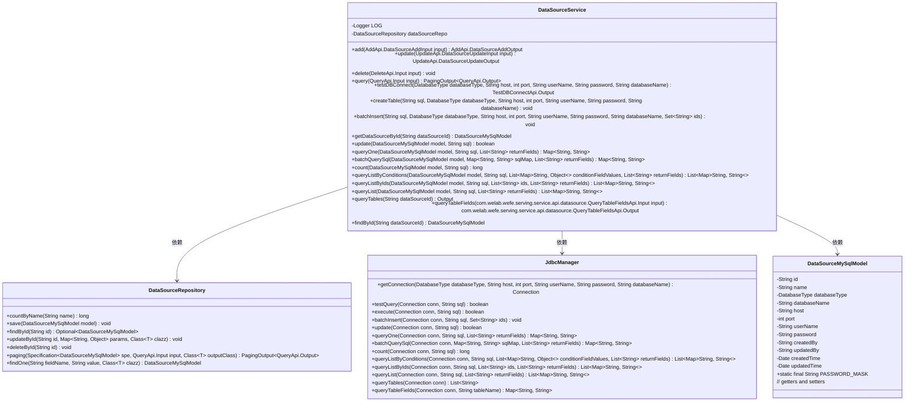

# 基础信息

|      |      |
|------|------|
| 名称 | DataSourceService |
| 编码语言 | .java |
| 代码路径 | WeFe/serving/serving-service/src/main/java/com/welab/wefe/serving/service/service/DataSourceService.java |
| 包名 | com.welab.wefe.serving.service.service |
| 依赖项 | ['com.alibaba.fastjson.JSONObject', 'com.welab.wefe.common.StatusCode', 'com.welab.wefe.common.data.mysql.Where', 'com.welab.wefe.common.exception.StatusCodeWithException', 'com.welab.wefe.common.jdbc.base.DatabaseType', 'com.welab.wefe.common.web.util.CurrentAccountUtil', 'com.welab.wefe.common.web.util.ModelMapper', 'com.welab.wefe.serving.service.api.datasource', 'com.welab.wefe.serving.service.api.datasource.QueryTableFieldsApi.FieldOutput', 'com.welab.wefe.serving.service.api.datasource.QueryTablesApi.Output', 'com.welab.wefe.serving.service.database.entity.DataSourceMySqlModel', 'com.welab.wefe.serving.service.database.repository.DataSourceRepository', 'com.welab.wefe.serving.service.dto.PagingOutput', 'com.welab.wefe.serving.service.manager.JdbcManager', 'org.apache.commons.lang3.StringUtils', 'org.slf4j.Logger', 'org.slf4j.LoggerFactory', 'org.springframework.beans.factory.annotation.Autowired', 'org.springframework.data.jpa.domain.Specification', 'org.springframework.stereotype.Service', 'java.sql.Connection', 'java.sql.SQLException', 'java.util'] |
| 概述说明 | DataSourceService提供数据源管理功能，包括增删改查、测试连接、执行SQL、查询表结构等操作，支持多种数据库类型，确保数据源有效性和安全性。 |

# 说明

DataSourceService是一个处理数据源相关操作的服务类，提供数据源的增删改查、连接测试、SQL执行等功能。主要方法包括：添加数据源时检查名称唯一性并测试连接；更新数据源时验证连接并更新参数；删除数据源；分页查询数据源；测试数据库连接；执行SQL语句如创建表、批量插入等；根据ID查询数据源；查询数据库表和字段信息。所有操作均通过JdbcManager管理数据库连接，并处理异常情况。

# 类列表 Class Summary

| 名称   | 类型  | 说明 |
|-------|------|-------------|
| DataSourceService | class | DataSourceService提供数据源管理功能，包括增删改查、测试连接、执行SQL、查询表结构等操作，支持多种数据库类型，确保数据源操作的安全性和有效性。 |

## 类 DataSourceService

|      |      |
|------|------|
| 访问范围 | @Service;public |
| 类型 | class |
| 名称 | DataSourceService |
| 说明 | DataSourceService提供数据源管理功能，包括增删改查、测试连接、执行SQL、查询表结构等操作，支持多种数据库类型，确保数据源操作的安全性和有效性。 |

### UML类图

类图描述：DataSourceService 是一个服务类，负责数据源的增删改查及数据库连接测试等操作。它依赖于 DataSourceRepository 进行数据持久化操作，使用 JdbcManager 管理数据库连接和执行SQL，操作的数据模型是 DataSourceMySqlModel。类图展示了它们之间的关系及主要方法，体现了分层架构的设计思想。

### 内部方法调用关系图

```mermaid
graph TD
    A["类DataSourceService"]
    B["属性: Logger LOG"]
    C["属性: DataSourceRepository dataSourceRepo"]
    D["方法: add(DataSourceAddInput input)"]
    E["方法: update(DataSourceUpdateInput input)"]
    F["方法: delete(Input input)"]
    G["方法: query(Input input)"]
    H["方法: testDBConnect(...)"]
    I["方法: createTable(...)"]
    J["方法: batchInsert(...)"]
    K["方法: getDataSourceById(String)"]
    L["方法: update(model, sql)"]
    M["方法: queryOne(...)"]
    N["方法: batchQuerySql(...)"]
    O["方法: count(...)"]
    P["方法: queryListByConditions(...)"]
    Q["方法: queryListByIds(...)"]
    R["方法: queryList(...)"]
    S["方法: queryTables(...)"]
    T["方法: queryTableFields(...)"]
    U["方法: findById(String)"]

    A --> B
    A --> C
    A --> D
    A --> E
    A --> F
    A --> G
    A --> H
    A --> I
    A --> J
    A --> K
    A --> L
    A --> M
    A --> N
    A --> O
    A --> P
    A --> Q
    A --> R
    A --> S
    A --> T
    A --> U
```

这段代码是一个数据源服务类，主要功能包括数据源的增删改查、数据库连接测试、SQL执行等操作。类中通过JdbcManager进行数据库连接和操作，使用DataSourceRepository进行数据持久化。核心方法包括添加数据源时的名称校验和连接测试，更新时的参数处理和连接验证，以及多种查询方式如分页查询、批量查询等。所有数据库操作都包含异常处理和日志记录，确保数据一致性和可追溯性。

### 字段列表 Field List

| 名称  | 类型  | 说明 |
|-------|-------|------|
| dataSourceRepo | DataSourceRepository | 自动注入数据源仓库实例。 |
| LOG = LoggerFactory.getLogger(this.getClass()) | Logger | 类中定义了一个受保护且不可变的日志记录器实例，用于当前类的日志输出。 |

### 方法列表

| 名称  | 类型  | 说明 |
|-------|-------|------|
| queryList | List<Map<String, String>> | 该方法通过MySQL数据源执行SQL查询并返回字段列表。若数据源无效则抛出异常，否则建立连接并查询结果。 |
| count | long | 方法count统计MySQL数据源查询结果数，参数为数据源模型和SQL语句，若数据源不存在则抛出异常。 |
| getDataSourceById | DataSourceMySqlModel | 该方法通过ID从数据源仓库查询并返回对应的MySQL数据源模型，若不存在则返回null。 |
| add | AddApi.DataSourceAddOutput | 方法`add`用于添加数据源：检查名称唯一性，测试连接，映射输入为模型并保存，返回新数据源ID。若名称存在则抛出异常。 |
| batchQuerySql | Map<String, String> | 方法batchQuerySql接收数据源模型、SQL映射和返回字段，验证数据源后建立数据库连接，执行批量SQL查询并返回结果。若数据源无效则抛出异常。 |
| queryOne | Map<String, String> | 查询MySQL数据源单条记录，验证数据源存在后建立连接并执行SQL查询，返回指定字段结果。 |
| update | UpdateApi.DataSourceUpdateOutput | 更新数据源信息方法：根据输入ID查找数据源，不存在则报错；测试数据库连接后更新参数，返回更新后的ID。 |
| createTable | void | 该方法通过JDBC连接数据库并执行SQL建表语句，失败时抛出SQL错误异常。参数包括SQL语句、数据库类型、连接信息和凭据。 |
| queryTables | Output | 查询指定数据源的表信息，若数据源不存在则抛出异常，返回数据库类型、名称及表列表。 |
| queryListByIds | List<Map<String, String>> | 该方法通过JDBC连接MySQL数据库，根据ID列表和返回字段查询数据。若数据源不存在则抛出异常。 |
| query | PagingOutput<QueryApi.Output> | Java方法query根据输入参数input的id和name条件构建查询条件，返回分页数据结果。id精确匹配，name模糊匹配，最终调用dataSourceRepo分页查询。 |
| update | boolean | 更新MySQL数据源方法：检查数据源是否存在，获取连接并执行SQL更新，返回操作结果。 |
| batchInsert | void | 批量插入数据方法，通过JDBC连接数据库执行SQL，处理异常并返回错误状态。 |
| delete | void | 该方法根据输入ID从数据库查找数据，若存在则删除对应记录，不存在则直接返回。 |
| queryListByConditions | List<Map<String, String>> | 该方法通过MySQL数据源执行SQL查询，返回符合条件的字段列表。若数据源不存在则抛出异常。使用JdbcManager建立连接并执行查询。 |
| queryTableFields | com.welab.wefe.serving.service.api.datasource.QueryTableFieldsApi.Output | 该方法通过数据源ID获取数据库连接，查询指定表的字段信息并返回字段名和类型列表。若数据源不存在则抛出异常。 |
| findById | DataSourceMySqlModel | 通过ID查询MySQL数据源，调用dataSourceRepo的findOne方法返回对应数据源模型。 |
| testDBConnect | TestDBConnectApi.Output | 该方法测试数据库连接，通过JDBC管理器建立连接并执行查询验证，成功返回结果，失败抛出异常。 |

