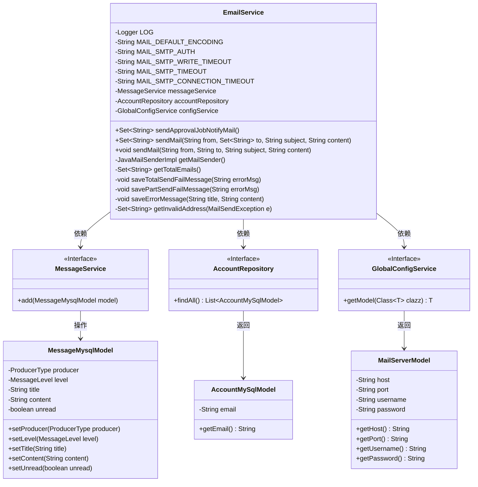
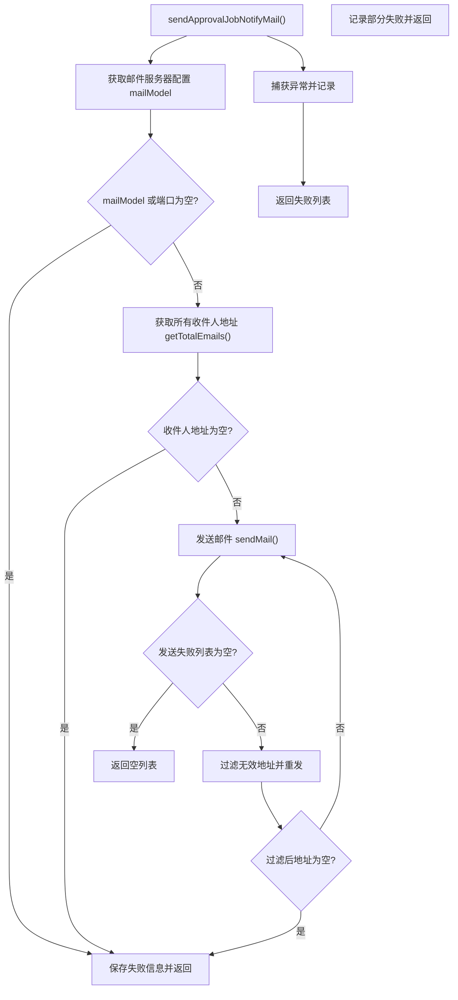
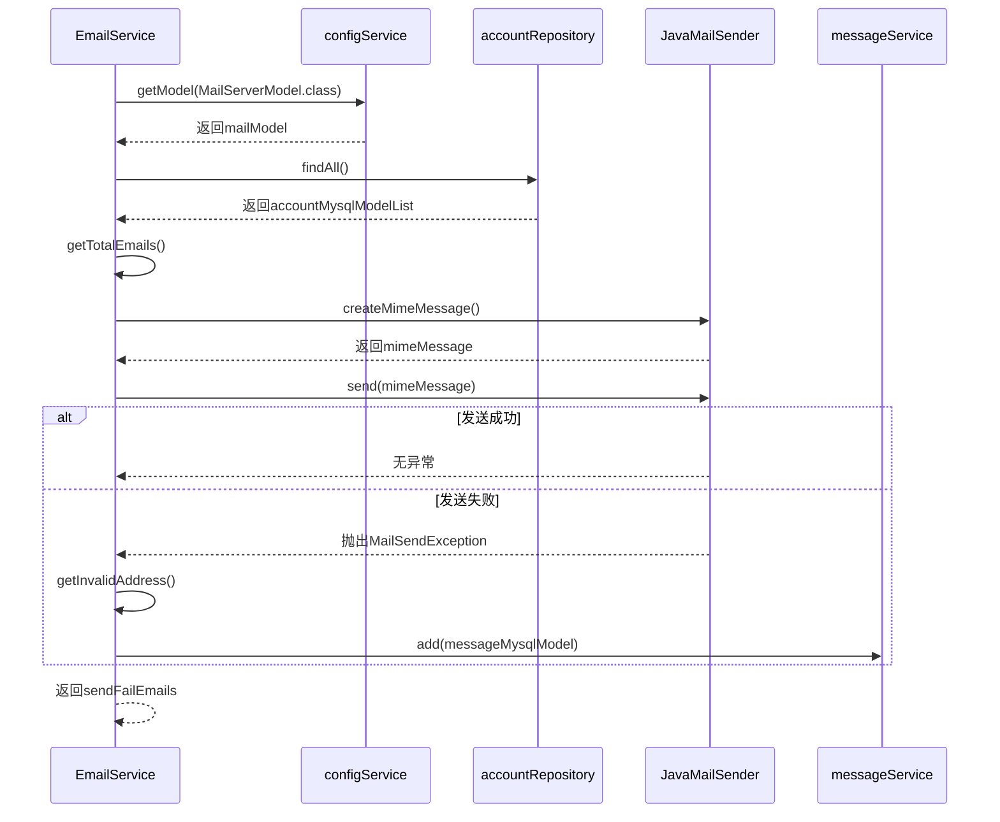

# 基础信息

|      |      |
|------|------|
| 名称 | EmailService |
| 编码语言 | .java |
| 代码路径 | WeFe/serving/serving-service/src/main/java/com/welab/wefe/serving/service/service/EmailService.java |
| 包名 | com.welab.wefe.serving.service.service |
| 依赖项 | ['com.welab.wefe.common.util.StringUtil', 'com.welab.wefe.common.wefe.enums.MessageLevel', 'com.welab.wefe.common.wefe.enums.ProducerType', 'com.welab.wefe.serving.service.database.entity.AccountMySqlModel', 'com.welab.wefe.serving.service.database.entity.MessageMysqlModel', 'com.welab.wefe.serving.service.database.repository.AccountRepository', 'com.welab.wefe.serving.service.dto.globalconfig.MailServerModel', 'com.welab.wefe.serving.service.service.globalconfig.GlobalConfigService', 'org.apache.commons.collections4.CollectionUtils', 'org.apache.commons.lang3.StringUtils', 'org.slf4j.Logger', 'org.slf4j.LoggerFactory', 'org.springframework.beans.factory.annotation.Autowired', 'org.springframework.mail.MailSendException', 'org.springframework.mail.javamail.JavaMailSenderImpl', 'org.springframework.mail.javamail.MimeMessageHelper', 'org.springframework.stereotype.Service', 'javax.mail.Address', 'javax.mail.SendFailedException', 'javax.mail.internet.MimeMessage', 'java.util.HashSet', 'java.util.List', 'java.util.Properties', 'java.util.Set'] |
| 概述说明 | EmailService类提供邮件发送功能，支持批量发送和错误处理，包括无效地址过滤和重试机制，依赖配置服务和账户数据。 |

# 说明

EmailService是一个用于发送邮件的服务类，包含发送审批任务通知邮件和普通邮件的功能。它通过配置获取邮件服务器信息，支持批量发送和单发邮件，处理发送失败情况并记录错误信息。服务类包含获取邮件发送器、验证邮件服务器配置、过滤无效收件地址等功能，同时会保存发送失败的信息到数据库。邮件发送支持SMTP协议，设置了超时、编码等参数，并处理异常情况。

# 类列表 Class Summary

| 名称   | 类型  | 说明 |
|-------|------|-------------|
| EmailService | class | EmailService类实现邮件发送功能，包含SMTP配置、异常处理和重试机制，支持批量发送和失败地址记录。 |

## 类 EmailService

|      |      |
|------|------|
| 访问范围 | @Service;public |
| 类型 | class |
| 名称 | EmailService |
| 说明 | EmailService类实现邮件发送功能，包含SMTP配置、异常处理和重试机制，支持批量发送和失败地址记录。 |

### UML类图

类图描述：
该图展示了EmailService的核心结构及其依赖关系。EmailService作为主类，通过Autowired注入MessageService、AccountRepository和GlobalConfigService三个接口，分别用于消息处理、账户数据访问和配置管理。MailServerModel存储邮件服务器配置，AccountMySqlModel和MessageMysqlModel是数据模型类。类图中清晰体现了Spring的依赖注入模式，以及服务层与持久层之间的协作关系，展示了邮件发送功能从配置获取、地址收集到异常处理的完整流程。

### 内部方法调用关系图

这段代码实现了一个邮件服务类，主要功能是发送审批任务通知邮件。流程图展示了主方法sendApprovalJobNotifyMail()的逻辑流程，包括配置检查、收件人获取、邮件发送和失败处理等步骤。时序图则详细描述了类与外部服务的交互过程，包括获取配置、查询账户信息、创建邮件和发送邮件的完整流程。代码特别注重异常处理和失败场景的记录，包括无效地址过滤和重发机制。

### 字段列表 Field List

| 名称  | 类型  | 说明 |
|-------|-------|------|
| MAIL_SMTP_AUTH = "true" | String | 定义常量字符串MAIL_SMTP_AUTH，值为"true"，用于SMTP认证配置。 |
| MAIL_SMTP_TIMEOUT = "30000" | String | 定义邮件SMTP超时时间为30000毫秒的静态常量。 |
| configService | GlobalConfigService | 使用@Autowired自动注入GlobalConfigService实例configService。 |
| MAIL_DEFAULT_ENCODING = "UTF-8" | String | 定义常量字符串MAIL_DEFAULT_ENCODING，值为UTF-8编码格式。 |
| LOG = LoggerFactory.getLogger(this.getClass()) | Logger | 类中定义了一个受保护且不可变的日志对象LOG，用于记录当前类的日志信息。 |
| accountRepository | AccountRepository | 使用@Autowired自动注入AccountRepository实例。 |
| MAIL_SMTP_WRITE_TIMEOUT = "30000" | String | 定义邮件SMTP写入超时时间为30000毫秒的静态常量。 |
| messageService | MessageService | 自动注入MessageService实例。 |
| MAIL_SMTP_CONNECTION_TIMEOUT = "30000" | String | 定义SMTP邮件连接超时时间为30000毫秒的静态常量。 |

### 方法列表

| 名称  | 类型  | 说明 |
|-------|-------|------|
| sendApprovalJobNotifyMail | Set<String> | 方法发送审批邮件，检查邮件服务器设置和接收人，处理发送失败情况并重试无效地址，返回失败邮箱集合。 |
| sendMail | Set<String> | Java方法sendMail通过JavaMailSender发送邮件，处理无效地址异常并返回无效收件人集合。 |
| getTotalEmails | Set<String> | 该方法从数据库获取所有账户的电子邮件，过滤非空值后存入Set集合返回，初始容量16。 |
| getMailSender | JavaMailSenderImpl | 获取邮件发送器实例，检查配置有效性后设置主机、端口、用户名、密码等参数，并配置SMTP属性和SSL加密。 |
| sendMail | void | 发送邮件方法：使用JavaMailSender发送带主题和内容的邮件，处理异常并记录错误日志。 |
| saveTotalSendFailMessage | void | 方法saveTotalSendFailMessage用于保存审批任务邮件发送失败的错误信息，调用saveErrorMessage记录错误详情。 |
| savePartSendFailMessage | void | 方法savePartSendFailMessage用于保存审批任务邮件部分发送失败的报错信息，调用saveErrorMessage记录错误详情。 |
| saveErrorMessage | void | 方法saveErrorMessage将错误信息存入数据库，包含标题、内容、生产者类型为board、级别为error、未读状态，出错时记录日志。 |
| getInvalidAddress | Set<String> | 提取邮件发送异常中的无效地址，存入集合并返回。 |

