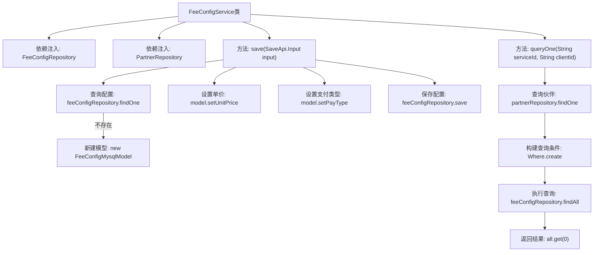

# 基础信息

|      |      |
|------|------|
| 名称 | FeeConfigService |
| 编码语言 | .java |
| 代码路径 | WeFe/serving/serving-service/src/main/java/com/welab/wefe/serving/service/service/FeeConfigService.java |
| 包名 | com.welab.wefe.serving.service.service |
| 依赖项 | ['java.util.List', 'com.welab.wefe.serving.service.database.entity.PartnerMysqlModel', 'com.welab.wefe.serving.service.database.repository.PartnerRepository', 'org.springframework.beans.factory.annotation.Autowired', 'org.springframework.data.jpa.domain.Specification', 'org.springframework.stereotype.Service', 'com.welab.wefe.common.data.mysql.Where', 'com.welab.wefe.common.data.mysql.enums.OrderBy', 'com.welab.wefe.common.util.StringUtil', 'com.welab.wefe.serving.service.api.feeconfig.SaveApi', 'com.welab.wefe.serving.service.database.entity.FeeConfigMysqlModel', 'com.welab.wefe.serving.service.database.repository.FeeConfigRepository'] |
| 概述说明 | FeeConfigService类提供保存和查询计费配置功能，通过FeeConfigRepository和PartnerRepository操作数据库，支持按ID更新或创建配置，以及按服务ID和客户ID查询最新配置。 |

# 说明

FeeConfigService是一个服务类，包含保存和查询计费配置的功能。通过FeeConfigRepository和PartnerRepository操作数据库。save方法根据输入参数更新或创建FeeConfigMysqlModel，支持设置单价和支付类型。queryOne方法通过服务ID和客户ID查询最新的计费配置，使用Specification构建查询条件，按创建时间降序排序后返回第一条记录。

# 类列表 Class Summary

| 名称   | 类型  | 说明 |
|-------|------|-------------|
| FeeConfigService | class | FeeConfigService类提供保存和查询计费配置功能，通过FeeConfigRepository和PartnerRepository操作数据库，支持按ID更新或创建配置，以及根据服务ID和客户ID查询最新配置。 |


## 类 FeeConfigService

|      |      |
|------|------|
| 访问范围 | @Service;public |
| 类型 | class |
| 名称 | FeeConfigService |
| 说明 | FeeConfigService类提供保存和查询计费配置功能，通过FeeConfigRepository和PartnerRepository操作数据库，支持按ID更新或创建配置，以及根据服务ID和客户ID查询最新配置。 |


### UML类图

```mermaid
classDiagram
    class FeeConfigService {
        -FeeConfigRepository feeConfigRepository
        -PartnerRepository partnerRepository
        +save(SaveApi$Input input) FeeConfigMysqlModel
        +queryOne(String serviceId, String clientId) FeeConfigMysqlModel
    }

    class FeeConfigRepository {
        <<Interface>>
        +findOne(String field, String value, Class~T~ clazz) T
        +save(FeeConfigMysqlModel model) FeeConfigMysqlModel
        +findAll(Specification~T~ spec) List~T~
    }

    class PartnerRepository {
        <<Interface>>
        +findOne(String field, String value, Class~T~ clazz) T
    }

    class FeeConfigMysqlModel {
        +setUnitPrice(BigDecimal unitPrice)
        +setPayType(String payType)
    }

    class PartnerMysqlModel {
        -String id
    }

    class SaveApi$Input {
        -String id
        -BigDecimal unitPrice
        -String payType
        +getId() String
        +getUnitPrice() BigDecimal
        +getPayType() String
    }

    class Where {
        +create() WhereBuilder
    }

    class WhereBuilder {
        +equal(String field, Object value) WhereBuilder
        +orderBy(String field, OrderBy order) WhereBuilder
        +build(Class~T~ clazz) Specification~T~
    }

    class OrderBy {
        <<Enumeration>>
        asc
        desc
    }

    FeeConfigService --> FeeConfigRepository : 依赖
    FeeConfigService --> PartnerRepository : 依赖
    FeeConfigService --> SaveApi$Input : 使用
    FeeConfigService --> FeeConfigMysqlModel : 操作
    FeeConfigService --> PartnerMysqlModel : 查询
    FeeConfigService --> Where : 使用
    Where --> WhereBuilder : 创建
    WhereBuilder --> Specification : 生成
```

该图展示了计费配置服务的核心类关系。FeeConfigService作为服务类，依赖FeeConfigRepository和PartnerRepository进行数据操作，使用Where构建查询条件。主要功能包括保存配置（通过SaveApi.Input接收参数）和查询最新配置（基于serviceId和clientId）。类图中包含实体类、输入参数类、仓库接口及查询构建工具类，形成完整的配置管理流程。


### 内部方法调用关系图



流程图描述了FeeConfigService的两个核心方法：save()用于保存或更新计费配置，先查询现有配置不存在则新建，再更新字段后保存；queryOne()通过服务ID和客户ID查询最新计费规则，先验证伙伴信息再构建查询条件获取结果。展示了从参数校验到数据库操作的全流程，包含条件分支和依赖调用关系。

### 字段列表 Field List

| 名称  | 类型  | 说明 |
|-------|-------|------|
| partnerRepository | PartnerRepository | 使用@Autowired自动注入PartnerRepository实例。 |
| feeConfigRepository | FeeConfigRepository | 自动注入FeeConfigRepository实例。 |

### 方法列表

| 名称  | 类型  | 说明 |
|-------|-------|------|
| save | FeeConfigMysqlModel | 保存费用配置信息：根据输入ID查找或新建模型，更新单价和支付类型后保存到数据库。 |
| queryOne | FeeConfigMysqlModel | 查询指定服务ID和客户ID的最新计费规则配置，若无结果返回null。 |


