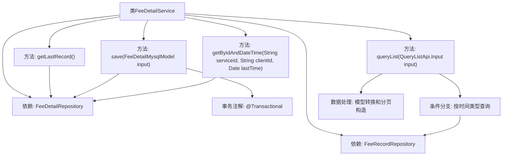

# 基础信息

|      |      |
|------|------|
| 名称 | FeeDetailService |
| 编码语言 | .java |
| 代码路径 | WeFe/serving/serving-service/src/main/java/com/welab/wefe/serving/service/service/FeeDetailService.java |
| 包名 | com.welab.wefe.serving.service.service |
| 依赖项 | ['java.util.ArrayList', 'java.util.Date', 'java.util.List', 'org.springframework.beans.BeanUtils', 'org.springframework.beans.factory.annotation.Autowired', 'org.springframework.data.jpa.domain.Specification', 'org.springframework.stereotype.Service', 'org.springframework.transaction.annotation.Transactional', 'com.welab.wefe.common.data.mysql.Where', 'com.welab.wefe.common.web.util.ModelMapper', 'com.welab.wefe.serving.service.api.feedetail.QueryListApi', 'com.welab.wefe.serving.service.database.entity.FeeDetailMysqlModel', 'com.welab.wefe.serving.service.database.entity.FeeDetailOutputModel', 'com.welab.wefe.serving.service.database.repository.FeeDetailRepository', 'com.welab.wefe.serving.service.database.repository.FeeRecordRepository', 'com.welab.wefe.serving.service.dto.PagingOutput', 'com.welab.wefe.serving.service.enums.QueryDateTypeEnum'] |
| 概述说明 | FeeDetailService类提供费用明细操作，包括获取最新记录、保存数据、分页查询列表及按条件查询。支持按小时、日、月、年统计，使用事务确保数据一致性。 |

# 说明

FeeDetailService是一个Spring服务类，负责处理费用明细相关操作。它依赖FeeRecordRepository和FeeDetailRepository进行数据访问。主要功能包括：获取最后一条记录、保存费用明细（支持事务回滚）、分页查询费用列表（支持按小时、日、月、年不同时间粒度查询）以及根据服务ID、客户ID和时间查询明细。查询功能会根据输入参数动态构建SQL条件，并返回分页结果。保存操作会检查记录是否存在，不存在则新建，存在则更新属性。

# 类列表 Class Summary

| 名称   | 类型  | 说明 |
|-------|------|-------------|
| FeeDetailService | class | FeeDetailService提供费用明细操作：获取最新记录、保存明细、分页查询列表（支持按小时/日/月/年统计）、根据ID和时间查询。使用事务确保数据一致性。 |


## 类 FeeDetailService

|      |      |
|------|------|
| 访问范围 | @Service;public |
| 类型 | class |
| 名称 | FeeDetailService |
| 说明 | FeeDetailService提供费用明细操作：获取最新记录、保存明细、分页查询列表（支持按小时/日/月/年统计）、根据ID和时间查询。使用事务确保数据一致性。 |


### UML类图

```mermaid
classDiagram
    class FeeDetailService {
        -FeeRecordRepository feeRecordRepository
        -FeeDetailRepository feeDetailRepository
        +getLastRecord() FeeDetailMysqlModel
        +save(FeeDetailMysqlModel input) void
        +queryList(QueryListApi~Input~ input) PagingOutput~QueryListApi~Output~~
        +getByIdAndDateTime(String serviceId, String clientId, Date lastTime) FeeDetailMysqlModel
    }

    class FeeRecordRepository {
        <<Interface>>
        +queryList(String clientName, String serviceName, String serviceType, String format, Date startTime, Date endTime, Integer offset, Integer limit) List~FeeDetailOutputModel~
        +count(String clientName, String serviceName, String serviceType, String format, Date startTime, Date endTime) Integer
    }

    class FeeDetailRepository {
        <<Interface>>
        +getLastRecord() FeeDetailMysqlModel
        +findOne(String field, Object value, Class~T~ clazz) T
        +save(FeeDetailMysqlModel model) void
        +findOne(Specification~T~ spec) Optional~T~
    }

    class FeeDetailMysqlModel {
        // 数据模型类
    }

    class QueryListApi {
        <<Interface>>
        class Input {
            // 查询输入参数
        }
        class Output {
            // 查询输出结果
        }
    }

    class PagingOutput~T~ {
        // 分页输出包装类
    }

    class FeeDetailOutputModel {
        // 费用明细输出模型
    }

    FeeDetailService --> FeeRecordRepository : 依赖
    FeeDetailService --> FeeDetailRepository : 依赖
    FeeDetailService --> FeeDetailMysqlModel : 操作
    FeeDetailService --> QueryListApi : 使用
    FeeDetailService --> PagingOutput : 返回
    QueryListApi.Output --> FeeDetailOutputModel : 映射
```

该图展示了FeeDetailService核心类及其依赖关系。作为服务类，它通过FeeRecordRepository和FeeDetailRepository进行数据访问，处理费用明细的查询、保存等操作。类图包含6个主要组件：1个服务类、2个仓库接口、3个数据模型类，清晰地呈现了服务层与持久层的协作方式，其中查询逻辑涉及复杂的分页处理和多种时间粒度条件判断。


### 内部方法调用关系图



这段代码是FeeDetailService服务类，主要处理费用明细的CRUD操作和复杂查询。通过Autowired注入两个Repository实现数据访问，提供获取最新记录、保存数据、分页查询和条件查询等功能。其中save方法使用事务保证数据一致性，queryList方法根据不同的时间粒度（小时/天/月/年）进行分组统计查询，最后将结果转换为API输出格式并构造分页响应。整个流程展现了从数据访问到业务逻辑处理的完整链路。

### 字段列表 Field List

| 名称  | 类型  | 说明 |
|-------|-------|------|
| feeDetailRepository | FeeDetailRepository | 自动注入FeeDetailRepository实例。 |
| feeRecordRepository | FeeRecordRepository | 自动注入费用记录仓库实例。 |

### 方法列表

| 名称  | 类型  | 说明 |
|-------|-------|------|
| getByIdAndDateTime | FeeDetailMysqlModel | 根据服务ID、客户ID和创建时间查询费用详情，无结果返回null。 |
| queryList | PagingOutput<QueryListApi.Output> | 该方法根据输入参数查询费用记录列表，支持按小时、日、月、年分组统计，返回分页结果。若无日期类型参数，默认按小时分组。查询结果经模型转换后包含服务类型和支付类型，最终返回总记录数和分页数据列表。 |
| getLastRecord | FeeDetailMysqlModel | 获取最新费用记录的方法，调用存储库接口返回最后一条数据。 |
| save | void | 带有事务回滚的保存方法，若ID存在则更新，否则新建并拷贝属性，最后设置创建时间后保存。 |


